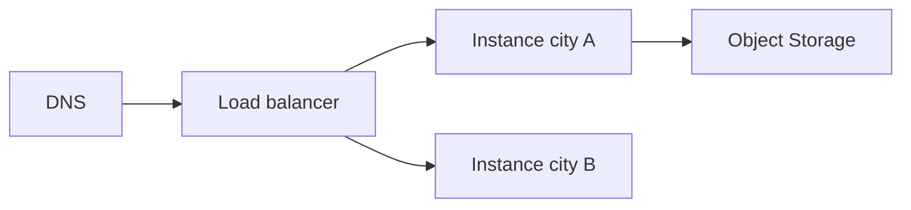

import { ConceptTemplate } from '@/features/kb/components/templates/ConceptTemplate'
import { Callout } from '@/features/kb/components/mdx/Callout'
import { ComparisonTable } from '@/features/kb/components/mdx/ComparisonTable'

export default function Layout({ children }) {
  return (
    <ConceptTemplate title="Vultr">
      {children}
    </ConceptTemplate>
  )
}

**Vultr** sells cloud **compute** (shared, dedicated, optimized), **Bare Metal**, block storage, **VKE** (Kubernetes), load balancers, and object storage across a long list of cities. The product is location plus price. IAM, landing zones, and managed data services are thinner than the big three.

## 1. Deep Dive and Mechanics

**Instances.** Images, cloud-init, VPC, reserved IPs, firewall groups. Optimized SKUs for CPU or burst. Snapshots are your AMI analog.

**VKE.** Managed control plane, node pools, and Vultr CCM. Fine for small clusters. Do not expect every EKS addon.

**Bare Metal.** Hourly whole boxes in select sites. Useful for noisy-neighbor-sensitive or licensed software.

**Object + CDN.** S3-compatible enough for backups and assets.

<Callout icon="warning" title="Firewall groups are not optional">
A new instance with a public IPv4 and open SSH is a countdown. Attach a firewall group in the same API call that creates the VM.
</Callout>

## 2. Mathematical / Theoretical Foundation

Many regions does not mean multi-region HA. Each site is its own failure domain. Replicate data yourself.

Bandwidth packages and IPv4 pricing show up on the invoice next to the cheap vCPU.

<ComparisonTable
  headers={['Need', 'Vultr', 'DO / Hetzner']}
  rows={[
    ['VM', 'Cloud compute', 'Droplet / CX'],
    ['K8s', 'VKE', 'DOKS / DIY'],
    ['Bare metal', 'Yes', 'Limited / Robot'],
    ['City coverage', 'Very wide', 'Fewer / EU-strong'],
  ]}
/>

## 3. Real-World Implementation

```bash
vultr-cli instance create --region ewr --plan vc2-2c-4gb \
  --os 2284 --label web-1 --vpc-enable
```

Terraform `vultr` provider should own firewall groups and VPCs too.

## 4. Visualizations



## 5. Interview Prep

**Q: Vultr vs DigitalOcean?**
**A:** Same class. Vultr often wins on number of cities and bare metal. DO wins on polish and App Platform.

**Q: Is VKE enough?**
**A:** For a small product, yes. For enterprise addons and IAM, you will feel the gap.

**Q: Why so many locations?**
**A:** Gaming, latency, and local presence. You still need a data plane story.

## 6. Production Use Cases

- Latency-sensitive game or voice relays in many cities.
- Cheap CI runners.
- Bare metal for a licensed DB you will not virtualize.

<Callout icon="tip" title="Offsite the snapshots">
Snapshot in the same account/region is not DR. Copy objects to another provider or city on a schedule you test.
</Callout>
