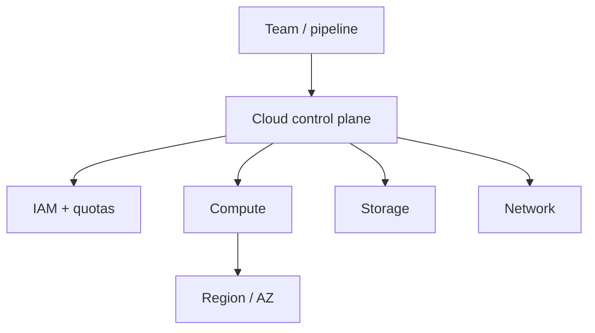

import { ConceptTemplate } from '@/features/kb/components/templates/ConceptTemplate'
import { Callout } from '@/features/kb/components/mdx/Callout'
import { ComparisonTable } from '@/features/kb/components/mdx/ComparisonTable'

export default function Layout({ children }) {
  return (
    <ConceptTemplate title="Cloud Computing">
      {children}
    </ConceptTemplate>
  )
}

**Cloud computing** is on-demand access to shared pools of compute, storage, and networking, provisioned through APIs and billed as you go. The NIST model still holds: on-demand self-service, broad network access, resource pooling, rapid elasticity, and measured service. You trade capex hardware for opex and a **shared responsibility** contract.

## 1. Deep Dive and Mechanics

**Service models.** IaaS rents VMs and disks. PaaS rents a runtime. FaaS / serverless rents a function invocation. SaaS rents the application. Each step gives away control and ops load.

**Deployment models.** Public (AWS, Azure, GCP, OCI), private (your DC with cloud-shaped APIs), hybrid (both, with identity and network glue), and multi-cloud (two publics on purpose or by accident).

**Control planes.** Every resource is a record in the provider's API plus some physical or virtual capacity. IAM, quotas, and regions are the real product boundaries. The VM is an implementation detail.

**Economics.** List price is not the bill. Egress, idle reservations, orphan disks, and chatty logs dominate. Committed use / reserved / savings plans are bets on future load.

<Callout icon="warning" title="Shared responsibility is not shared blame">
The provider patches the hypervisor. You patch the guest, the IAM, the bucket policy, and the app. A public S3 bucket is not an AWS outage.
</Callout>

## 2. Mathematical / Theoretical Foundation

Elasticity is a control loop: measure load, add or remove capacity, wait for cool-down. Oscillation happens if the metric is noisy and the cooldown is short.

Availability of a serial chain is the product of component availabilities. Two nines times two nines is not four nines. Redundancy is parallel, not a slogan.

<ComparisonTable
  headers={['Model', 'You run', 'They run']}
  rows={[
    ['IaaS', 'OS, runtime, app', 'DC, hardware, hypervisor'],
    ['PaaS', 'App + config', 'OS and platform'],
    ['FaaS', 'Function code', 'All servers'],
    ['SaaS', 'Users and data policy', 'The product'],
  ]}
/>

## 3. Real-World Implementation

```bash
# Same idea on every major cloud: an API creates capacity
gcloud compute instances create web-1 --zone=us-central1-a --machine-type=e2-medium
aws ec2 run-instances --image-id ami-123 --instance-type t3.medium
az vm create --name web-1 --resource-group rg --image Ubuntu2204
```

Terraform or CDK should own this. Click-ops is an unreviewed API call.

## 4. Visualizations



## 5. Interview Prep

**Q: What is the cloud in one sentence?**
**A:** Metered, API-provisioned multi-tenant infrastructure with elasticity and a shared-responsibility security model.

**Q: Multi-cloud vs hybrid?**
**A:** Hybrid is on-prem plus public. Multi-cloud is two or more publics. Both need identity, network, and data-gravity plans. "Avoid lock-in" is not a plan.

**Q: Why do bills surprise people?**
**A:** Egress, idle, and logs. Compute list price is the slide; data movement is the invoice.

## 6. Production Use Cases

- Burst web traffic that would have required a hardware refresh.
- Global user bases that need a region near the client.
- Regulated workloads that still use public cloud with landing zones and private connectivity.

<Callout icon="tip" title="Design for the API, not the console">
If you cannot recreate the account from code, you do not have an architecture. You have a pet.
</Callout>
