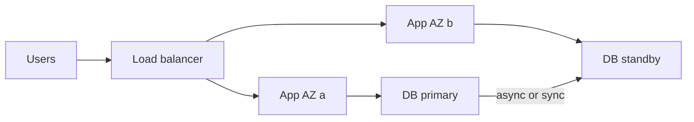

import { ConceptTemplate } from '@/features/kb/components/templates/ConceptTemplate'
import { Callout } from '@/features/kb/components/mdx/Callout'
import { ComparisonTable } from '@/features/kb/components/mdx/ComparisonTable'

export default function Layout({ children }) {
  return (
    <ConceptTemplate title="High Availability">
      {children}
    </ConceptTemplate>
  )
}

**High availability** is the practice of keeping a service within its error budget when components fail. **Fault tolerance** is continuing correctly (or safely degraded) through those failures. Cloud vendors sell regions and zones; you still have to place replicas, remove single points of failure, and rehearse failover.

## 1. Deep Dive and Mechanics

**Nines.** Availability A = uptime / (uptime + downtime). Three nines is about 8.8 hours/year; five nines is minutes. Maintenance you planned still counts unless the SLO says otherwise.

**SPOF removal.** Two app instances behind a load balancer, disks that replicate, a database with a standby in another zone. If both instances share one subnet, one NAT, or one IAM key, you still have a SPOF.

**Zones and regions.** An AZ is a failure domain (power, flood, building). A region is a set of AZs plus a control plane. Multi-AZ survives a building. Multi-region survives a region — and creates split-brain and latency problems you must design.

**Failover.** Active-active (all replicas serve) vs active-passive (standby promotes). RPO and RTO are the numbers; "we have a replica" is not.

<Callout icon="error" title="Untested failover is fiction">
A replica that never received a promote drill will fail DNS, auth, or disk encryption on the day you need it. Game-day the cutover.
</Callout>

## 2. Mathematical / Theoretical Foundation

Independent failures: if each replica fails with probability p, n replicas all-down is p^n only if failures are independent. Shared fate (one region, one bad config push) makes p^n optimistic.

Error budgets: SLO of 99.9% means 0.1% downtime is allowed. Burn the budget on deploys or on incidents; you cannot spend it twice.

<ComparisonTable
  headers={['Pattern', 'Survives', 'Does not survive']}
  rows={[
    ['Multi-instance one AZ', 'One VM death', 'AZ loss'],
    ['Multi-AZ', 'AZ loss', 'Region loss'],
    ['Multi-region active-active', 'Region loss', 'Global bad deploy'],
    ['Backups only', 'Data loss window', 'Immediate uptime'],
  ]}
/>

## 3. Real-World Implementation

```yaml
# Sketch: 3 replicas, anti-affinity, PDB so deploys cannot evict all
apiVersion: policy/v1
kind: PodDisruptionBudget
metadata:
  name: api
spec:
  minAvailable: 2
  selector:
    matchLabels:
      app: api
```

Pair this with a regional load balancer and a database that has a standby in another zone. Kubernetes replicas in one node pool in one zone are still one fate.

## 4. Visualizations



## 5. Interview Prep

**Q: HA vs FT vs DR?**
**A:** HA keeps the service up through expected failures. Fault tolerance is correct behavior during faults. DR is recovering from a disaster with stated RPO/RTO. Overlap exists; the interview wants the intent.

**Q: Why is 99.999% expensive?**
**A:** You pay in replicas, multi-region, people, and slower deploys. Most products cannot honestly claim five nines end-to-end including the client ISP.

**Q: What kills HA in the cloud?**
**A:** Control-plane misconfig, IAM, and data stores that were left single-AZ. Compute is the easy part.

## 6. Production Use Cases

- Payments API: multi-AZ stateless compute, multi-AZ datastore, runbooks for region evacuate.
- Internal tools: two nines may be enough; do not buy five nines of Kafka for a wiki.
- Telecom-style control loops that fail closed and never fail silent.

<Callout icon="tip" title="Write the SLO before the architecture">
If the business accepts four hours of downtime, a second region is theater. If it does not accept five minutes, a single-AZ RDS is theater.
</Callout>
