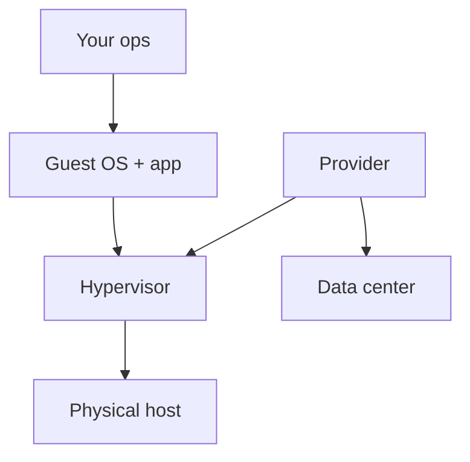

import { ConceptTemplate } from '@/features/kb/components/templates/ConceptTemplate'
import { Callout } from '@/features/kb/components/mdx/Callout'
import { ComparisonTable } from '@/features/kb/components/mdx/ComparisonTable'

export default function Layout({ children }) {
  return (
    <ConceptTemplate title="Infrastructure as a Service">
      {children}
    </ConceptTemplate>
  )
}

**IaaS** is the cloud service model where the provider sells raw (virtual) infrastructure: machines, block/object storage, and virtual networks. You choose the image, the kernel, the agent, and the blast radius. EC2, Compute Engine, Azure VMs, and OCI Compute are the textbook products.

## 1. Deep Dive and Mechanics

**What you get.** A hypervisor-isolated VM (or bare metal), persistent disks, a VPC NIC, and an IAM identity. Snapshots, images, and instance templates are how you stop treating VMs as pets.

**What you still own.** OS patches, SSH/SSM access, disk encryption settings you chose, backup jobs, and capacity. Auto Scaling Groups / MIGs / VMSS are IaaS with a control loop, not PaaS.

**Neighbors.** Object storage (S3, GCS, Blob) is often taught next to IaaS even though you do not manage a filesystem. Load balancers and NAT gateways sit in front of IaaS fleets.

**Escape hatches.** Custom kernels, GPUs, licensed Windows, and lift-and-shift appliances live here because PaaS will not let you install them.

<Callout icon="warning" title="Unpatched guests are your CVE">
The provider will not apt-upgrade your Ubuntu. A golden image pipeline plus automated patching is the minimum IaaS hygiene.
</Callout>

## 2. Mathematical / Theoretical Foundation

Utilization: you pay for the instance while it exists. Average CPU 8% means you bought 12x headroom. Rightsizing and schedules are the IaaS cost function.

Placement: instances in one AZ share fate. Spread across AZs raises availability and often egress or replication cost.

<ComparisonTable
  headers={['Layer', 'IaaS', 'PaaS']}
  rows={[
    ['OS patches', 'You', 'Provider'],
    ['Scaling unit', 'VM / group', 'App / dyno'],
    ['SSH', 'Usually yes', 'Usually no'],
    ['Examples', 'EC2, GCE, Azure VM', 'Beanstalk, App Service, Cloud Run'],
  ]}
/>

## 3. Real-World Implementation

```hcl
resource "google_compute_instance_template" "web" {
  machine_type = "e2-medium"
  disk {
    source_image = "projects/debian-cloud/global/images/family/debian-12"
    boot         = true
  }
  network_interface {
    subnetwork = "projects/host/regions/us-central1/subnetworks/app"
  }
  service_account {
    email  = "web@proj.iam.gserviceaccount.com"
    scopes = ["cloud-platform"]
  }
}
```

Templates plus a managed instance group beat a named VM you love.

## 4. Visualizations



## 5. Interview Prep

**Q: IaaS vs PaaS in one line?**
**A:** IaaS sells machines you administer. PaaS sells a runtime you deploy to.

**Q: Is S3 IaaS?**
**A:** NIST would call it storage-as-a-service sitting next to IaaS. Interviews accept "IaaS-adjacent object storage." Do not overfit the taxonomy.

**Q: When do you refuse IaaS?**
**A:** When the team cannot patch, image, and observe VMs. Then pay for PaaS or serverless and accept the constraints.

## 6. Production Use Cases

- Lift-and-shift of a vendor appliance that needs a specific OS.
- GPU / HPC fleets with custom drivers.
- Regulated workloads that require a locked-down golden image you attest.

<Callout icon="tip" title="Cattle, not pets">
If you cannot terminate an instance and let the group replace it, you built a snowflake. IaaS without immutability is a colocation facility with a credit card.
</Callout>
