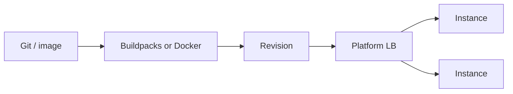

import { ConceptTemplate } from '@/features/kb/components/templates/ConceptTemplate'
import { Callout } from '@/features/kb/components/mdx/Callout'
import { ComparisonTable } from '@/features/kb/components/mdx/ComparisonTable'

export default function Layout({ children }) {
  return (
    <ConceptTemplate title="Platform as a Service">
      {children}
    </ConceptTemplate>
  )
}

**PaaS** hides the guest OS. You provide a build artifact (or a git repo) and config: CPU, concurrency, env, and a bind port. Heroku popularized `git push`. Cloud Run, App Service, Elastic Beanstalk, App Engine, and Render are the same idea with different escape hatches.

## 1. Deep Dive and Mechanics

**Contract.** The platform builds or accepts a container, assigns a URL, restarts on crash, and scales instances from a metric. You do not SSH. You do not pick a kernel.

**Buildpacks vs images.** Buildpacks detect language and produce a slug/image. A Dockerfile is the modern default because it is reproducible. Language-version drift is the classic PaaS outage.

**Adjacent services.** Managed Postgres, object storage, and a secrets UI ship next to the app. The danger is a unique addon API that is painful to leave.

**Twelve-factor.** Config in the environment, disposable processes, and logs as streams. PaaS assumes this. A sticky local disk does not.

<Callout icon="warning" title="Local disk is a lie">
Many PaaS filesystems are ephemeral. Writes vanish on restart. Persist in object storage or a database, not in /tmp you grew fond of.
</Callout>

## 2. Mathematical / Theoretical Foundation

Scale-out is replica count times per-instance concurrency. If the app holds a global lock or a single-writer SQLite file, replicas add errors, not capacity.

Price is instance-hours (or vCPU-seconds). A 24/7 PaaS service can cost more than a reserved VM; you pay for the ops you did not hire.

<ComparisonTable
  headers={['Product', 'Unit', 'Escape hatch']}
  rows={[
    ['Cloud Run', 'Container revision', 'Min instances, GPUs'],
    ['App Service', 'Plan + app', 'Custom containers'],
    ['Elastic Beanstalk', 'Env + ASG', 'Underneath it is EC2'],
    ['Heroku / Render', 'Dyno / service', 'Limited OS packages'],
  ]}
/>

## 3. Real-World Implementation

```dockerfile
FROM node:22-slim
WORKDIR /app
COPY package*.json ./
RUN npm ci --omit=dev
COPY . .
CMD ["node", "server.js"]
```

```bash
gcloud run deploy api --source . --region=us-central1 --allow-unauthenticated=false
```

The Dockerfile is the contract. The platform command is plumbing.

## 4. Visualizations



## 5. Interview Prep

**Q: PaaS vs FaaS?**
**A:** PaaS runs a long-lived process that serves many requests. FaaS bills a handler invocation and can go to zero. Overlap exists (Cloud Run). Interviews want process vs invocation.

**Q: Why do companies leave Heroku-class PaaS?**
**A:** Cost at scale, region limits, or a need for sidecars and custom networking. They often land on Kubernetes and rebuild PaaS themselves.

**Q: Is Kubernetes PaaS?**
**A:** Raw Kubernetes is IaaS-plus. GKE Autopilot, Cloud Run, and OpenShift start looking like PaaS on top.

## 6. Production Use Cases

- Product teams that should not own patch Tuesdays.
- APIs with a clean twelve-factor shape and a container already.
- Internal tools where time-to-URL beats millicent unit cost.

<Callout icon="tip" title="Keep a second deploy target">
If the app only runs on one proprietary buildpack, you have a lock-in bug. A plain container that also runs locally is the insurance policy.
</Callout>
