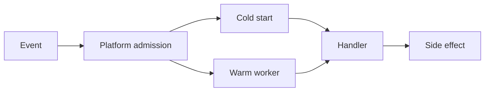

import { ConceptTemplate } from '@/features/kb/components/templates/ConceptTemplate'
import { Callout } from '@/features/kb/components/mdx/Callout'
import { ComparisonTable } from '@/features/kb/components/mdx/ComparisonTable'

export default function Layout({ children }) {
  return (
    <ConceptTemplate title="Serverless Computing">
      {children}
    </ConceptTemplate>
  )
}

**Serverless** means you do not provision servers and you do not pay for idle compute (or you pay a small minimum). **FaaS** (Lambda, Cloud Functions, Azure Functions) is the narrow form: a handler, a trigger, a timeout. Broader serverless includes scale-to-zero containers (Cloud Run), serverless databases, and event buses. There are still servers. You just cannot SSH into them.

## 1. Deep Dive and Mechanics

**Lifecycle.** An event arrives. The platform places the handler on a worker (cold or warm). You run until return, crash, or timeout. Concurrency is either one request per instance (classic Lambda) or many (Cloud Run, some Function setups).

**Cold start.** New workers load the runtime and your package. Large images, VPCs that need ENIs, and heavy imports make the first request slow. Provisioned concurrency / min instances buy warmth with money.

**Triggers.** HTTP, queues, storage events, schedules. Idempotency matters because at-least-once is the usual delivery.

**Limits.** Timeouts, payload sizes, ephemeral disk, and max concurrency are hard ceilings. A 15-minute video transcode does not belong in a 60-second function.

<Callout icon="warning" title="VPC-attached functions">
Pulling a function into a private subnet can add seconds of cold start if the platform must attach a network interface. Prefer private connectivity patterns the cloud documented, not a reflexive 'put it in the VPC.'
</Callout>

## 2. Mathematical / Theoretical Foundation

Bill ≈ invocations × duration × memory. Doubling memory can cut duration more than 2x if the work is CPU-bound, so the cheaper setting is an experiment, not a guess.

Scale is admission control: the platform raises concurrency until a quota. Thundering herds after a deploy are real; use reserved concurrency so one function cannot starve the account.

<ComparisonTable
  headers={['Style', 'Idle cost', 'Fit']}
  rows={[
    ['FaaS', 'Near zero', 'Spiky, short work'],
    ['Scale-to-zero container', 'Near zero or min instances', 'HTTP APIs'],
    ['Always-on IaaS', 'VM hours', 'Steady + special OS'],
    ['Serverless DB', 'Per request / storage', 'Variable query load'],
  ]}
/>

## 3. Real-World Implementation

```javascript
exports.resize = async (event) => {
  const bucket = event.bucket;
  const name = event.name;
  await resizeToThumb(bucket, name);
};
```

Ack or return only after the side effect is durable. Pair with a dead-letter topic for poison images.

## 4. Visualizations



## 5. Interview Prep

**Q: Are there servers?**
**A:** Yes. Serverless is an ops and billing model, not a new physics.

**Q: Cold start vs warm?**
**A:** Cold includes runtime + init. Warm reuses the isolate. Tail latency is dominated by cold unless you pay to keep workers.

**Q: Serverless vs PaaS?**
**A:** Both hide OS. Serverless emphasizes scale-to-zero and per-invocation billing. PaaS often keeps a process up. Cloud Run sits on the line.

## 6. Production Use Cases

- Image/PDF processing off an object-storage event.
- Webhooks that are idle 23 hours a day.
- Glue code between SaaS events and a warehouse load.

<Callout icon="tip" title="Keep the package small">
A 200 MB node_modules is a cold-start tax. Slim images and lazy imports are cheaper than another memory bump.
</Callout>
