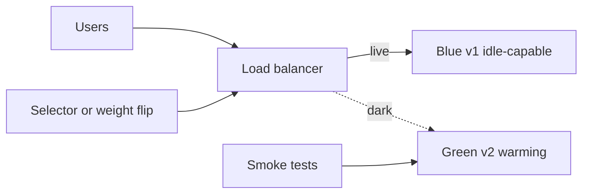

import { ConceptTemplate } from '@/features/kb/components/templates/ConceptTemplate'
import { Callout } from '@/features/kb/components/mdx/Callout'
import { ComparisonTable } from '@/features/kb/components/mdx/ComparisonTable'

export default function Layout({ children }) {
  return (
    <ConceptTemplate title="Blue-Green Deployment">
      {children}
    </ConceptTemplate>
  )
}

**Blue-green deployment** keeps two production-class environments that are as identical as cost allows. **Blue** serves live traffic. **Green** receives the next release, is smoke-tested in isolation, then the edge router flips so Green becomes live. Blue stays warm as a one-click rollback. Downtime is the propagation time of a routing change, not a rebuild.

## 1. Deep Dive and Mechanics

**Provision.** Green is not a laptop. It is the same AMI or image, same instance size, same secrets shape, same schema-compatible data plane. If Green is cheaper or smaller, the cutover is a load test you never ran.

**Warm-up.** New processes have cold caches, empty connection pools, and JIT that has not run. Route synthetic traffic or replay a slice of production before the flip, or the first real minute looks like an outage.

**The flip.** Historically a VIP or DNS TTL. Today: ALB target groups, Ingress weights, service-mesh destination rules. Prefer a control-plane write that is atomic from the client's point of view. Long DNS TTLs make "instant rollback" a lie.

**Data.** Stateless services flip cleanly. Shared databases do not. Expand-contract migrations (add nullable column, dual-write, backfill, switch read, drop old) must land **before** Green can serve. A rollback that cannot read the new schema is not a rollback.

**Drain.** After the flip, Blue still has in-flight requests. Stop new connections, wait for the idle timeout, then scale Blue to zero or leave it idle for the soak window.

<Callout icon="warning" title="Shared state is the real risk">
The router flip is the easy part. Session stores, feature-flag caches, and irreversible migrations are why blue-green fails in production more often than the load balancer does.
</Callout>

## 2. Mathematical / Theoretical Foundation

Treat the flip as a **cut** on a bipartite traffic graph: users U map to backends B_blue or B_green. Desired state is a total function to one colour. During drain, the map is mixed: new sessions to Green, old sockets still on Blue.

**Capacity.** If each colour must absorb 100 percent of peak QPS, you pay 2x compute during the window. Some teams shrink Blue after soak; that trades money for rollback time.

**Failure probability.** Let p be the chance a release is bad. Blue-green does not reduce p. It reduces **mean time to recover** (MTTR) from "rebuild and redeploy" to "rewrite one route." Blast radius is still 100 percent of users the moment you flip — unlike a canary.

<ComparisonTable
  headers={['Pattern', 'Traffic shift', 'Rollback', 'Infra cost']}
  rows={[
    ['Blue-green', 'Atomic 0 to 100', 'Flip back to idle colour', '2x during window'],
    ['Canary', 'Ramp 1 to 5 to 25 to 100', 'Drop canary pods', 'Small extra slice'],
    ['Rolling', 'Replace N at a time', 'Roll forward or reverse surge', '1x plus surge'],
    ['Recreate', 'Down then up', 'Redeploy old artifact', '1x, with downtime'],
  ]}
/>

## 3. Real-World Implementation

```yaml
# Kubernetes-style cutover: two Deployments, one Service selector flip.
apiVersion: v1
kind: Service
metadata:
  name: checkout
spec:
  selector:
    app: checkout
    colour: green
  ports:
    - port: 80
      targetPort: 8080
```

Keep Blue labeled `colour: blue` and still running. To roll back, change the Service selector to `colour: blue` and wait for endpoints to update. Pair this with a readiness probe so Green is never selected while it is still booting.

## 4. Visualizations



## 5. Interview Prep

**Q: Blue-green versus canary?**
**A:** Blue-green is a binary cutover with instant rollback and full blast radius. Canary ramps a fraction of traffic and uses error budgets to decide whether to continue. Use canary when you need statistical evidence; use blue-green when the release is already trusted and you want a hot standby.

**Q: Why can DNS cutover fail?**
**A:** Clients cache TTLs. Some ignore TTL. You cannot "unflip" resolvers you do not control. Prefer a VIP, anycast, or L7 proxy you own.

**Q: How do you blue-green a database change?**
**A:** You do not flip the database. You ship backward-compatible schema first, deploy Green on the new code, then clean up only after both colours no longer need the old shape.

## 6. Production Use Cases

- **Regulated cutovers** that demand a documented rollback in minutes (payments, health).
- **Immutable AMIs** in autoscaling groups: launch a new ASG, attach to the ELB, detach the old ASG.
- **Holiday freezes** where you keep Blue parked for 24 hours after Black Friday deploys.

<Callout icon="tip" title="Name colours by version">
Call them v142 and v143 in dashboards. "Blue" and "Green" swap meaning every release and page the wrong on-call.
</Callout>
