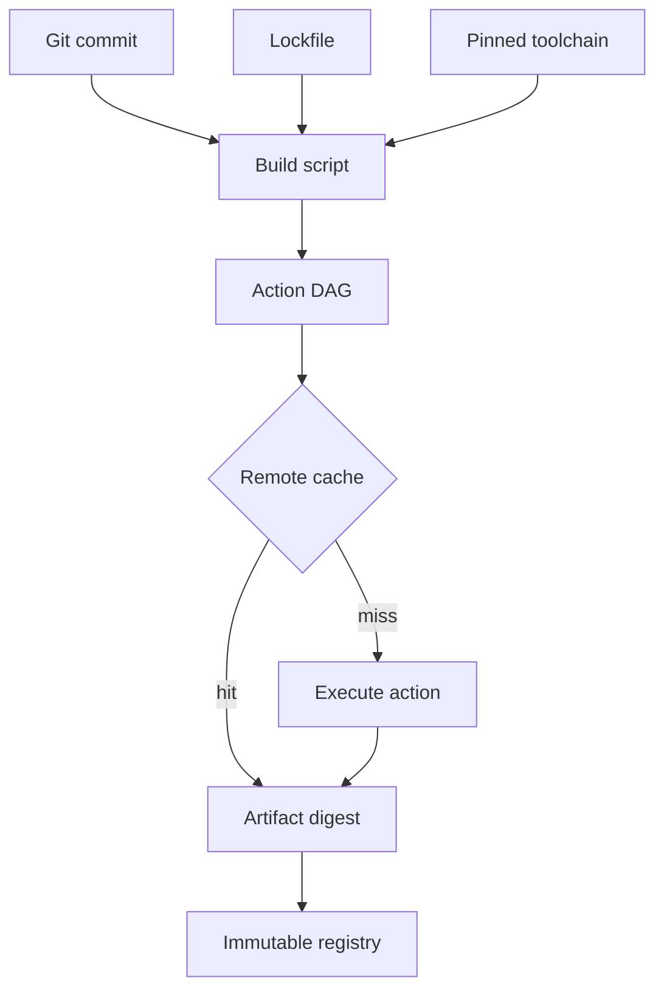

import { ConceptTemplate } from '@/features/kb/components/templates/ConceptTemplate'
import { Callout } from '@/features/kb/components/mdx/Callout'
import { ComparisonTable } from '@/features/kb/components/mdx/ComparisonTable'

export default function Layout({ children }) {
  return (
    <ConceptTemplate title="Build Automation">
      {children}
    </ConceptTemplate>
  )
}

**Build automation** is the rule that humans do not compile, link, or package by hand on a laptop that "has the right JDK." A versioned script — Makefile, Gradle, Bazel, npm ci — runs on a clean agent, pins toolchains, and emits a hashed artifact. The slogan is **hermetic and deterministic**: same inputs, same bytes.

## 1. Deep Dive and Mechanics

**Inputs.** Source tree at a commit SHA, lockfile, compiler version, OS image, environment variables that the script actually reads. Anything else is contamination. "Works on my machine" means an untracked input leaked in.

**Graph.** Modern builders model a DAG: compile units, test shards, image layers. Unchanged nodes are cache hits. Remote cache (BuildBuddy, Gradle Enterprise, sccache) makes the DAG a distributed memoization table.

**Hermeticity.** Sandbox the action: no undeclared network, no `/usr/local` leftovers, timestamps epoch-fixed, locale pinned. Bazel and Nix treat undeclared deps as bugs. Docker without `--mount=type=cache` and a digest-pinned base image is not hermetic.

**Outputs.** One or more artifacts: jar, wheel, OCI image, SBOM, provenance attestation (SLSA). The artifact ID is content-addressed. QA and prod must pull the **same digest**, not "latest."

**Idempotency.** Re-running the script on the same commit must not invent a new "release." If timestamps or UUIDs leak into the binary, you get flaky hashes and broken audit trails.

<Callout icon="info" title="The lockfile is part of the source">
A floating caret range in package.json is not a build input. Pin hashes. Renovate or Dependabot can bump them in a PR you review.
</Callout>

## 2. Mathematical / Theoretical Foundation

A build is a function B: Inputs → Artifact. **Reproducible** means B is a function in the mathematical sense: equal inputs imply equal outputs. **Repeatable** is weaker (same behaviour, different bytes). **Hermetic** means the domain of B is fully declared — no hidden globals.

Cache correctness requires **referential transparency**. If action A depends on files F and command C, the cache key is hash(F, C, env_subset, toolchain). A false-positive cache hit is a soundness bug; a false-negative is only money.

Complexity: naive clean builds are O(n) in translation units. Incremental builds with a correct DAG approach O(changed + dependents). This is why monorepos invest in Bazel.

<ComparisonTable
  headers={['Property', 'Laptop make', 'Automated hermetic build']}
  rows={[
    ['Toolchain', 'Whatever is installed', 'Pinned image or nix store'],
    ['Deps', 'Node_modules leftover', 'Lockfile + fetch by hash'],
    ['Output ID', 'latest or v1-final-final', 'Content digest'],
    ['Audit', 'Hope', 'Provenance + SBOM'],
  ]}
/>

## 3. Real-World Implementation

```python
import hashlib, subprocess, json
from pathlib import Path

def build_and_attest(src: Path, out: Path) -> dict:
    subprocess.check_call(["npm", "ci"], cwd=src)
    subprocess.check_call(["npm", "run", "build"], cwd=src)
    digest = hashlib.sha256(out.read_bytes()).hexdigest()
    commit = subprocess.check_output(["git", "rev-parse", "HEAD"], cwd=src).decode().strip()
    return dict(commit=commit, artifact=str(out), sha256=digest)
```

Store the returned record next to the artifact in the registry. Promote by digest, never by mutable tag.

## 4. Visualizations



## 5. Interview Prep

**Q: What is a hermetic build?**
**A:** Every input is declared and hashed. The action cannot see undeclared files or the public internet except through a fetch whose URL and hash are known. Two agents then produce the same digest.

**Q: Why pin the base image by digest, not by tag?**
**A:** Tags move. `node:20` on Monday is not `node:20` on Friday. Digests are content-addressed.

**Q: How do you debug a "works locally, fails in CI" build?**
**A:** Diff the input set: Node/Java version, case-sensitive FS, line endings, env vars, secret presence, and whether the CI ran `npm ci` versus `npm install`.

## 6. Production Use Cases

- **Release trains** that must prove the binary in prod is the binary that passed the gate.
- **Monorepos** where remote caching turns 40-minute cleans into 3-minute incrementals.
- **Supply-chain compliance** (SLSA, SSDF) that requires attested, scripted builds — not intern laptops.

<Callout icon="tip" title="Fail closed on dirty trees">
Refuse to publish if `git status` is dirty or if the builder cannot record a commit SHA. Unpublished dirty artifacts become un-reproducible legends.
</Callout>
