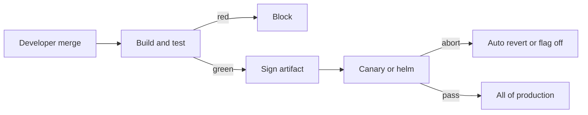

import { ConceptTemplate } from '@/features/kb/components/templates/ConceptTemplate'
import { Callout } from '@/features/kb/components/mdx/Callout'
import { ComparisonTable } from '@/features/kb/components/mdx/ComparisonTable'

export default function Layout({ children }) {
  return (
    <ConceptTemplate title="Continuous Deployment (CD)">
      {children}
    </ConceptTemplate>
  )
}

**Continuous Deployment** (often abbreviated **CD** in this narrower sense) means a green pipeline **is** the production release. There is no CAB meeting, no "release captain" clicking Deploy on Friday. Continuous **Delivery** stops at a releasable artifact; this page is the last mile: the machine ships it.

## 1. Deep Dive and Mechanics

**Prereqs.** Trunk-based or very short-lived branches. Automated unit, integration, and a thin E2E suite that is not flaky. Observability and a one-command rollback or revert. If you cannot detect a bad release in minutes, do not auto-deploy.

**Pipeline.** Commit → build → test → sign → deploy to prod (often via canary). Each stage is a **quality gate** with a binary verdict. Manual approval jobs are Continuous Delivery, not this.

**Batch size.** CD forces small diffs. A 20-line PR that breaks checkout is bisectable. A monthly train of 10 kLOC is not. DORA's "deployment frequency" and "lead time" move together here.

**Safety valves.** Feature flags hide incomplete work. Database migrations stay backward compatible. Production is not the first place a migration runs — but it may be the first place real cardinality appears, so canaries still matter.

**Culture.** Developers own the pager for what they ship. Ops is not a separate "throw over the wall" queue. That is the DevOps bargain that makes CD socially possible.

<Callout icon="error" title="Flaky tests veto CD">
If the suite is 3 percent red on a good day, humans start retrying until green. That is roulette, not a gate. Quarantine flakes or you will ship bugs and skip real failures.
</Callout>

## 2. Mathematical / Theoretical Foundation

Model lead time L as sum of wait and work. CD drives **queueing delay** toward zero: there is no release backlog. Little's Law: WIP = throughput × L. Smaller batches cut L and cut WIP.

**Risk.** Let defect density be d per KLOC and batch size be b lines. Expected defects per release ≈ d · b / 1000. CD shrinks b. It does **not** shrink d — tests and review do that.

**Change-fail rate** and **MTTR** are the other DORA pair. CD is only rational if MTTR is small (revert, flag off, or blue-green flip). Otherwise you have automated a casino.

<ComparisonTable
  headers={['Practice', 'Prod trigger', 'Human gate', 'Typical cadence']}
  rows={[
    ['Continuous Integration', 'None', 'Merge blocked on tests', 'Many times per day'],
    ['Continuous Delivery', 'Human or schedule', 'Yes, on prod', 'On demand'],
    ['Continuous Deployment', 'Green pipeline', 'No', 'Every good commit'],
    ['Release train', 'Calendar', 'Yes, plus freeze', 'Weekly or monthly'],
  ]}
/>

## 3. Real-World Implementation

```yaml
# GitHub Actions: deploy on main if tests pass. No environment approval.
name: cd
on:
  push:
    branches: [main]
jobs:
  ship:
    runs-on: ubuntu-latest
    steps:
      - uses: actions/checkout@v4
      - run: npm ci && npm test && npm run build
      - run: helm upgrade --install web ./chart --set image.tag=$GITHUB_SHA
```

Pin the image tag to the commit SHA from the GITHUB_SHA environment variable. Add a canary Rollout in the chart if you cannot tolerate a full-fleet bad push.

## 4. Visualizations



## 5. Interview Prep

**Q: Delivery versus deployment?**
**A:** Delivery keeps main always releasable and may wait for a human. Deployment releases every green commit. Many banks do Delivery; many SaaS products do Deployment.

**Q: Is CD incompatible with compliance?**
**A:** No. Compliance wants **evidence** (who, what, when, attested artifact), not a weekly meeting. Signed commits, SBOMs, and an auditable pipeline log often beat a spreadsheet CAB.

**Q: What do you do with a bad CD release?**
**A:** Revert the commit (faster than forward-fix if you lack certainty), or disable the flag. Do not "stop the pipeline" for a week — that recreates batch risk.

## 6. Production Use Cases

- **SaaS web** with strong tests and feature flags (Etsy, the original CD poster child).
- **Internal platforms** where services are independently deployable.
- **Mobile backends** (the API, not the store-reviewed binary) that must move faster than app-store review.

<Callout icon="tip" title="Measure revert time">
If revert-to-healthy is more than 15 minutes, you are not ready for CD. Fix rollback, then remove the approval button.
</Callout>
