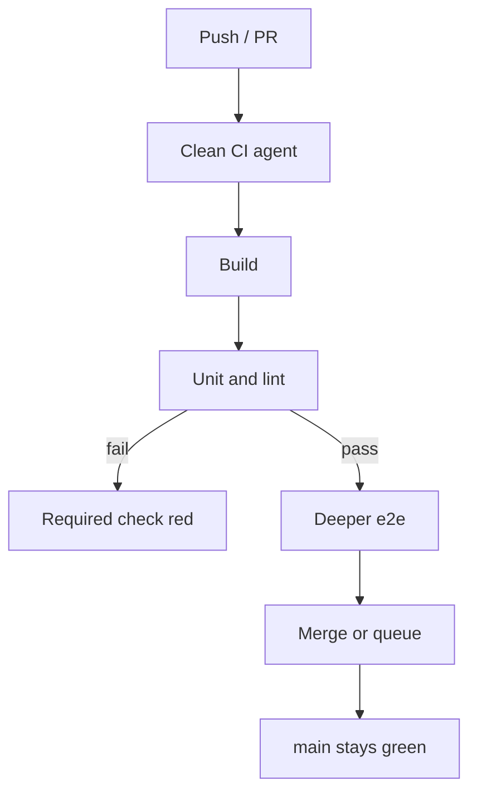

import { ConceptTemplate } from '@/features/kb/components/templates/ConceptTemplate'
import { Callout } from '@/features/kb/components/mdx/Callout'
import { ComparisonTable } from '@/features/kb/components/mdx/ComparisonTable'

export default function Layout({ children }) {
  return (
    <ConceptTemplate title="Continuous Integration (CI)">
      {children}
    </ConceptTemplate>
  )
}

**Continuous Integration** is a **social contract plus a robot**. Developers integrate into a shared trunk several times a day. A CI server builds that trunk (or the proposed merge) in a sterile environment and publishes a red/green signal. The point is not "we have GitHub Actions." The point is **integration is never a week-long event**.

## 1. Deep Dive and Mechanics

**Frequent merge.** Long-lived feature branches diverge. Merge cost grows with time × team size. CI shrinks the interval so conflicts stay local and reviewable.

**The gate.** On each PR or each push to main: checkout, install pinned deps, compile, unit tests, lint, maybe a smoke integration. Red means the merge button stays off (required checks). Green means main stays **shippable in principle** — Delivery/Deployment decide whether it actually ships.

**Pre-merge versus post-merge.** Pre-merge CI (PR checks) protects main. Post-merge CI catches "merged green but main is red" races when two PRs both passed against an older HEAD. **Merge queues** (GitHub merge queue, Bors, Graphite) re-test the serialized result.

**Feedback time.** A 40-minute suite trains people to context-switch and ignore red. Split into a fast required shard (under 10 minutes) and a deeper nightly. Cache deps and use test impact analysis carefully — it is a correctness trade.

**Main is sacred.** If main is red, the team's job is to fix main, not open new feature PRs. That rule is what makes CI continuous.

<Callout icon="warning" title="CI without trunk discipline is just a compiler in the cloud">
Running tests on a 19-day branch does not integrate anything. The "continuous" is the merge cadence, not the YAML file.
</Callout>

## 2. Mathematical / Theoretical Foundation

**Integration cost** is roughly superlinear in branch age: more overlapping edits, more semantic clash that git cannot see. Model expected conflict as growing with the product of lines changed and time since diverge.

**Race on main.** Two PRs tested against commit C can both pass and still break C+P1+P2. Probability rises with PR arrival rate λ and suite duration T (more in-flight merges). Merge queues reduce this to a single serial candidate.

**Signal detection.** A flaky test with false-red rate f destroys trust: after enough retries, P(eventual green | buggy) and P(green | good) both approach 1. Reliability of the gate requires f near 0.

<ComparisonTable
  headers={['Practice', 'What is continuous', 'Failure mode']}
  rows={[
    ['CI', 'Integrate + verify on main', 'Red main, ignored flakes'],
    ['Nightly build', 'A daily batch compile', 'Friday surprise'],
    ['Feature branch CI only', 'Tests in isolation', 'Merge hell on release'],
    ['CI plus merge queue', 'Serialized pre-main test', 'Queue latency'],
  ]}
/>

## 3. Real-World Implementation

```yaml
name: ci
on:
  pull_request:
  push:
    branches: [main]
jobs:
  test:
    runs-on: ubuntu-latest
    steps:
      - uses: actions/checkout@v4
      - uses: actions/setup-node@v4
        with:
          node-version: "22"
          cache: npm
      - run: npm ci
      - run: npm run lint
      - run: npm test -- --coverage
```

Mark this workflow as a **required status check**. Without that, CI is advisory and will be skipped under deadline pressure.

## 4. Visualizations



## 5. Interview Prep

**Q: What problem does CI actually solve?**
**A:** Delayed integration. The later you combine work, the more the combined system is an untested artifact. CI makes "the system" exist and stay tested all day.

**Q: Why required checks instead of polite conventions?**
**A:** Conventions fail at 5pm Friday. Branch protection is the enforcement of the contract.

**Q: How do you keep CI fast as the repo grows?**
**A:** Shard tests, remote cache, affected-target graphs, and a merge queue so you do not re-run the world on every speculative push. Do not delete tests to hit a clock.

## 6. Production Use Cases

- **Every serious product team** — CI is table stakes; the debate is suite design.
- **Open source** where contributors cannot be trusted to run the full matrix locally.
- **Monorepos** with a build graph so you test only affected packages — plus a periodic full build.

<Callout icon="tip" title="Protect the default branch">
Required reviews plus required CI plus no force-push on main. That trio is the minimum viable CI policy.
</Callout>
