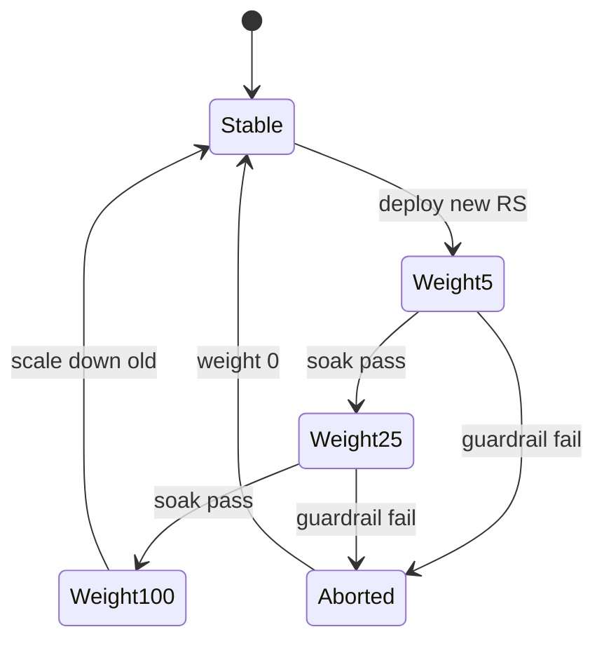

import { ConceptTemplate } from '@/features/kb/components/templates/ConceptTemplate'
import { Callout } from '@/features/kb/components/mdx/Callout'
import { ComparisonTable } from '@/features/kb/components/mdx/ComparisonTable'

export default function Layout({ children }) {
  return (
    <ConceptTemplate title="Canary Deployment">
      {children}
    </ConceptTemplate>
  )
}

**Canary deployment** ships the new revision beside the stable one and gives it a **small, measured share** of real users. Telemetry — not a Friday hope — decides whether to ramp, pause, or abort. The name is the coal-mine bird: if the canary dies, you stop the mine, not the whole city.

## 1. Deep Dive and Mechanics

**Slice.** Start at 1–5 percent of requests or of pods. Prefer **request-level** weighting (mesh, Ingress, API gateway) over "one unlucky replica in the pool," which couples canary share to replica math and session affinity.

**Metrics that matter.** Golden signals: error ratio, latency quantiles (p95, p99), saturation. Compare **canary versus baseline** over the same window, not versus last Tuesday. A global SLO breach during a sale is not evidence the canary is bad.

**Promotion.** If the canary stays inside the guardrail for a soak (5–30 minutes, or N requests), raise weight: 5 → 25 → 50 → 100. Automate this (Flagger, Argo Rollouts, Spinnaker). Humans are slow and optimistic.

**Abort.** A circuit: if canary 5xx rate exceeds baseline by a threshold, or a canary-only panic appears, weight goes to 0 and the new ReplicaSet scales down. Only the slice felt it.

**Bias.** Sticky sessions, geo routing, and bot traffic can starve the canary of representative load — or dump all crawlers onto it. Sample by user-id hash when you need apples-to-apples.

<Callout icon="warning" title="Canaries do not test rare paths">
A 5 percent slice for 10 minutes will not exercise the year-end billing job. Pair canaries with integration tests and synthetic probes for low-QPS endpoints.
</Callout>

## 2. Mathematical / Theoretical Foundation

This is **sequential hypothesis testing**. Let p_c and p_b be canary and baseline error rates. You want to reject "p_c ≤ p_b + δ" quickly without too many false aborts.

Naive "error percent greater than 1" ignores volume. With n=40 requests, two 500s is 5 percent and is noise. Use **Wilson intervals**, Beta-Binomial posteriors, or SPRT. Flagger's analysis templates encode this.

**Power.** Detecting a +0.2 percent absolute error lift at 1 percent baseline needs thousands of requests. Tiny canaries on low-traffic services never reach significance — then teams "promote on vibes."

**Multiple metrics.** Bonferroni or a pre-declared primary (availability) plus secondary (p99). Otherwise you abort on the noisiest chart.

<ComparisonTable
  headers={['Strategy', 'Who sees new code', 'Decision rule', 'Typical tool']}
  rows={[
    ['Canary', 'Random or hashed slice', 'Baseline vs canary stats', 'Argo Rollouts, Flagger'],
    ['Blue-green', 'Everyone at once', 'Manual or smoke gate', 'Two stacks + flip'],
    ['A/B experiment', 'Assigned cohorts', 'Product metric, not SLO', 'Experiment platform'],
    ['Feature flag', 'Attribute targeting', 'Flag eval, not replica count', 'LaunchDarkly, Unleash'],
  ]}
/>

## 3. Real-World Implementation

```yaml
apiVersion: argoproj.io/v1alpha1
kind: Rollout
metadata:
  name: checkout
spec:
  replicas: 20
  strategy:
    canary:
      steps:
        - setWeight: 5
        - pause:
            duration: 10m
        - setWeight: 25
        - pause:
            duration: 10m
      analysis:
        templates:
          - templateName: success-rate
        startingStep: 1
```

The analysis template queries Prometheus: if `canary_error_rate - baseline_error_rate` exceeds δ, the Rollout aborts and scales the canary to zero.

## 4. Visualizations



## 5. Interview Prep

**Q: Canary versus A/B test?**
**A:** Canary asks "is this revision safe?" A/B asks "does this change the product metric?" Canaries should abort on 5xx. A/B should not kill a variant because conversion dipped for an hour.

**Q: Why compare to a concurrent baseline, not to last week?**
**A:** Traffic mix, dependency latency, and incidents drift. A same-window control isolates the revision.

**Q: What if the bug only hits 0.01 percent of users?**
**A:** A short canary will miss it. Use error budgeting, targeted flags, and audit logs — not only ramps.

## 6. Production Use Cases

- **Edge and API gateways** (Envoy, NGINX) shifting weight between upstream clusters.
- **Mobile backend** ramps where a bad proto change would crash a slice of app versions.
- **ML model** promotion: shadow or canary inference versus the champion on the same features.

<Callout icon="tip" title="Hash the user, not the request">
Hashing per request splits a checkout across versions mid-funnel. Sticky user-id hashes keep a session on one revision.
</Callout>
