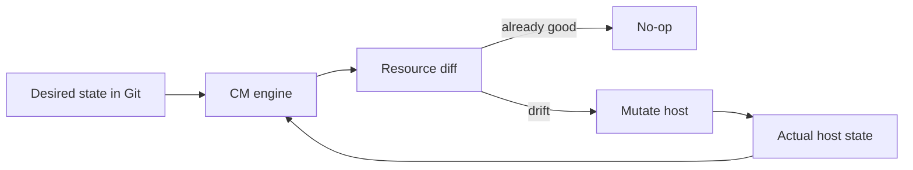

import { ConceptTemplate } from '@/features/kb/components/templates/ConceptTemplate'
import { Callout } from '@/features/kb/components/mdx/Callout'
import { ComparisonTable } from '@/features/kb/components/mdx/ComparisonTable'

export default function Layout({ children }) {
  return (
    <ConceptTemplate title="Configuration Management">
      {children}
    </ConceptTemplate>
  )
}

**Configuration management** treats a server's packages, files, users, and services as **state that must match a declaration**. Ansible, Puppet, Chef, and Salt encode that declaration in Git. The agent or push-job **converges** reality toward the declaration. A box someone SSH-edited is a snowflake: it cannot be rebuilt, and it will drift.

## 1. Deep Dive and Mechanics

**Desired state.** You write "nginx is installed, this template is the config, the service is running." You do not write a shell novel of apt-get steps that fail on the second run. **Idempotency** is the contract: apply twice, same result.

**Push versus pull.** Ansible typically pushes over SSH from a control node. Puppet/Chef often pull from a server on a timer. Pull scales to large fleets and self-heals when a box boots; push is simpler for small estates and ad-hoc jobs.

**Convergence loop.** Observe actual state → diff against desired → execute the smallest change → re-observe. A good resource model has a dependency graph (file before service reload).

**Secrets.** Config that contains passwords must not live in Git as plaintext. Use a vault (Ansible Vault, SOPS, cloud secret manager) and inject at converge time.

**Drift.** Humans hotfix prod. Containers reduced this class of problem by making instances disposable, but VMs, golden images, and appliance hosts still need CM — or they become archaeology.

<Callout icon="warning" title="CM is not a substitute for images">
Baking a golden AMI and then "Ansible-ing the last mile" is fine. Using CM to compile apps on every host at 3am is a build-system smell. Build once; configure instance identity.
</Callout>

## 2. Mathematical / Theoretical Foundation

Model each host as a state vector s in a large discrete space (packages × files × services). Desired state s* is declared. The CM tool is an **operator** T that should satisfy T(s*) = s* (fixed point) and T^n(s) → s* for reachable s (convergence).

**Idempotence** is T ∘ T = T. Non-idempotent scripts (append a line every run) have no fixed point and grow without bound.

**Drift** is a stochastic process: unauthorized edits add noise. Periodic converge is a restoring force. If converge interval Δ is longer than the incident you care about, CM will not save you — use immutable infra or a tighter loop.

<ComparisonTable
  headers={['Tool', 'Model', 'Default transport', 'Language']}
  rows={[
    ['Ansible', 'Push playbooks, mostly agentless', 'SSH', 'YAML + Jinja'],
    ['Puppet', 'Pull catalog, model resources', 'Agent to CA', 'Puppet DSL'],
    ['Chef', 'Pull cookbooks, imperative Ruby', 'Agent', 'Ruby'],
    ['Salt', 'Event bus, fast remote exec', 'ZeroMQ / REST', 'YAML + Python'],
  ]}
/>

## 3. Real-World Implementation

```yaml
# Ansible: idempotent nginx converge
- hosts: web
  become: true
  tasks:
    - name: nginx present
      apt:
        name: nginx
        state: present
    - name: config matches template
      template:
        src: nginx.conf.j2
        dest: /etc/nginx/nginx.conf
      notify: reload nginx
  handlers:
    - name: reload nginx
      service:
        name: nginx
        state: reloaded
```

Re-running this playbook on a compliant host is a no-op aside from gathering facts. That is the test of CM quality.

## 4. Visualizations



## 5. Interview Prep

**Q: Idempotent versus convergent?**
**A:** Idempotent means twice is the same as once. Convergent means repeated applies move toward s* even from messy starts. You want both.

**Q: Why did containers reduce CM usage?**
**A:** The unit of replace became the image. Pets that need in-place mutation became cattle that get terminated. CM remains for hypervisors, bare metal, and bootstrap.

**Q: How do you test CM?**
**A:** Molecule, Test Kitchen, or apply against ephemeral VMs in CI and assert with goss or inspec. Untested roles are production-only hope.

## 6. Production Use Cases

- **Bare-metal and VM fleets** that cannot be replaced on every change.
- **Compliance hardening** (CIS benchmarks applied as code, evidenced by converge reports).
- **Bootstrap** of Kubernetes nodes before the control plane exists.

<Callout icon="tip" title="Ban snowflake SSH">
If someone must SSH to fix prod, the fix is incomplete until the declaration in Git is updated. Otherwise the next converge will undo the heroics — or the next host will lack them.
</Callout>
