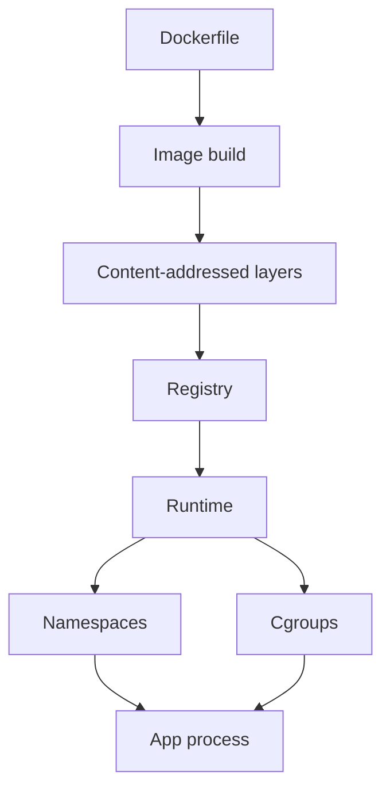

import { ConceptTemplate } from '@/features/kb/components/templates/ConceptTemplate'
import { Callout } from '@/features/kb/components/mdx/Callout'
import { ComparisonTable } from '@/features/kb/components/mdx/ComparisonTable'

export default function Layout({ children }) {
  return (
    <ConceptTemplate title="Containerisation">
      {children}
    </ConceptTemplate>
  )
}

**Containerisation** packages a process and its userspace — libc, interpreter, shared objects — into an **image**, then runs it with kernel isolation (namespaces, cgroups). Unlike a VM, it does not ship a guest kernel. The promise is **environment parity**: the same digest that passed CI is what prod execs.

## 1. Deep Dive and Mechanics

**Image.** A stack of content-addressed layers (OCI). A Dockerfile is a recipe; the **digest** is the identity. Tags like `latest` are mutable pointers and must not be the promotion key.

**Runtime.** containerd or CRI-O pull the image, set up namespaces (pid, net, mnt, uts, ipc, user), apply cgroup limits, and pivot into the rootfs. The kernel is shared. That is why a kernel CVE is a fleet CVE.

**Isolation is not a VM.** User namespaces help. seccomp, drop capabilities, read-only root, and non-root USER are mandatory in serious shops. A container that runs as uid 0 with `--privileged` is a fancy chroot.

**Why it won.** Smaller than VMs, faster start, denser packing, and a unit that CI can build once. Orchestrators (Kubernetes) schedule containers, not pets.

**Limits.** Noisy neighbors still share a kernel and a NIC. Windows/Linux ABI differences remain. Stateful data lives in volumes, not in the writable layer you will lose on evict.

<Callout icon="info" title="Image plus config is the unit">
The same image with different env and mounts is a different **deployed thing**. Pin both the digest and the config hash in the release record.
</Callout>

## 2. Mathematical / Theoretical Foundation

Layers form a **Merkle DAG**: each layer hash covers its diff and its parent. Tampering changes the digest. Pull-by-digest is an integrity check, not just a version pin.

**Resource isolation** is a scheduler plus cgroups: cpu shares, memory limits, IO weights. Without limits, one leaky process is a denial of service against the node. OOM-kill is the kernel's last operator.

**Density.** VMs pay a kernel and a reserved RAM tax per guest. Containers amortize the kernel. The trade is a larger shared trusted computing base.

<ComparisonTable
  headers={['Unit', 'Kernel', 'Start time', 'Isolation strength', 'Typical use']}
  rows={[
    ['Process on host', 'Shared, no box', 'ms', 'None', 'Dev laptop'],
    ['Container', 'Shared, namespaced', 'ms to s', 'Medium if hardened', 'Microservices'],
    ['VM', 'Guest kernel', 'seconds', 'Stronger', 'Multitenant, kernels'],
    ['Unikernel / gVisor', 'Specialized', 'varies', 'Different TCB', 'Sandbox niches'],
  ]}
/>

## 3. Real-World Implementation

```dockerfile
FROM node:22-alpine@sha256:aaaaaaaaaaaaaaaaaaaaaaaaaaaaaaaaaaaaaaaaaaaaaaaaaaaaaaaaaaaaaaaa
WORKDIR /app
COPY package.json package-lock.json ./
RUN npm ci --omit=dev
COPY dist ./dist
USER node
CMD ["node", "dist/server.js"]
```

Pin the base by digest in real files (the hash above is a placeholder). Run as non-root. Copy a built `dist` from CI rather than compiling as root in the final image when you can use multi-stage builds.

## 4. Visualizations



## 5. Interview Prep

**Q: Container versus VM?**
**A:** A VM virtualizes hardware and runs a guest kernel. A container is a process with isolation features on a shared kernel. VMs isolate better; containers pack denser and start faster.

**Q: Why is latest dangerous?**
**A:** It moves. Two clusters pulling `app:latest` a day apart may run different bytes. Promote by digest.

**Q: Does a container sandbox a hostile workload?**
**A:** Not by default. Add user namespaces, seccomp, no privileged, and consider gVisor or a VM if the tenant is untrusted.

## 6. Production Use Cases

- **Microservice packaging** for Kubernetes and ECS.
- **CI agents** that need a clean, disposable userspace per job.
- **Batch and ML** jobs where the training code plus CUDA userspace must be repeatable.

<Callout icon="tip" title="Scan and sign">
Trivy/Grype in CI, plus cosign or Notation signatures, turn the registry from a file dump into a supply-chain control point.
</Callout>
