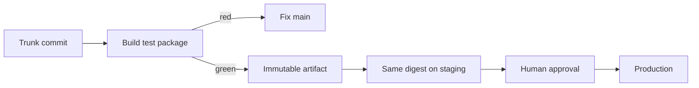

import { ConceptTemplate } from '@/features/kb/components/templates/ConceptTemplate'
import { Callout } from '@/features/kb/components/mdx/Callout'
import { ComparisonTable } from '@/features/kb/components/mdx/ComparisonTable'

export default function Layout({ children }) {
  return (
    <ConceptTemplate title="Continuous Delivery">
      {children}
    </ConceptTemplate>
  )
}

**Continuous Delivery** (Humble and Farley) means every change that lands on the trunk is **built, tested, and packaged** so it *could* go to production on demand. A human or a schedule may still press the last button. The sin it kills is "we cannot release this week because merge hell and a snowflake staging box."

## 1. Deep Dive and Mechanics

**Always releasable.** Main builds. Tests pass. Migrations are forward-safe. Feature flags hide unfinished UI. If main is not releasable, you stop feature work and restore the property.

**The deployment pipeline.** Commit → compile → unit → artifact → automated acceptance → optional performance → **manual prod approval**. That last box is what distinguishes Delivery from Deployment.

**Environments.** Staging is not a museum of hotfixes. It is fed the same artifact digest as prod will get. "Rebuild for prod" violates the pipeline.

**Release vs deploy.** You can **deploy** a binary to prod with a flag off (dark launch). You **release** when users get the behaviour. Delivery is about the artifact path; flags are about the product path.

**Governance.** Regulated teams often stop here: auditors want a named approver. The pipeline still proves what was tested; the approval is a recorded gate, not a tribal ritual on a war-room call.

<Callout icon="info" title="Delivery is a property of main">
If only release branches are releasable, you are doing staged integration, not Continuous Delivery. Trunk must be the product.
</Callout>

## 2. Mathematical / Theoretical Foundation

Delivery maximises **optionality**. At any time t you have an artifact A(t) with a known test verdict. Lead time to prod is then the approval wait, not rebuild time.

**Cost of delay.** Holding a releasable artifact still incurs inventory cost (features unseen, defects unseen). Delivery without frequent deploys is a parked car with a full tank — better than a car in pieces, worse than driving.

DORA: Delivery enables high **deployment frequency** even when a human gate exists, because the gate is cheap. If the gate includes a 3-day QA cycle, you have Continuous Integration plus a waterfall tail.

<ComparisonTable
  headers={['Question', 'Continuous Delivery', 'Continuous Deployment']}
  rows={[
    ['Is main releasable?', 'Yes', 'Yes'],
    ['Who ships to prod?', 'Human or schedule', 'The pipeline'],
    ['Typical extra control', 'Approval + change ticket', 'Flags + auto-canary'],
    ['Failure if abused', 'Queue of unshipped value', 'Auto-ship of weak tests'],
  ]}
/>

## 3. Real-World Implementation

```yaml
# Pipeline stops at a protected environment. A reviewer clicks Approve.
jobs:
  build:
    runs-on: ubuntu-latest
    steps:
      - uses: actions/checkout@v4
      - run: make test && make image
      - run: make push
  deploy_prod:
    needs: build
    environment: production
    runs-on: ubuntu-latest
    steps:
      - run: helm upgrade --install web ./chart --set image.tag=$IMAGE_DIGEST
```

The `environment: production` binding is the Delivery gate. Required reviewers live in the GitHub Environment settings, not in Slack folklore.

## 4. Visualizations



## 5. Interview Prep

**Q: How is Delivery different from CI?**
**A:** CI proves the integrated source builds and unit-tests. Delivery extends the pipeline through acceptance tests and a production-shaped artifact so release is not a project.

**Q: Can you do Delivery with weekly releases?**
**A:** Yes. Cadence is a product choice. The **ability** to release any green commit is the practice. Weekly trains that require a stabilization week are not Delivery.

**Q: Why the same artifact in every environment?**
**A:** Rebuilding introduces new inputs. You would be testing a different function than you ship.

## 6. Production Use Cases

- **Banks and health** that require a recorded production approver.
- **Mobile** where the store is an external gate but the backend stays on Delivery.
- **Enterprises** migrating off quarterly trains: first make every commit releasable, then raise frequency.

<Callout icon="tip" title="Time the approval, not just the build">
If approval waits average two days, you have a queueing problem. Shrink the risk of each artifact so approvers can say yes in minutes.
</Callout>
