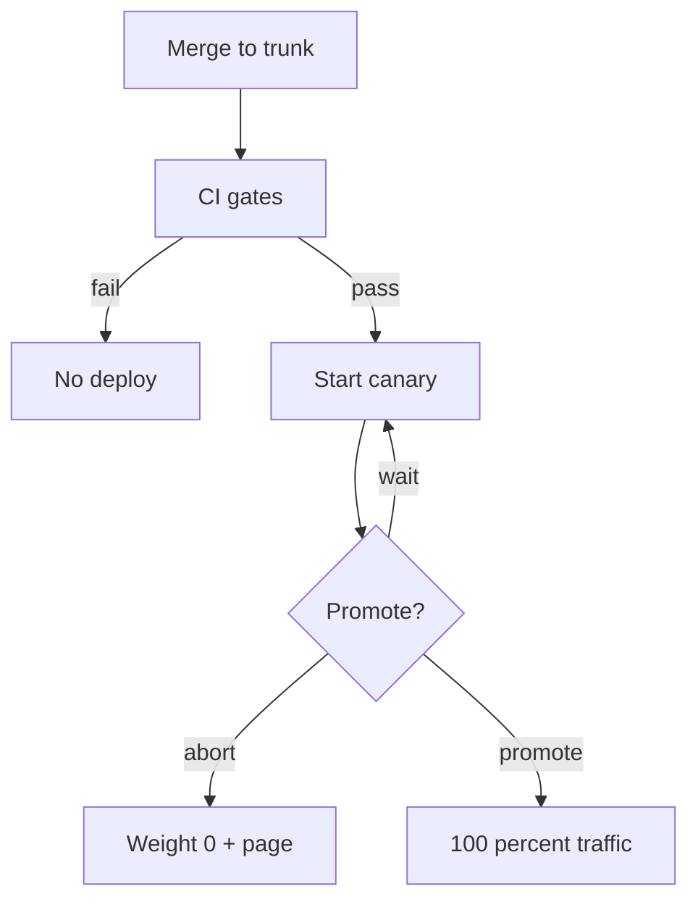

import { ConceptTemplate } from '@/features/kb/components/templates/ConceptTemplate'
import { Callout } from '@/features/kb/components/mdx/Callout'
import { ComparisonTable } from '@/features/kb/components/mdx/ComparisonTable'

export default function Layout({ children }) {
  return (
    <ConceptTemplate title="Continuous Deployment">
      {children}
    </ConceptTemplate>
  )
}

**Continuous Deployment** is Continuous Delivery **without the last human gate**. The production environment is just another pipeline stage. This page is the operational contract: what must be true before you delete the Approve button, and how you survive the first bad auto-ship.

## 1. Deep Dive and Mechanics

**Delete the ceremony, keep the evidence.** You still sign artifacts, still write SBOMs, still log who merged. You remove the wait. Auditors get the pipeline log; they do not get a weekly meeting.

**Progressive delivery.** Full-fleet `kubectl apply` on every commit is Continuous Deployment only in the letter. Serious shops canary, use mesh weights, or flag-ramp. The pipeline's "deploy" step starts a **controller**, not a hope.

**Incomplete work on main.** Trunk-based CD requires flags or dark launches. Merging behind a flag is a deploy of dead code paths; turning the flag on is the release.

**Data plane.** Auto-deploying an irreversible `DROP COLUMN` is how you get a headline. Expand/contract plus a hold on destructive steps (manual or delayed job) is still compatible with CD of **application** code.

**Ownership.** The author of the merge is on the hook. ChatOps "who shipped?" must be one query. Blame-free postmortems keep the page from becoming a punishment.

<Callout icon="error" title="No observability, no CD">
If you cannot see error rate and p99 within a minute of a ship, you will learn about failures from Twitter. Instrument first.
</Callout>

## 2. Mathematical / Theoretical Foundation

Let arrival of good commits be Poisson with rate λ. CD sets deploy rate ≈ λ. Batching k commits into one release makes blast-radius debugging a search over k, and rollback a coarse undo.

**Change-fail rate** q: expected failed deploys per day is λq. Acceptable only if MTTR is tiny. The product λq × MTTR is **unavailability from change**. CD teams invest in MTTR (revert, flag, traffic flip) as much as in q (tests).

**Feature-flag residual risk.** Flags have their own combinatorial explosion. CD without flag hygiene just moves the batch from Git to the flag service.

<ComparisonTable
  headers={['Control', 'Stops a bad ship?', 'Slows a good ship?']}
  rows={[
    ['Required CI', 'Yes, if tests catch it', 'By suite duration'],
    ['Canary analysis', 'Yes, after some live traffic', 'By soak time'],
    ['Feature flag', 'Yes, if wrapped', 'Only if default off'],
    ['Manual CAB', 'Sometimes', 'Always'],
  ]}
/>

## 3. Real-World Implementation

```python
def should_auto_promote(canary_err, baseline_err, n_canary, delta=0.002, min_n=500):
    if n_canary < min_n:
        return "wait"
    if canary_err > baseline_err + delta:
        return "abort"
    return "promote"
```

Wire this into the rollout controller. "Wait" is not a human meeting; it is more samples. "Abort" rolls weight to zero and opens an incident.

## 4. Visualizations



## 5. Interview Prep

**Q: When would you refuse CD?**
**A:** Irreversible hardware changes, store-reviewed clients, or a test suite that cannot detect your class of bug. Also when MTTR is hours because nobody can revert.

**Q: How do you CD database changes?**
**A:** Separate expand migrations (auto) from contract migrations (gated). App versions must run on both old and new schema during the overlap.

**Q: Is CD the same as no QA?**
**A:** No. QA moves left into automation, exploratory testing, and production checks. It does not vanish.

## 6. Production Use Cases

- **Multi-tenant SaaS** with independent services and mature flag platforms.
- **Internal developer platforms** that deploy thousands of micro-changes per day.
- **Experimentation stacks** where the expensive part is the idea, not the ship.

<Callout icon="tip" title="Practice reverts on a good day">
A revert pipeline you have never run will fail on a bad day. Schedule game-days that ship a deliberate no-op revert.
</Callout>
