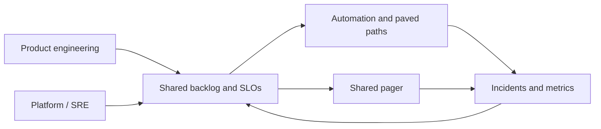

import { ConceptTemplate } from '@/features/kb/components/templates/ConceptTemplate'
import { Callout } from '@/features/kb/components/mdx/Callout'
import { ComparisonTable } from '@/features/kb/components/mdx/ComparisonTable'

export default function Layout({ children }) {
  return (
    <ConceptTemplate title="DevOps Culture">
      {children}
    </ConceptTemplate>
  )
}

**DevOps culture** is not a job title and not Jenkins. It is the organisational decision that **the people who build a system help run it**, and the people who run it have a voice in how it is built. The wall it tears down is the old split: Dev throws a tarball; Ops takes the pager and the blame.

## 1. Deep Dive and Mechanics

**Shared incentives.** If Dev is rewarded for features shipped and Ops for "no changes," you get warfare. Shared SLOs, shared roadmaps, and a common backlog for reliability work realign the game.

**You build it, you run it.** Amazon's formulation. The team that merges also gets the 3am page — or a well-designed escalation. That feedback loop is the mechanism, not a punishment.

**Automation as manners.** Manual handoffs (tickets to create a queue, tickets to open a firewall) encode distrust. Culture shows up as self-service platforms and paved roads, not as posters.

**Blameless learning.** Postmortems that hunt root causes in systems and incentives, not in people, keep reporting honest. A culture of blame produces silence and shadow IT.

**Small batches.** Culture and architecture couple: you cannot "be DevOps" on a quarterly monolith train with a change-advisory board of 20. Conway and DORA both apply.

<Callout icon="warning" title="Renaming Ops to DevOps changes nothing">
A silo with a new name still throws work over a wall. Look at who can deploy, who holds the pager, and who can say no to a feature in favour of toil reduction.
</Callout>

## 2. Mathematical / Theoretical Foundation

DORA's four keys (lead time, deploy frequency, change-fail rate, MTTR) are **empirical** correlates of culture and technical practice. Westrum's organisational typology (pathological / bureaucratic / generative) predicts information flow — and therefore incident learning.

**Toil budget.** SRE-style: if operational toil exceeds a fraction of time (classically ~50 percent), the system is under-automated and culture will rot into heroics. Treat toil as a backlog with the same dignity as features.

**Game theory.** When local optima differ (ship vs freeze), you need a repeated game with shared payoff — the SLO and the customer — not a one-shot "make the date."

<ComparisonTable
  headers={['Signal', 'Wall-of-confusion shop', 'DevOps-shaped shop']}
  rows={[
    ['Who deploys?', 'Release engineers on a ticket', 'The product team'],
    ['Who pages?', 'A central NOC only', 'Team plus follow-the-sun'],
    ['Change size', 'Monthly trains', 'Small, frequent'],
    ['Failure talk', 'Blame, secrecy', 'Blameless write-ups'],
  ]}
/>

## 3. Real-World Implementation

```markdown
## Team working agreement (excerpt)

- Trunk is releasable. A red main stops feature work.
- The author of a merge is primary on-call for 24 hours, with a secondary.
- Reliability work is at least 20 percent of each sprint capacity.
- Every SEV-1 gets a blameless doc within 5 business days.
- No production access by ticket if the paved path already exists.
```

Write this down. Culture that lives only in a founder's head dies at 40 people.

## 4. Visualizations



## 5. Interview Prep

**Q: Is DevOps a team?**
**A:** A platform team can **enable** DevOps. A team that monopolises deploys is the old Ops silo. The culture is cross-functional ownership.

**Q: How do you know the culture is working?**
**A:** DORA metrics trending well, time-to-provision measured in minutes, postmortems that change systems, and developers who can ship without a hidden priest.

**Q: What is the first lever if leadership only bought a CI logo?**
**A:** Give one product team deploy keys, a pager, and a reliability budget. Success stories spread faster than a centre-of-excellence slide.

## 6. Production Use Cases

- **Digital transformations** that stall on ticket-driven infra.
- **Scale-ups** crossing 30 engineers where informal heroics stop working.
- **Enterprises** adopting SRE alongside product teams rather than as a new wall.

<Callout icon="tip" title="Fund the paved road">
Culture talks are cheap. A golden path that makes the safe thing the easy thing is the actual intervention.
</Callout>
