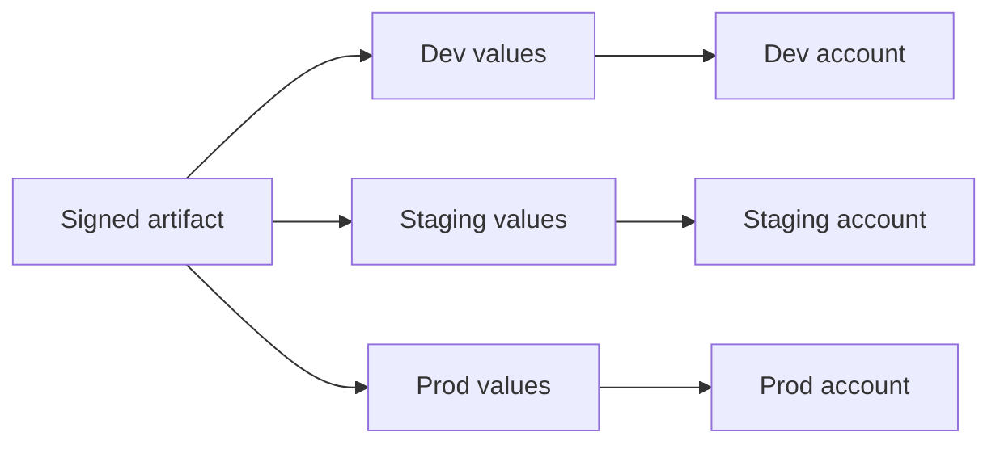

import { ConceptTemplate } from '@/features/kb/components/templates/ConceptTemplate'
import { Callout } from '@/features/kb/components/mdx/Callout'
import { ComparisonTable } from '@/features/kb/components/mdx/ComparisonTable'

export default function Layout({ children }) {
  return (
    <ConceptTemplate title="Environment Management">
      {children}
    </ConceptTemplate>
  )
}

**Environment management** is the discipline of **named, isolated runtimes** — typically Dev, CI, staging, production — each with a charter: who may write, what data is allowed, how config is injected, and how artifacts promote. Without it you get one muddy cluster, prod credentials on laptops, and "it passed in QA" on a box that looks nothing like prod.

## 1. Deep Dive and Mechanics

**Charter per tier.** Dev is disposable and noisy. CI is ephemeral and hermetic. Staging is production-like for acceptance. Prod is the SLO. Do not let staging become a second prod with real customers "just for this pilot."

**Parity.** Same topology, same limits, smaller N. Same artifact digest. Config differs (URLs, replica counts, log level), and that difference must be **declared** (Kustomize overlays, Helm values, Terraform workspaces) — not guessed.

**Data.** Prod data in lower tiers is a compliance incident unless anonymised. Prefer synthetic or subsetted, masked clones. Refresh jobs are part of the environment, not a hero with a dump file.

**Ephemeral environments.** Preview apps per PR (namespaces, Vercel previews, Terraform workspaces) shrink the "wait for staging" queue. They need TTL, cost caps, and seed data.

**Promotion.** Artifact moves; code is not rebuilt. Config is environment-scoped. Secrets never promote — they are bound per tier in a secret manager.

<Callout icon="error" title="Prod credentials in Dev">
A shared `.env` that works everywhere is how ransomware and leaked keys happen. Separate accounts, separate roles, separate keys.
</Callout>

## 2. Mathematical / Theoretical Foundation

Think of an environment as a tuple (artifact, config, secrets, data, network policy). **Parity** is a distance: topology match, version match, scale factor α. If α is too small, load-related bugs escape. If config drift is unbounded, the tuple is not a test of prod.

**Queues.** A single staging environment is an M/M/1 queue for acceptance. Arrival of PRs with service time of a QA cycle produces wait. Ephemeral envs move toward infinite servers and kill that queue — at dollar cost.

**Isolation.** Network policies and accounts are access-control lattices. "Same cluster, different namespace" is weaker isolation than "same cluster, different account" than "different org." Pick the lattice point that matches blast radius.

<ComparisonTable
  headers={['Tier', 'Lifespan', 'Data', 'Who deploys']}
  rows={[
    ['Local / Dev', 'Hours', 'Synthetic', 'Developer'],
    ['CI', 'Minutes', 'Fixtures', 'Pipeline'],
    ['Preview / staging', 'Hours to days', 'Masked subset', 'Pipeline + QA'],
    ['Production', 'Until next ship', 'Real', 'Pipeline or SRE'],
  ]}
/>

## 3. Real-World Implementation

```bash
# Same module, different tfvars per tier — not a fork of the stack.
# prod.tfvars
replicas=8
db_instance=db.r6g.xlarge

# staging.tfvars
replicas=2
db_instance=db.t4g.medium

terraform workspace select prod
terraform apply -var-file=prod.tfvars
```

One module, many workspaces or state keys. The scale and instance class are the declared differences — not a fork of the module.

## 4. Visualizations



## 5. Interview Prep

**Q: How many environments do you need?**
**A:** As few as you can while keeping prod-like validation and safe data. Three is common (dev, staging, prod). Twelve long-lived "QA-3-old" boxes are a smell.

**Q: Staging that is always broken — what now?**
**A:** Treat staging like a product with an SLO. If it is red, stop parking more work on it. Consider ephemeral previews so one team cannot brick everyone.

**Q: Terraform workspace versus separate state files?**
**A:** Workspaces are convenient and easy to mis-point. Separate states (or separate accounts) make blast radius obvious. Many shops prefer separate states.

## 6. Production Use Cases

- **Multi-account AWS** (org units for sdld / prod) with SCPs.
- **Kubernetes** with cluster-per-tier or namespace-plus-strict RBAC for previews.
- **Regulated** environments where data residency forces regional clones of the whole lattice.

<Callout icon="tip" title="Name the promotion contract">
Write "same digest, different values file" on the wall. Rebuilds and snowflake hotfixes are then visibly out of policy.
</Callout>
