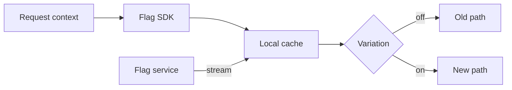

import { ConceptTemplate } from '@/features/kb/components/templates/ConceptTemplate'
import { Callout } from '@/features/kb/components/mdx/Callout'
import { ComparisonTable } from '@/features/kb/components/mdx/ComparisonTable'

export default function Layout({ children }) {
  return (
    <ConceptTemplate title="Feature Flags">
      {children}
    </ConceptTemplate>
  )
}

**Feature flags** (feature toggles) wrap a behaviour behind a **decision evaluated at runtime**. You can deploy code that is dark, open it to staff, then to 5 percent of users, then to everyone — or slam it off without rebuilding. Deploy becomes a technical event; release becomes a product event.

## 1. Deep Dive and Mechanics

**Types (Pete Hodgson).** Release toggles (short-lived, hide WIP). Experiment toggles (A/B). Ops toggles (kill switches, degraded modes). Permission toggles (entitlements). Mixing them in one boolean soup is how you get untestable combinatorics.

**Evaluation.** A flag service (LaunchDarkly, Unleash, ConfigCat, home-grown) takes context — user id, region, app version — and returns a variation. Clients should **cache with streaming updates**, not block a request on a 200ms HTTP call to the flag CDN on every eval.

**Targeting.** Percentage rollouts hash the user key so the same user is sticky. Attribute rules (email domain, plan) enable dogfood. Never use a flag as your only authorisation layer for a paid entitlement unless you treat the flag service as a security control.

**Lifecycle.** Flags are **inventory**. A merged flag without a removal ticket becomes permanent complexity. Age them; archive them; delete dead branches.

**Failure mode.** If the flag service is down, define fail-open versus fail-closed per flag. A checkout flag that defaults to "new unsaved cart" on timeout will page you.

<Callout icon="warning" title="Flags are not free abstractions">
Every flag doubles paths you should test. Ten independent booleans are 1024 worlds. Prefer short-lived release toggles and delete them.
</Callout>

## 2. Mathematical / Theoretical Foundation

A flag is a function f: Context → Variation. Percentage rollout uses hash(key) mod 100 compared to a threshold t. Sticky assignment requires a stable key; request-id hashing splits a session.

**Experimentation.** Assignment must be independent of the outcome metric. Interaction effects (two experiments on checkout) violate that unless you use orthogonal layers or a combined design.

**Debt.** Let n be live flags. Worst-case paths are 2^n if they nest independently. In practice they correlate, but QA still cannot cover the hypercube. Budget n aggressively.

<ComparisonTable
  headers={['Mechanism', 'When it changes', 'Granularity', 'Rollback']}
  rows={[
    ['Feature flag', 'Runtime eval', 'User, cohort, region', 'Flip off'],
    ['Canary deploy', 'Replica or weight', 'Request slice', 'Drop canary'],
    ['Branch deploy', 'Build of a branch', 'Whole env', 'Redeploy'],
    ['Config file in image', 'Next deploy', 'Process', 'Redeploy'],
  ]}
/>

## 3. Real-World Implementation

```python
def checkout_path(user_id: str, flags) -> str:
    ctx = dict(key=user_id, plan="pro")
    if flags.variation("checkout-v2", ctx, default=False):
        return "v2"
    return "v1"
```

Default is the safe old path. The flag name is namespaced. When v2 is 100 percent and soaked, delete the branch and the flag in the same sprint.

## 4. Visualizations



## 5. Interview Prep

**Q: Flag versus canary?**
**A:** A canary shifts traffic between **revisions**. A flag shifts behaviour **inside** a revision. Use both: canary the binary, flag the risky feature.

**Q: Where should flags not live?**
**A:** In a JSON file only a senior can edit on a Friday, or as an env var that requires a bounce. Those are config deploys, not flags.

**Q: How do you test flagged code?**
**A:** Unit-test both sides. Contract-test the default. In CI, run the suite with the new path forced on for the PR that introduces it.

## 6. Production Use Cases

- **Dark launches** of APIs before the mobile client is in the store.
- **Incident kill switches** that disable a recommendation model or a new cache.
- **Entitlements** (with a real authz backup) for plan-gated features.

<Callout icon="tip" title="Name flags like you will grep them">
`checkout-v2` plus an owner and an expiry date in the flag description. `tmp` and `new` are how you get 400 mystery booleans.
</Callout>
