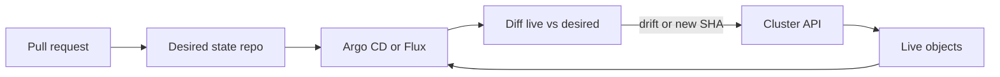

import { ConceptTemplate } from '@/features/kb/components/templates/ConceptTemplate'
import { Callout } from '@/features/kb/components/mdx/Callout'
import { ComparisonTable } from '@/features/kb/components/mdx/ComparisonTable'

export default function Layout({ children }) {
  return (
    <ConceptTemplate title="GitOps">
      {children}
    </ConceptTemplate>
  )
}

**GitOps** (Weaveworks) says: the **desired state** of the cluster lives in Git, declared as YAML or Helm or Kustomize. An in-cluster agent (Argo CD, Flux) **pulls**, diffs, and applies until reality matches. Humans do not kubectl-apply from laptops. A PR is the change-management interface.

## 1. Deep Dive and Mechanics

**Source of truth.** One or more repos: app manifests, cluster add-ons, maybe secrets as SOPS ciphertext. The agent's sync revision is an auditable SHA. If it is not in Git, it is not authorised.

**Reconcile loop.** Observe live objects → compare to desired → apply or prune → report health. This is the same control-loop idea as Kubernetes itself, one level up.

**Push CI versus pull GitOps.** CI that kubectl-applies at the end of a job is CD, but it is not GitOps. The cluster state can drift after the job exits. GitOps **continuously** corrects drift.

**App of apps.** A root Application points at a folder of Applications. That is how you bootstrap 80 microservices without 80 click-ops entries.

**Secrets.** Sealed Secrets, SOPS+age, External Secrets Operator. Plain Secret YAML in Git is a credential leak with extra steps.

**Break-glass.** Disaster recovery still needs a path (local apply, cluster API) when Git or the agent is down. Document it; log it; revert to Git after.

<Callout icon="warning" title="Two sources of truth fight">
If CI also applies and a human also applies, the agent will flap or overwrite. Pick Git as the winner or stop calling it GitOps.
</Callout>

## 2. Mathematical / Theoretical Foundation

Desired state D and live state L are objects in a configuration space. The reconciler implements a **feedback controller**: u = apply(D − L). Stability requires the apply to be idempotent and the diff to be well-defined (last-applied annotations, server-side apply field managers).

**Drift** is L changing without D: a human edit, a mutating webhook, a crash. The loop period τ bounds how long drift lives. Too small τ thrashes the API server; too large τ misses incidents.

**Convergence** can fail: admission webhooks reject, quotas, CRD missing. Health ≠ synced. GitOps dashboards exist because "applied" is not "working."

<ComparisonTable
  headers={['Model', 'Who applies', 'Drift correction', 'Audit trail']}
  rows={[
    ['GitOps pull', 'In-cluster agent', 'Continuous', 'Git SHA + agent log'],
    ['CI push', 'Pipeline job', 'Only at job time', 'Pipeline run'],
    ['Click-ops', 'Human console', 'None', 'Maybe CloudTrail'],
    ['CM push (Ansible)', 'Control node', 'When playbook runs', 'Git + run log'],
  ]}
/>

## 3. Real-World Implementation

```yaml
apiVersion: argoproj.io/v1alpha1
kind: Application
metadata:
  name: checkout
  namespace: argocd
spec:
  project: default
  source:
    repoURL: https://git.example.com/org/gitops.git
    targetRevision: main
    path: apps/checkout
  destination:
    server: https://kubernetes.default.svc
    namespace: checkout
  syncPolicy:
    automated:
      prune: true
      selfHeal: true
```

`selfHeal` is the GitOps punchline: laptop kubectl edits lose.

## 4. Visualizations



## 5. Interview Prep

**Q: Is GitOps only for Kubernetes?**
**A:** The pattern is general (desired state in Git + reconciler). Terraform Cloud / Atlantis are cousins for cloud APIs. The term is most associated with cluster controllers.

**Q: How do you handle secrets?**
**A:** Encrypt at rest in Git, decrypt in cluster, or keep material in a vault and store only references. Never commit raw tokens.

**Q: What if the desired state is wrong?**
**A:** GitOps will faithfully make the cluster wrong. Revert the commit. The agent is not a product-quality brain; it is a servo.

## 6. Production Use Cases

- **Multi-cluster** estates where every cluster pulls the same repo with different overlays.
- **Regulated** shops that need "who changed prod" to be a Git history, not a shared kubeconfig.
- **Platform teams** offering a golden Application CR as the self-service interface.

<Callout icon="tip" title="Separate app repo and cluster repo">
App teams write their Helm chart; the platform repo only references a version. Blast radius and review load stay sane.
</Callout>
