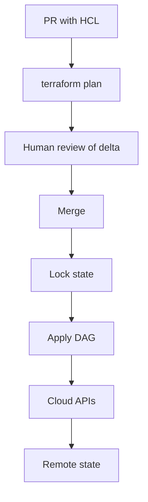

import { ConceptTemplate } from '@/features/kb/components/templates/ConceptTemplate'
import { Callout } from '@/features/kb/components/mdx/Callout'
import { ComparisonTable } from '@/features/kb/components/mdx/ComparisonTable'

export default function Layout({ children }) {
  return (
    <ConceptTemplate title="Infrastructure as Code (IaC)">
      {children}
    </ConceptTemplate>
  )
}

**Infrastructure as Code** manages cloud and datacenter resources through **reviewed, versioned definitions** — Terraform, Pulumi, CloudFormation, Bicep, Crossplane — instead of console clicking. The API is the same; the difference is that change has a diff, a PR, and a plan you can reason about.

## 1. Deep Dive and Mechanics

**Declarative versus imperative.** Terraform and CloudFormation describe the desired end state; the engine diffs against a **state file** or live API and issues creates/updates/deletes. Pulumi and CDK still compile to a graph, even if you wrote loops in TypeScript.

**State.** Terraform state is the memory of what this stack owns. Lose it and you double-create or cannot destroy. Store it remotely with lock (S3+Dynamo, Terraform Cloud, pg backend). Never commit it if it has secrets — and it often does.

**Plan then apply.** `terraform plan` is the preview; apply is the mutation. CI should run plan on PRs and apply on merge (Atlantis, Terraform Cloud, Spacelift). Unplanned apply is click-ops with extra steps.

**Modules.** Reuse a "vpc" or "service" module. Pin module versions. A module that does too much becomes an unreviewable god-object.

**Drift.** Someone changed a security group in the console. The next plan wants to revert it — or you refresh and import. Policy: Git wins, or you have two truths.

<Callout icon="error" title="State lock or double apply">
Two applies without a lock race on the same resource IDs. Use remote state with locking. Local state on a laptop is a outage story.
</Callout>

## 2. Mathematical / Theoretical Foundation

IaC engines build a **DAG** of resources (edges are implicit/explicit dependencies). Apply is a topological execution with parallelism bounded by the graph and the provider rate limits.

**Convergence.** Desired config C and remote state R. The provider computes a delta. Some updates are in-place; some are destroy-create (replacement). Replacement of a database is not a theoretical footnote — it is data loss if you mis-set `force_new`.

**Idempotence** of apply: a second apply with no drift should be empty. If it is not, you have a non-convergent resource (random names, missing lifecycle, eventual-consistency bugs).

<ComparisonTable
  headers={['Tool', 'Language', 'State', 'Sweet spot']}
  rows={[
    ['Terraform / OpenTofu', 'HCL', 'State file', 'Multi-cloud APIs'],
    ['Pulumi', 'General languages', 'State service', 'Complex logic, reuse'],
    ['CloudFormation / Bicep', 'YAML / Bicep', 'Stack in-cloud', 'Single cloud native'],
    ['Crossplane', 'K8s CRs', 'etcd / cluster', 'Kube-centric control'],
  ]}
/>

## 3. Real-World Implementation

```bash
# Equivalent end state declared in Terraform and applied from CI:
# aws_s3_bucket.artifacts plus versioning and public-access block.
terraform plan -out=tfplan
terraform apply -auto-approve tfplan
aws s3api get-bucket-versioning --bucket acme-ci-artifacts-prod
aws s3api get-public-access-block --bucket acme-ci-artifacts-prod
```

The reviewed plan is the contract. Apply that plan, then confirm versioning and the public-access block with the API — not a console checkbox you will forget on the second account.

## 4. Visualizations



## 5. Interview Prep

**Q: What lives in state versus in the provider?**
**A:** State remembers resource IDs and last-written attributes this stack manages. The provider talks to the live API. Refresh reconciles the two. Orphan resources in the cloud but not in state will not be destroyed by this stack.

**Q: How do you structure state?**
**A:** One state per blast radius (per account, per region, per app). A single global state file is a lock convoy and a catastrophic apply.

**Q: Terraform versus ClickOps plus export?**
**A:** Export is a snapshot. IaC is a process. Without the process, the next change is ClickOps again.

## 6. Production Use Cases

- **Greenfield cloud** accounts stood up from a module catalogue in an hour.
- **Disaster recovery** that is "apply the stack in another region," not "remember the console."
- **Policy as code** (Sentinel, OPA, Checkov) blocking public buckets at plan time.

<Callout icon="tip" title="Plan is a contract">
If apply diverges from the reviewed plan, stop and re-plan. Auto-approve of unexpected replacements is how databases vanish.
</Callout>
