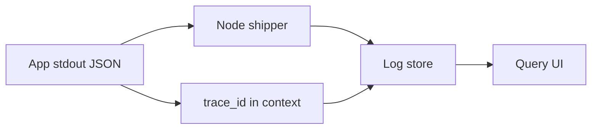

import { ConceptTemplate } from '@/features/kb/components/templates/ConceptTemplate'
import { Callout } from '@/features/kb/components/mdx/Callout'
import { ComparisonTable } from '@/features/kb/components/mdx/ComparisonTable'

export default function Layout({ children }) {
  return (
    <ConceptTemplate title="Logging">
      {children}
    </ConceptTemplate>
  )
}

**Logging** is the practice of writing **discrete events** — request received, payment declined, migration started — as durable records. Metrics tell you *that* error rate jumped. Logs (and traces) tell you *which* order id and *why*. In production, logs are a product: schema, volume, retention, and PII rules matter as much as the `info()` call.

## 1. Deep Dive and Mechanics

**Structure.** Prefer JSON (or logfmt) with stable keys: timestamp, level, service, env, trace_id, message, and a flat bag of context. Unstructured "printf debugging" is unqueryable at 10 TB/day.

**Context.** A log line without a request or trace id is a bottle in the ocean. Propagate W3C traceparent or B3. Inject user or tenant **hashes**, not raw emails, unless you have a legal basis and a redaction path.

**Levels.** DEBUG is not for prod by default. INFO is business-meaningful events. WARN is recoverable unexpected. ERROR is failed user-visible work. FATAL is process death. Using ERROR for routine 404s is how you train people to ignore ERROR.

**Pipeline.** App → stdout → node agent or sidecar → shipper (Fluent Bit, Vector) → broker or vendor (Loki, ELK, CloudWatch, Datadog). Backpressure: if the sink is down, drop or buffer — do not stall request threads on logging.

**Cardinality.** Logging a high-cardinality unique id as a **metric label** explodes time series. On logs it is fine; that is what logs are for. Know which signal you are writing.

<Callout icon="warning" title="PII and secrets in logs">
Tokens, session cookies, and card PANs in logs are breaches. Add deny-lists, structured redaction, and a "log review" in threat models. You cannot un-index a leak.
</Callout>

## 2. Mathematical / Theoretical Foundation

A log stream is a totally ordered (approximately) sequence of events e_i = (t_i, attrs). Reconstruction of a request is a **join** on trace_id or request_id. Clock skew means t_i is not globally comparable; rely on trace graphs, not raw timestamps, across hosts.

**Volume.** If each request writes k lines at QPS q, ingest is k·q lines/s. Cost is linear in retained bytes. Sampling (head, tail, or error-biased) is a statistical design: tail-based keep-all-on-error preserves the incidents you care about.

**Information.** A log that fires on every loop iteration has high entropy and low surprise. Budget lines per request.

<ComparisonTable
  headers={['Signal', 'What it answers', 'Cost shape', 'Query style']}
  rows={[
    ['Logs', 'What happened in this case', 'Bytes ingested and stored', 'Search and filter'],
    ['Metrics', 'How much / how fast overall', 'Time series cardinality', 'PromQL-style'],
    ['Traces', 'Where time went on a request', 'Span volume', 'Trace UI / TraceQL'],
  ]}
/>

## 3. Real-World Implementation

```python
import json, logging, sys

class JsonFormatter(logging.Formatter):
    def format(self, record):
        payload = dict(
            ts=self.formatTime(record),
            level=record.levelname,
            msg=record.getMessage(),
            service="checkout",
        )
        if hasattr(record, "trace_id"):
            payload["trace_id"] = record.trace_id
        return json.dumps(payload)

log = logging.getLogger("checkout")
h = logging.StreamHandler(sys.stdout)
h.setFormatter(JsonFormatter())
log.addHandler(h)
```

Emit one JSON object per line to stdout. Let the platform ship it. Do not open random syslog sockets from app code if you can avoid it.

## 4. Visualizations



## 5. Interview Prep

**Q: Why structured logs?**
**A:** You can index fields, alert on them, and join to traces. Regex over prose does not survive schema change or volume.

**Q: Logs versus metrics for alerting?**
**A:** Alert on metrics (cheap, bounded). Use logs to diagnose. Log-based alerts on high-volume strings are expensive and flaky.

**Q: How long do you retain?**
**A:** Hot search for 7–30 days is common; cheap object storage longer for compliance. Know your regulation before you delete — or before you keep PII forever.

## 6. Production Use Cases

- **Incident reconstruction** with a request id from a support ticket.
- **Audit trails** (who changed what) as append-only structured events.
- **Security detections** (failed auth bursts) streamed into a SIEM.

<Callout icon="tip" title="Log the decision, not the noise">
"Discount applied: reason=loyalty" is gold. "Entered function calculateDiscount" 40 times is landfill.
</Callout>
