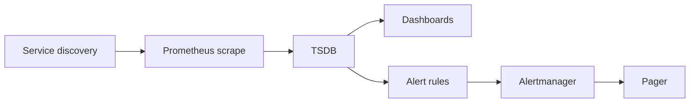

import { ConceptTemplate } from '@/features/kb/components/templates/ConceptTemplate'
import { Callout } from '@/features/kb/components/mdx/Callout'
import { ComparisonTable } from '@/features/kb/components/mdx/ComparisonTable'

export default function Layout({ children }) {
  return (
    <ConceptTemplate title="Monitoring">
      {children}
    </ConceptTemplate>
  )
}

**Monitoring** is the closed loop of **measure → visualise → alert → respond**. You scrape or push numeric series (QPS, error ratio, CPU, queue depth), chart them, and page a human when a rule fires. It answers "is it broken?" for **known** failure modes. Observability extends this to questions you did not write a dashboard for.

## 1. Deep Dive and Mechanics

**Golden signals (Google SRE).** Latency, traffic, errors, saturation. Four well-chosen series beat 400 host plots nobody watches.

**Collection.** Prometheus scrape (pull) versus DogStatsD / OTLP push. Pull makes the monitor the active party and simplifies targets via service discovery. Push fits short-lived jobs (then use a Pushgateway or OTel).

**Labels.** A metric name plus a label set is a time series. `user_id` as a label is a cardinality bomb. Keep labels low-cardinality: env, region, version, endpoint *class*.

**Alerting.** Alert on **symptoms** (user-facing error rate) more than causes (CPU). Causes are for dashboards after the page. Use burn-rate alerts on SLOs (see SRE) instead of naive "CPU greater than 80 percent" pages that cry wolf.

**Staleness.** A missing series is a signal. `absent()` rules catch dead exporters. Dashboards that show the last happy value forever hide outages.

<Callout icon="info" title="Monitoring assumes you knew what to measure">
A new deadlock in an un-instrumented lock will not appear on the CPU graph until saturation. That gap is why you also want traces and logs.
</Callout>

## 2. Mathematical / Theoretical Foundation

A metric is a function m(t) sampled at interval Δ. Counters are monotonic; you alert on **rate** (derivative). Histograms approximate a distribution; quantiles from histograms are biased if buckets are wrong.

**Alert quality.** Precision = true pages / all pages. Recall = true pages / all incidents. A threshold that maximises neither is typical. SLO burn-rate uses error budget math to keep precision usable.

**Cardinality.** Series count ≈ product of label value counts. Memory of a TSDB is roughly linear in active series. This is the real quota, not "number of metric names."

<ComparisonTable
  headers={['Approach', 'Strength', 'Weakness']}
  rows={[
    ['Host metrics only', 'Easy to start', 'Misses user pain'],
    ['Golden signals', 'Pages on symptoms', 'Needs request metrics'],
    ['SLO burn-rate', 'Ties alerts to budget', 'Needs a real SLO'],
    ['Check-list ping', 'Simple up/down', 'Blind to brownouts'],
  ]}
/>

## 3. Real-World Implementation

```yaml
groups:
  - name: checkout
    rules:
      - alert: CheckoutErrorBudgetBurn
        expr: |
          (
            sum(rate(checkout_http_5xx_total[5m]))
            /
            sum(rate(checkout_http_requests_total[5m]))
          ) > 0.02
        for: 10m
        labels:
          severity: page
        annotations:
          summary: Checkout 5xx ratio above 2 percent for 10 minutes
```

Tune the threshold to your SLO, not to a blog post. The `for` clause is hysteresis against blips.

## 4. Visualizations



## 5. Interview Prep

**Q: Pull versus push metrics?**
**A:** Pull (Prometheus) gives a central view of what should exist and easy up/down via scrape fail. Push fits ephemeral workers and some vendor agents. Many shops do both.

**Q: Why not alert on CPU?**
**A:** CPU is a cause candidate. Users feel latency and errors. High CPU with healthy SLIs is a capacity ticket, not a 3am page.

**Q: What is a cardinality explosion?**
**A:** Unbounded label values create millions of series, OOMing the TSDB and slowing queries. Never label with raw IDs.

## 6. Production Use Cases

- **24/7 pages** on user-facing SLIs for a checkout API.
- **Capacity** planning from saturation series (memory headroom, thread pools).
- **Black-box** probes (synthetic login) as an outside-in complement to in-process metrics.

<Callout icon="tip" title="Page people, ticket graphs">
If nobody will wake up for it, it is not a page. Put the rest on a ticket or a Slack channel with a daytime SLO.
</Callout>
