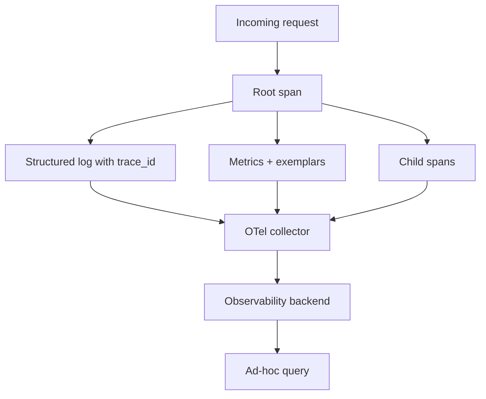

import { ConceptTemplate } from '@/features/kb/components/templates/ConceptTemplate'
import { Callout } from '@/features/kb/components/mdx/Callout'
import { ComparisonTable } from '@/features/kb/components/mdx/ComparisonTable'

export default function Layout({ children }) {
  return (
    <ConceptTemplate title="Observability">
      {children}
    </ConceptTemplate>
  )
}

**Observability** (from control theory, popularised for software by Charity Majors and others) is whether you can ask **new questions** of a running system without shipping new instrumentation first. Monitoring watches known unknowns. Observability aims at unknown unknowns: a weird customer, a new deadlock, a bad canary that only hits one tenant.

## 1. Deep Dive and Mechanics

**Three pillars is a starting kit, not a religion.** Metrics: cheap aggregates. Logs: discrete events. Traces: causal graphs of spans across services. The join key is **trace_id** (and increasingly exemplar links from metrics to traces).

**High cardinality.** Observability systems (Honeycomb-style wide events) keep fields like tenant, build SHA, and endpoint on each event so you can break down *after* the fact. That is the opposite of Prometheus label discipline — different store, different cost model.

**Wide events.** One structured event per request with enough dimensions beats three disconnected pillars you cannot join. OpenTelemetry is the current lingua franca for producing those signals.

**Sampling.** Head-based sampling is simple and biased toward volume. Tail-based keeps slow and error traces. You cannot store 100 percent of spans at FAANG scale without a budget story.

**Culture.** Pretty UIs do not make a system observable if on-call is afraid to query or if services emit only `INFO started`. Instrumentation is part of the definition of done.

<Callout icon="info" title="Control-theory origin">
A system is observable if the state can be reconstructed from outputs. In software, "state" is messy and infinite. We mean: can a skilled human explain a novel failure from stored telemetry?
</Callout>

## 2. Mathematical / Theoretical Foundation

In linear control theory, observability is rank of the observability matrix. Software borrows the **metaphor**: outputs y(t) should distinguish states x(t) of interest.

**Dimensionality.** A wide event is a point in a high-dimensional space. Incident debug is slicing that space (filter tenant=acme, then p99, then a trace). If the dimensions were never recorded, the slice does not exist.

**Sampling bias.** Let p be keep-probability. Rare errors with rate r have expected kept count λ = r·p·T. If λ ≪ 1 per incident window, you will not see them. Error-aware sampling raises p when status is 5xx.

<ComparisonTable
  headers={['Practice', 'Question it answers', 'Blind spot']}
  rows={[
    ['Monitoring', 'Is a known SLI burning?', 'Novel failure modes'],
    ['Logging', 'What did this instance say?', 'Causality across hops'],
    ['Tracing', 'Where did this request spend time?', 'Work with no request context'],
    ['Wide-event analytics', 'Which dimension correlates?', 'Cost at full fidelity'],
  ]}
/>

## 3. Real-World Implementation

```python
from opentelemetry import trace

tracer = trace.get_tracer("checkout")

def pay(order_id: str, tenant: str):
    with tracer.start_as_current_span("pay") as span:
        span.set_attribute("order.id", order_id)
        span.set_attribute("tenant", tenant)
        span.set_attribute("build.sha", "abc123")
        charge_bank()
```

Attributes on the span are the dimensions you will slice later. Omit secrets. Include the build SHA so a bad deploy is a filter, not a guess.

## 4. Visualizations



## 5. Interview Prep

**Q: Observability versus monitoring?**
**A:** Monitoring: predefined checks and dashboards. Observability: enough rich context to investigate issues you did not anticipate. You need both; they are not synonyms.

**Q: Do you need all three pillars?**
**A:** You need a way to aggregate, a way to see a single case, and a way to see causality. That often is metrics + logs + traces, or wide events that can derive the others.

**Q: What do you instrument first?**
**A:** Edge request path: route, status, latency, tenant, version. Then dependencies (DB, HTTP clients). Then business events (payment captured).

## 6. Production Use Cases

- **Microservice** estates where a 5xx is a graph, not a single process.
- **Multi-tenant SaaS** debugging "only customer X is slow."
- **Canary analysis** that slices errors by version and by endpoint, not just a global rate.

<Callout icon="tip" title="Put a trace link in the error page">
Support and on-call should copy a trace id, not a screenshot of a spinner. That one field pays for a lot of vendor spend.
</Callout>
