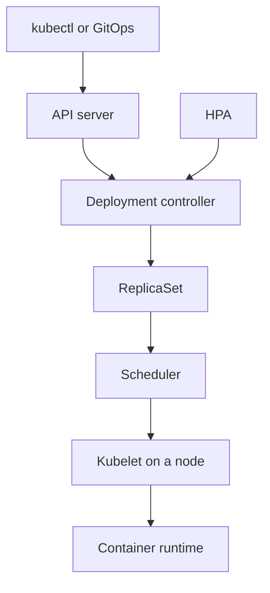

import { ConceptTemplate } from '@/features/kb/components/templates/ConceptTemplate'
import { Callout } from '@/features/kb/components/mdx/Callout'
import { ComparisonTable } from '@/features/kb/components/mdx/ComparisonTable'

export default function Layout({ children }) {
  return (
    <ConceptTemplate title="Orchestration">
      {children}
    </ConceptTemplate>
  )
}

**Orchestration** is the control plane that takes a **desired count and shape** of workloads and makes a cluster of machines comply: schedule, restart, roll out, scale, and network them. Kubernetes is the default conversation. Nomad, ECS, and Swarm are the same idea with different APIs. This is not a Dockerfile — that is packaging. Orchestration is **fleet behaviour**.

## 1. Deep Dive and Mechanics

**Desired state.** You say "3 replicas of checkout, 512Mi, these probes." The orchestrator notices 2 and starts a third. You do not SSH to pick a host.

**Scheduling.** A bin-pack or spread algorithm: filters (disk, taints, affinity) then scores (least loaded, topology spread). Bad constraints produce Pending pods and a false sense of capacity.

**Reconciliation.** Controllers watch the API: ReplicaSet, Deployment, Job. Each is a loop: observe, diff, act. Orchestration **is** a pile of these loops.

**Rollouts.** Deployments surge or max-unavailable. Combined with readiness probes, this is a rolling update. Without probes, you roll out deaths.

**Service discovery and networking.** Names, kube-proxy or eBPF, Ingress / Gateway. The app should not hardcode peer IPs.

**Self-healing.** Dead proc → restart. Dead node → reschedule (if the workload is stateless or has a volume that can move). StatefulSets and operators extend the model to data planes.

<Callout icon="warning" title="Orchestrators do not understand your data">
Kubernetes will happily evict a pod whose "stateless" label was a lie. PersistentVolume claims, PodDisruptionBudgets, and backup are your job.
</Callout>

## 2. Mathematical / Theoretical Foundation

Scheduling is **online bin packing** with constraints: items (pods) with vector size (cpu, mem, gpu) into bins (nodes). Optimal packing is NP-hard; production schedulers use heuristics and sometimes deschedulers to fix packing over time.

**Control loops** are discrete-time feedback: error e = desired − actual, action proportional to e (start or stop n replicas). Stability fails if loops fight (HPA vs Cluster Autoscaler vs a human kubectl scale).

**Availability.** With n replicas and independent node fail probability p, naive unavailability is p^n only if they land on different failure domains. Topology spread is how you approach that independence.

<ComparisonTable
  headers={['System', 'Unit', 'Strength', 'Typical home']}
  rows={[
    ['Kubernetes', 'Pod', 'Ecosystem, CRDs', 'Most cloud-native'],
    ['Nomad', 'Task group', 'Simple, multi-workload', 'Hashi stacks'],
    ['ECS', 'Task', 'AWS-native IAM', 'AWS-only shops'],
    ['Swarm', 'Service', 'Low ceremony', 'Small Docker estates'],
  ]}
/>

## 3. Real-World Implementation

```yaml
apiVersion: apps/v1
kind: Deployment
metadata:
  name: checkout
spec:
  replicas: 3
  selector:
    matchLabels:
      app: checkout
  template:
    metadata:
      labels:
        app: checkout
    spec:
      containers:
        - name: app
          image: ghcr.io/acme/checkout:abc123
          resources:
            requests:
              cpu: "100m"
              memory: 256Mi
          readinessProbe:
            httpGet:
              path: /healthz
              port: 8080
```

The readiness probe is what makes orchestration safe: the Service will not send traffic until the process can serve.

## 4. Visualizations



## 5. Interview Prep

**Q: Containerisation versus orchestration?**
**A:** Containers package a process. Orchestration places and maintains many of them. You can run Docker on one VM without an orchestrator; you should not pretend that is a fleet strategy.

**Q: What does Pending mean?**
**A:** The scheduler found no node that satisfies requests, taints, and affinities. It is usually capacity or a constraint bug, not "Kubernetes is slow."

**Q: Why requests and limits?**
**A:** Requests are what the scheduler bins on. Limits cap usage (CPU throttle, memory OOM). Requests=0 overcommits until the node falls over.

## 6. Production Use Cases

- **Microservice platforms** with hundreds of Deployments and a shared mesh.
- **Batch** (Jobs, CronJobs, Spark on K8s) next to serving on the same cluster.
- **Multi-tenant** platforms using namespaces, quotas, and NetworkPolicies as the isolation story.

<Callout icon="tip" title="PDB before the first drain">
Cluster upgrades drain nodes. A PodDisruptionBudget of minAvailable=2 is how you survive the upgrade you scheduled for Tuesday.
</Callout>
