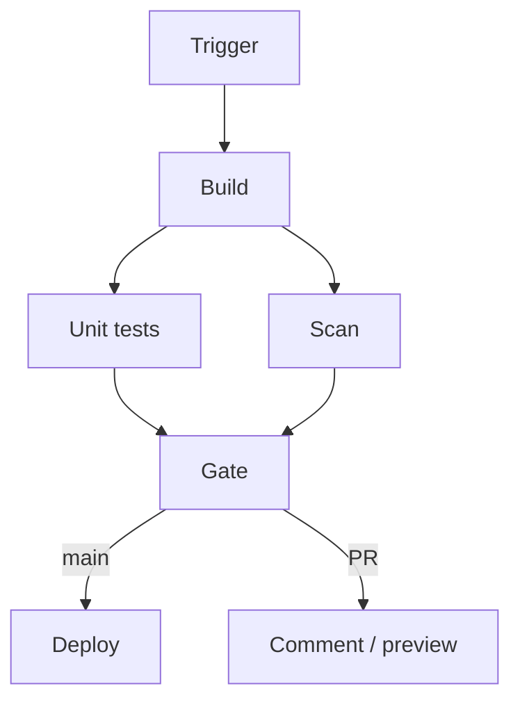

import { ConceptTemplate } from '@/features/kb/components/templates/ConceptTemplate'
import { Callout } from '@/features/kb/components/mdx/Callout'
import { ComparisonTable } from '@/features/kb/components/mdx/ComparisonTable'

export default function Layout({ children }) {
  return (
    <ConceptTemplate title="CI/CD Pipelines">
      {children}
    </ConceptTemplate>
  )
}

A **CI/CD pipeline** is the **directed graph of automated stages** a change must pass: checkout, build, unit test, security scan, package, maybe deploy. It is the machine-readable definition of your quality bar. YAML in GitHub Actions, Jenkinsfiles, GitLab CI, Tekton — different syntax, same idea: **gates with artifacts flowing downhill**.

## 1. Deep Dive and Mechanics

**Stages and jobs.** Stages are usually ordered (test before deploy). Jobs inside a stage may parallelise (lint || unit || typecheck). The graph should be explicit: deploy **needs** the image digest from build, not a race on `latest`.

**Triggers.** Push, PR, tag, schedule, manual. PR pipelines must not deploy prod. Tag pipelines often mean "release." Schedule pipelines catch bit-rot (base-image CVEs).

**Artifacts.** Pass digests, SBOMs, coverage reports via the system's artifact store. Do not rebuild in the deploy job "to be sure" — that breaks provenance.

**Secrets.** OIDC to cloud roles beats long-lived keys in the secret store. Least privilege per job: the lint job does not need prod AWS.

**Reusable pipelines.** Org-level workflows and templates keep 80 services from inventing 80 security holes. Leave an escape hatch or teams will fork and drift.

<Callout icon="error" title="Unpinned actions and images">
`uses: some-action@main` is remote code execution that moves. Pin by SHA. Same for `FROM ubuntu:latest` inside pipeline Docker builds.
</Callout>

## 2. Mathematical / Theoretical Foundation

A pipeline is a **DAG** G=(V,E) with jobs as vertices. Makespan on p agents is a scheduling problem; critical path length L is a lower bound on wall time. Parallelise off the critical path (tests, not "docker push then deploy").

**Fan-out/fan-in.** Test shards are a map-reduce: time ≈ setup + (n tests)/s + merge. Diminishing returns when setup dominates.

**Reliability.** If each of k independent required jobs has flake rate f, P(pipeline green | code good) ≈ (1−f)^k. Many small flaky jobs destroy the gate even if each looks "only 1 percent."

<ComparisonTable
  headers={['Style', 'How you write it', 'Strength', 'Pain']}
  rows={[
    ['YAML on PR (GHA, GitLab)', 'Declarative jobs', 'Low ops', 'Complex graphs get messy'],
    ['Jenkinsfile', 'Groovy / declarative', 'Plugins, anything', 'Snowflakes, Groovy debt'],
    ['Tekton / Argo Workflows', 'K8s CRDs', 'In-cluster, reusable Tasks', 'YAML weight'],
    ['Buildkite steps', 'Pipeline as code + agents', 'You own the metal', 'You own the metal'],
  ]}
/>

## 3. Real-World Implementation

```yaml
jobs:
  build:
    runs-on: ubuntu-latest
    steps:
      - uses: actions/checkout@v4
      - run: make publish > digest.txt
  test:
    needs: build
    runs-on: ubuntu-latest
    steps:
      - run: make test
  deploy:
    needs:
      - build
      - test
    if: github.ref == 'refs/heads/main'
    steps:
      - run: helm upgrade --install web ./chart --set image.digest=$DIGEST
```

The deploy job consumes the **output digest**, not a floating tag. That edge in the DAG is the supply-chain.

## 4. Visualizations



## 5. Interview Prep

**Q: Pipeline versus script?**
**A:** A script can build. A pipeline adds triggers, isolation, secrets, artifact passing, status checks, and an audit log. If it only runs on your laptop, it is not a pipeline.

**Q: How do you keep pipelines fast?**
**A:** Cache deps, shard tests, skip unaffected paths, and stop serialising independent jobs. Do not delete security scans to win a stopwatch.

**Q: Branch pipelines versus trunk?**
**A:** PR pipelines protect main. Trunk pipelines release. Mixing prod deploy into every branch workflow is how you ship a feature branch to customers.

## 6. Production Use Cases

- **Monorepo** pipelines that compute affected packages and run a subgraph.
- **Release** pipelines on semver tags that also cut a changelog and an SBOM.
- **Compliance** pipelines that refuse merge without license and CVE policy.

<Callout icon="tip" title="One digest all the way down">
Build once. Sign once. Deploy that digest to staging and prod. Rebuilds are new, untested artifacts.
</Callout>
