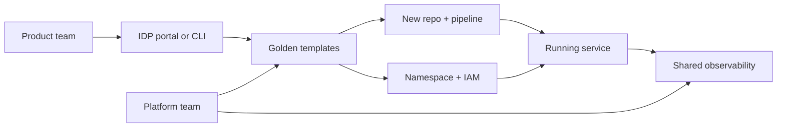

import { ConceptTemplate } from '@/features/kb/components/templates/ConceptTemplate'
import { Callout } from '@/features/kb/components/mdx/Callout'
import { ComparisonTable } from '@/features/kb/components/mdx/ComparisonTable'

export default function Layout({ children }) {
  return (
    <ConceptTemplate title="Platform Engineering">
      {children}
    </ConceptTemplate>
  )
}

**Platform engineering** treats the internal cloud path as a **product**. The users are other engineers. The artefact is an Internal Developer Platform (IDP): golden templates, a service catalogue, CI/CD defaults, observability baked in, and a support channel with an SLO. The goal is lower **cognitive load**, not a new ticket queue branded as "enablement."

## 1. Deep Dive and Mechanics

**Paved road.** The happy path (one language, one deploy shape, one metric stack) is boring and fast. Desire paths (special snowflakes) are allowed but cost the product team the maintenance. Tax evasion should be harder than paying.

**Self-service.** A portal (Backstage) or a CLI that spins a repo, a pipeline, a namespace, and a dashboard from a template. If the first deploy still needs a 45-minute Zoom with the platform team, you built a concierge, not a platform.

**Thin platform.** You do not wrap every AWS API. You pick the 20 percent of capabilities 80 percent of services need. Escape hatches (raw IAM with review) prevent shadow IT.

**Team API.** The platform team has customers, a roadmap, and satisfaction scores. "No" is a product decision with an alternative, not a power trip.

**Toil.** If the platform team is the bottleneck for every DNS record, the product failed. Automate the request or give teams a safe primitive.

<Callout icon="warning" title="A portal without a road is a directory of pain">
Backstage that only lists 200 half-broken services is a wiki. The value is the templates and the guarantees behind the buttons.
</Callout>

## 2. Mathematical / Theoretical Foundation

Cognitive load (Sweller) is the scarce resource. Every extra choice — which ingress, which mesh, which secret store — is germane or extraneous load. The platform maximises **germane** load (the domain) by collapsing extraneous load (the cloud).

**Economy of scale.** Cost of a capability (CI cache, SSO, vuln gate) amortised over n teams is O(1/n) per team if the platform owns it, versus O(1) if each team rebuilds it.

**Queueing.** A central Ops queue is an M/M/1 with terrible wait. Self-service is infinite-server for the common case. The platform's own support queue should only see the tail.

<ComparisonTable
  headers={['Model', 'Who provisions', 'Failure mode']}
  rows={[
    ['Ticket Ops', 'Central team by hand', 'Weeks of wait, heroics'],
    ['DevOps in each team', 'Every team learns AWS', 'N snowflakes, N pages'],
    ['Platform + paved road', 'Self-serve templates', 'Over-abstracted leaky wrappers'],
    ['Public PaaS only', 'Heroku-style', 'Escape hatch missing'],
  ]}
/>

## 3. Real-World Implementation

```yaml
# Backstage software template skeleton (parameters only)
apiVersion: scaffolder.backstage.io/v1beta3
kind: Template
metadata:
  name: service-golden-path
spec:
  parameters:
    - title: New service
      properties:
        name:
          type: string
        owner:
          type: string
  steps:
    - id: fetch
      name: Fetch golden repo
      action: fetch:template
    - id: publish
      name: Publish and open PR
      action: publish:github
```

The template's real value is what it includes: Dockerfile, CI workflow, SLO dashboard, and a CODEOWNERS file — not the wizard chrome.

## 4. Visualizations



## 5. Interview Prep

**Q: Platform engineering versus SRE versus DevOps?**
**A:** DevOps is the culture. SRE is reliability as engineering, often with SLOs and error budgets. Platform engineering **sells a product** (the IDP) that makes the DevOps path the default.

**Q: How do you measure a platform?**
**A:** Time-to-first-deploy, percent of services on the golden path, ticket volume per service, and developer satisfaction. Vanity (number of plugins) is not a metric.

**Q: When is a platform premature?**
**A:** Five engineers on one monolith do not need Backstage. They need a working pipeline. Start a platform when copy-paste of infra is already hurting.

## 6. Production Use Cases

- **Scale-ups** crossing 15–20 services where every team reinvented CI.
- **Enterprises** replacing a 6-week environment request with a 15-minute template.
- **Multi-cloud** companies that still want one mental model for deploy and observe.

<Callout icon="tip" title="Dogfood the road">
The platform team should ship their own tools on the same templates. Pain they do not feel will not get fixed.
</Callout>
