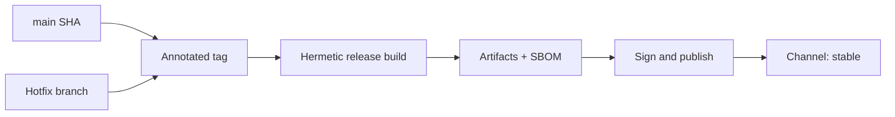

import { ConceptTemplate } from '@/features/kb/components/templates/ConceptTemplate'
import { Callout } from '@/features/kb/components/mdx/Callout'
import { ComparisonTable } from '@/features/kb/components/mdx/ComparisonTable'

export default function Layout({ children }) {
  return (
    <ConceptTemplate title="Release Engineering">
      {children}
    </ConceptTemplate>
  )
}

**Release engineering** is the software engineering of **shipping**: version numbers, changelogs, signed artifacts, compatibility promises, and the machinery that does this the same way at 3am as at noon. At Google it is a named role. Everywhere else it is the work that, if neglected, becomes a tribal wizard with a USB stick.

## 1. Deep Dive and Mechanics

**Reproducible release.** Same commit → same bits (see Build automation). The release engineer refuses "I compiled it on the release laptop."

**Versioning.** Semver, CalVer, or commit SHA. Semver is a **compatibility contract** (MAJOR breaking, MINOR compatible, PATCH fix). Lying about MAJOR is how you poison Dependabot.

**Notes and provenance.** Automated changelog from conventional commits or PR labels. SLSA provenance and SBOM attached to the GitHub Release or the registry. Humans still write the "why this matters" paragraph.

**Channels.** alpha / beta / stable, or nightly / release. Promotion copies or retags a digest; it does not rebuild. Mobile and browsers add store review as an extra channel.

**Freeze and trains.** Some orgs still run trains. Release engineering's job is to make the train boring: cut, soak, promote — not to hand-edit tarballs.

**Hotfix.** A process to ship a single cherry-pick to a maintained line without dragging half of main. Document it or you will invent it during an incident.

<Callout icon="info" title="Release is a product surface">
Customers see version numbers and notes. A dump of 80 ticket ids is not a release note. Map commits to user-visible change.
</Callout>

## 2. Mathematical / Theoretical Foundation

A release is a labelled point on the Git DAG plus a set of artifacts. **Monotonic versions** let clients write range constraints. Semver ranges are intervals on N^3 with a compatibility relation.

**Support matrix.** Maintaining k release lines costs roughly k times the backport and CI load. The support policy (N-2, LTS) is an economic choice, not a moral one.

**Reproducibility** is functional equality of the build map B(commit, toolchain). Release engineering's job is to freeze the domain of B and to publish the pair (version, digest).

<ComparisonTable
  headers={['Style', 'Version signal', 'Who cuts', 'Risk']}
  rows={[
    ['Continuous SHA deploys', 'Git SHA', 'Pipeline', 'Hard for humans to name'],
    ['Semver library', 'MAJOR.MINOR.PATCH', 'Maintainer or bot', 'False MAJOR / silent break'],
    ['Release train', 'Train date + patch', 'Release engineer', 'Batching, freeze politics'],
    ['Store binary', 'Build number', 'Store + pipeline', 'Review delay'],
  ]}
/>

## 3. Real-World Implementation

```bash
#!/usr/bin/env bash
set -euo pipefail
VERSION="$1"
git tag -a "v$VERSION" -m "Release $VERSION"
git push origin "v$VERSION"
gh release create "v$VERSION" --generate-notes dist/*.tar.gz
cosign sign --yes "ghcr.io/acme/web:$VERSION"
```

Tag is the input. Notes, tarball, and signature are outputs of the same SHA. Do not retag v1.2.3 to a different commit; cut v1.2.4.

## 4. Visualizations



## 5. Interview Prep

**Q: Release engineering versus CD?**
**A:** CD automates promotion of app services. Release engineering also owns version policy, multi-line support, client compatibility, and the public artefact story. Overlap is large; the mindset is "this must be explainable in five years."

**Q: Why annotated tags?**
**A:** They store a message, tagger, and are first-class objects. Lightweight tags are just a ref. Releases should be objects you can GPG-sign.

**Q: How do you hotfix 1.4 while main is 2.0?**
**A:** Branch from the 1.4 tag, cherry-pick the fix, run the 1.4 pipeline, tag 1.4.1. Do not ship a 2.x binary as a 1.4.1.

## 6. Production Use Cases

- **Languages and SDKs** with semver and multiple supported majors.
- **On-prem appliances** that customers will not auto-update.
- **Open source** GitHub Releases that downstream packagers consume.

<Callout icon="tip" title="Never move a published tag">
Downstream caches the SHA. Moving v1.2.3 is a supply-chain attack on your own users, even if you "meant well."
</Callout>
