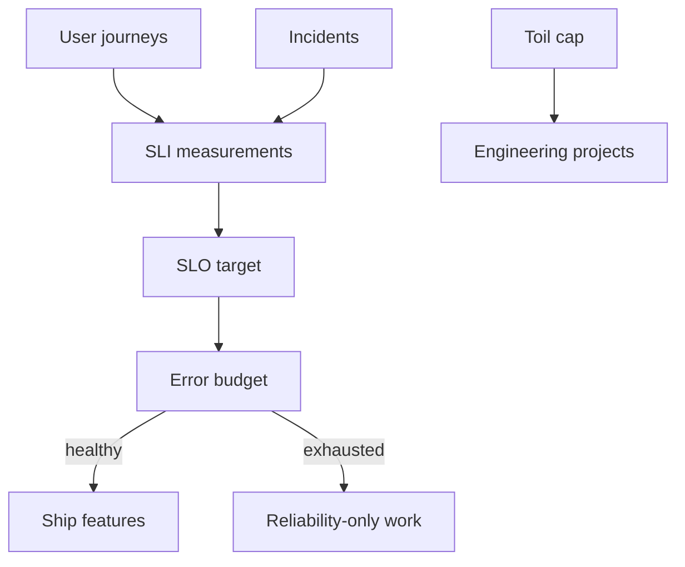

import { ConceptTemplate } from '@/features/kb/components/templates/ConceptTemplate'
import { Callout } from '@/features/kb/components/mdx/Callout'
import { ComparisonTable } from '@/features/kb/components/mdx/ComparisonTable'

export default function Layout({ children }) {
  return (
    <ConceptTemplate title="Site Reliability Engineering (SRE)">
      {children}
    </ConceptTemplate>
  )
}

**Site Reliability Engineering** (SRE) is what happens when you ask software engineers to run production and give them **permission to use code** — and a policy that says reliability is a first-class feature. Google published the model; the portable core is **SLI / SLO / error budget**, toil caps, and blameless incident work. It is not "Ops with a cooler title."

## 1. Deep Dive and Mechanics

**SLI.** A quantitative measure of user happiness: fraction of requests faster than 300ms, fraction of successful jobs, freshness of a search index. Measure from the **user's** perspective when you can (edge), not only from a process CPU graph.

**SLO.** The target: 99.9 percent success over 30 days. It is a product decision. 100 percent is not an SLO; it is a freeze.

**Error budget.** Budget = 1 − SLO. At 99.9 percent over 30 days you may burn 0.1 percent of requests. If the budget is exhausted, **feature launches halt** until reliability work catches up. That is the political technology that makes SRE work.

**Toil.** Manual, repetitive, automatable, reactive work. SRE teams cap toil (classically ~50 percent) so the rest is engineering. Without the cap, SRE becomes a ticket sink.

**Incidents.** Severity, incident commander, comms, blameless postmortem, tracked actions. Error budgets tell you whether the incident was "within the bargain" or a crisis.

<Callout icon="warning" title="SLO without consequences is a dashboard">
If product can ship while the budget is on fire, you do not have SRE. You have a graph.
</Callout>

## 2. Mathematical / Theoretical Foundation

Over window T, SLI = good events / valid events. Error budget B = (1 − SLO) × valid. Burn rate is (1 − SLI) / (1 − SLO). A 14.4× burn on a 30-day 99.9 percent SLO exhausts the month's budget in about 50 minutes — that is a page. A 1× burn is "on target."

**Multiwindow, multi-burn** alerts (Google SRE workbook) combine fast and slow windows to catch both outages and slow leaks without paging on every blip.

**Availability math.** Independent serial dependencies multiply: 3 services at 99.9 percent ≈ 99.7 percent if any one can fail the request. That is why SLOs must be **set on the user journey**, then budgeted inward.

<ComparisonTable
  headers={['Term', 'Meaning', 'Anti-pattern']}
  rows={[
    ['SLI', 'What you measure', 'CPU as a happiness proxy'],
    ['SLO', 'Target you promise', '100 percent or unofficial 99.999'],
    ['SLA', 'Legal/customer contract', 'Internal SLO copy-pasted into a contract'],
    ['Error budget', 'Allowed unreliability', 'Ignored when a launch date looms'],
  ]}
/>

## 3. Real-World Implementation

```python
def error_budget_remaining(good: int, valid: int, slo: float) -> float:
    if valid == 0:
        return 1.0
    slis = good / valid
    allowed_bad = (1.0 - slo) * valid
    actual_bad = valid - good
    return max(0.0, 1.0 - actual_bad / allowed_bad)

# 99.9 percent SLO: remaining 0.0 means freeze launches
```

Drive a dashboard and a policy from this number, not from vibes. Pair with Prometheus burn-rate rules for paging.

## 4. Visualizations



## 5. Interview Prep

**Q: SRE versus DevOps?**
**A:** DevOps is a culture (shared ownership, automation). SRE is a concrete implementation with SLOs, error budgets, and often a specialised role. You can have DevOps without SRE; SRE without DevOps culture becomes another wall.

**Q: Why not 100 percent?**
**A:** Cost is superlinear near 100 percent, and change is how products improve. The SLO is the agreed risk. 100 percent forbids change.

**Q: What is a good first SLI?**
**A:** Availability and latency of the top user-facing request class (login, search, checkout). Not disk fill on a single node.

## 6. Production Use Cases

- **Large SaaS** with a reliability organisation that can halt launches.
- **Platform SRE** offering SLIs as a service (golden dashboards, burn alerts) to product teams.
- **On-call redesigns** that replace "page on every 5xx spike" with budget-aware alerts.

<Callout icon="tip" title="Write the SLO with product">
If SRE invents 99.99 percent and product never agreed, the freeze will be overturned in a meeting. Co-author the number.
</Callout>
