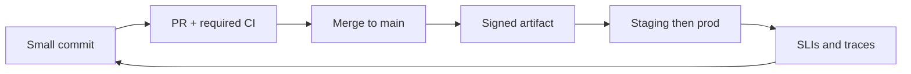

import { ConceptTemplate } from '@/features/kb/components/templates/ConceptTemplate'
import { Callout } from '@/features/kb/components/mdx/Callout'
import { ComparisonTable } from '@/features/kb/components/mdx/ComparisonTable'

export default function Layout({ children }) {
  return (
    <ConceptTemplate title="CI/CD">
      {children}
    </ConceptTemplate>
  )
}

**CI/CD** is the umbrella term teams actually say aloud: **Continuous Integration** plus **Continuous Delivery** (and often **Deployment**). CI keeps the trunk honest. CD — in the broad marketing sense — is the automated path from that trunk to users. This page is the map of the whole loop; the sibling pages drill into each word.

## 1. Deep Dive and Mechanics

**Left side (CI).** Frequent merges, required checks, merge queues, hermetic builds. Output: a candidate artifact and a green/red signal.

**Right side (CD).** Promote that artifact through environments. Delivery stops at a button; Deployment presses it for you. Canaries, flags, and GitOps are implementation tactics, not a third acronym.

**Feedback.** Prod telemetry flows back to the team that merged. Without that, CI/CD is a conveyor into the void.

**Tooling is not the practice.** A Jenkins box that runs a 4-hour nightly on a release branch is not CI/CD. A GitHub Actions org that merges 50 times a day with required checks and auto-canary is.

**Security in the loop.** SAST, dependency CVE gates, image scan, signing — on the critical path, with budgets so they do not become theatre that everyone skips.

<Callout icon="info" title="The slash hides a debate">
Some orgs say CD and mean Delivery. Some mean Deployment. Ask who presses prod and whether main is always releasable. The letters will then make sense.
</Callout>

## 2. Mathematical / Theoretical Foundation

DORA four keys are the scoreboard for CI/CD: lead time, deploy frequency, change-fail rate, MTTR. Elite profiles are empirically associated with trunk-based CI and automated CD.

**Little's Law** again: shrinking batch size (CI) and shrinking wait (CD) cut lead time if throughput holds. A pipeline that is 90 minutes long caps frequency at a few deploys per engineer per day unless you parallelise.

**Risk model.** Risk per change ≈ size × complexity × lack of tests. CI/CD attacks size and lack of tests. It does not make a 5 kLOC untested PR safe just because the YAML went green on a skip-tests label.

<ComparisonTable
  headers={['Letter', 'Core promise', 'Typical failure']}
  rows={[
    ['CI', 'Main stays integrated and tested', 'Long branches, flaky gates'],
    ['Delivery', 'Main stays releasable', 'Staging theatre, rebuild for prod'],
    ['Deployment', 'Green means shipped', 'Weak tests, no rollback'],
    ['CI/CD as a sticker', 'We bought a tool', 'Nightly on a release branch'],
  ]}
/>

## 3. Real-World Implementation

```yaml
# Minimal loop: CI on PR, CD on main
on:
  pull_request:
  push:
    branches: [main]
jobs:
  ci:
    runs-on: ubuntu-latest
    steps:
      - uses: actions/checkout@v4
      - run: make test
  cd:
    if: github.ref == 'refs/heads/main' && github.event_name == 'push'
    needs: ci
    runs-on: ubuntu-latest
    steps:
      - run: make publish && make deploy
```

Real systems split publish and deploy, pass a digest, and add a canary. The shape — PR proves, main ships — is the CI/CD contract.

## 4. Visualizations



## 5. Interview Prep

**Q: Define CI/CD in one minute.**
**A:** Integrate to a shared mainline many times a day with automated verification, and keep an automated path that can take that verified artifact to production with minimal ceremony.

**Q: What do you implement first, CI or CD?**
**A:** CI. Auto-deploying an unintegrated, untested main is how you get Continuous Damage. Delivery/Deployment ride on a trustworthy trunk.

**Q: How is this different from Agile?**
**A:** Agile is how you plan and learn. CI/CD is how you **move bits**. You can do standups without a pipeline; you cannot claim DevOps with only standups.

## 6. Production Use Cases

- **Any SaaS** that wants DORA-elite lead times.
- **Platforms** that offer a reusable CI/CD template as the golden path.
- **Regulated** Delivery (approval on prod) that still uses full CI on every PR.

<Callout icon="tip" title="Optimise the loop, not the logo">
If lead time is dominated by a two-day QA queue, a new CI vendor will not save you. Fix the queue.
</Callout>
