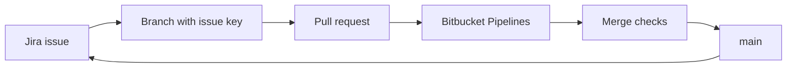

import { ConceptTemplate } from '@/features/kb/components/templates/ConceptTemplate'
import { Callout } from '@/features/kb/components/mdx/Callout'
import { ComparisonTable } from '@/features/kb/components/mdx/ComparisonTable'

export default function Layout({ children }) {
  return (
    <ConceptTemplate title="Bitbucket">
      {children}
    </ConceptTemplate>
  )
}

**Bitbucket** is Atlassian's Git (and historically Mercurial) hosting product. Teams buy it when **Jira is already the system of record** and they want pull requests, permissions, and CI that speak Jira issue keys natively. It exists as **Bitbucket Cloud** and self-managed **Data Center** (Server is end-of-life).

## 1. Deep Dive and Mechanics

**Hosting.** Cloud is multi-tenant SaaS. Data Center is your JVM cluster behind the firewall — still the choice for air-gapped and data-residency shops that standardised on Atlassian.

**Pull requests.** Same social object as GitHub PRs: diff, comments, required builds, merge checks (green builds, no open tasks, minimum approvals). Code Insights surfaces test and coverage from Pipelines or Jenkins.

**Jira tight loop.** A branch named `PROJ-123-fix-tax` and commits that mention PROJ-123 transition issues, show PRs on the Jira ticket, and gate releases with Jira versions. This integration is Bitbucket's actual moat.

**Bitbucket Pipelines.** YAML `bitbucket-pipelines.yml` on Cloud: Docker-based steps, Pipes (reusable steps), deployment environments, and 2FA-aware admin controls. Self-managed often keeps Jenkins or Bamboo instead.

**Access.** Workspace → projects → repos. Deployment permissions (who can push to prod env) live next to branch restrictions (who can write main). Smart mirroring exists for geographically distributed Data Center clones.

<Callout icon="info" title="Mercurial chapter is closed">
Bitbucket dropped Mercurial hosting in 2020. Treat it as a Git forge with an Atlassian identity story, not as a multi-VCS museum.
</Callout>

## 2. Mathematical / Theoretical Foundation

A PR is a proposed merge of commit set C onto target T. Merge checks are predicates P_i(C, T) that must all be true. Jira keys in messages are a **join** between the Git DAG and the issue graph — weak if people omit keys, strong if branch permissions require a key pattern.

**Permission lattices.** Project-level defaults plus repo overrides. Mis-set inheritance is a common audit finding: a "public" repo in a private workspace, or write on main without checks.

**Runner economics.** Pipelines minutes are a quota. Parallel steps reduce wall time and spend minutes faster — same trade as any CI.

<ComparisonTable
  headers={['Forge', 'Natural habitat', 'First-party CI', 'Issue gravity']}
  rows={[
    ['Bitbucket', 'Jira-centric orgs', 'Pipelines (Cloud)', 'Jira'],
    ['GitHub', 'Open source + many startups', 'Actions', 'Issues / Projects'],
    ['GitLab', 'Single-app DevOps', 'GitLab CI', 'GitLab issues'],
    ['Azure Repos', 'Microsoft estate', 'Azure Pipelines', 'Azure Boards'],
  ]}
/>

## 3. Real-World Implementation

```yaml
# bitbucket-pipelines.yml
image: node:22
pipelines:
  default:
    - step:
        name: test
        caches:
          - node
        script:
          - npm ci
          - npm test
  branches:
    main:
      - step:
          name: deploy
          deployment: production
          script:
            - npm ci
            - npm run deploy
```

Map `deployment: production` to Bitbucket's environment permissions so only the pipeline (or a restricted role) can run that step.

## 4. Visualizations



## 5. Interview Prep

**Q: Why Bitbucket over GitHub?**
**A:** Existing Jira/Confluence estate, Data Center requirement, or enterprise agreements. Not because Git is different — it is the same Git.

**Q: Pipelines versus Jenkins on Bitbucket?**
**A:** Pipelines wins on Cloud simplicity. Jenkins (or Bamboo) wins when you already have a farm, exotic agents, or Data Center without a Cloud migration.

**Q: What broke when Server went EOL?**
**A:** You migrate to Cloud or Data Center. Staying on Server is an unpatched forge — a security decision, not a lifestyle.

## 6. Production Use Cases

- **Enterprises** whose work already lives in Jira sprints and Advanced Roadmaps.
- **Data Center** shops that cannot put source on public SaaS.
- **Atlassian-centric** CI where issue-key hygiene is enforced in merge checks.

<Callout icon="tip" title="Require the issue key">
A branch-name regex for PROJECT-123 pays for itself the first time audit asks "which ticket shipped in this tag?"
</Callout>
