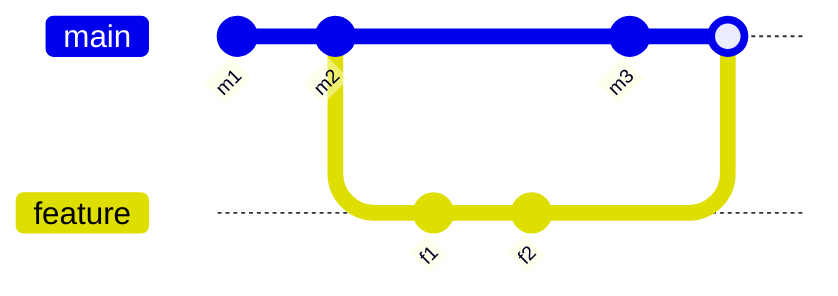

import { ConceptTemplate } from '@/features/kb/components/templates/ConceptTemplate'
import { Callout } from '@/features/kb/components/mdx/Callout'
import { ComparisonTable } from '@/features/kb/components/mdx/ComparisonTable'

export default function Layout({ children }) {
  return (
    <ConceptTemplate title="Branches">
      {children}
    </ConceptTemplate>
  )
}

A **branch** in Git is not a copy of the tree. It is a **pointer** — a ref under `refs/heads/` — that names a commit. As you commit, the pointer moves. Checking out a branch points `HEAD` at that ref so new commits advance it. Isolation is social and historical, not a second filesystem.

## 1. Deep Dive and Mechanics

**Refs.** `main` is a file containing a SHA (or a packed-ref). Creating `feature/tax` writes another SHA, usually the same as `main` at fork time. Cheap: O(1) space besides the commits you add.

**Remote-tracking.** `origin/main` is a ref Git updates on fetch. It is not a branch you commit to. Confusion here causes the "I committed on a detached origin/main" support ticket.

**Upstream.** `branch.feature.merge` records which remote ref you pull/push against. PR tools map this to a target branch.

**Lifetimes.** Trunk-based: hours. GitFlow: `develop`, `release/*`, `hotfix/*` live for days to weeks. Long-lived branches accumulate merge debt; the pointer stays cheap, the **diff** does not.

**Protection.** Hosts add rules on the pointer: no force-push, required CI, required reviews. The Git data model allows anything; the forge adds the policy.

**Delete after merge.** The pointer is not the history. Merged topic branches should die so humans are not looking at stale names. The commits remain reachable from main (if you merged) or may be GC'd (if you squash and drop).

<Callout icon="warning" title="A branch is not a backup">
Unpushed branches live on one disk. Force-push and laptop loss both delete work. Push early; protect main.
</Callout>

## 2. Mathematical / Theoretical Foundation

The repo is a **DAG** of commits. A branch is a distinguished vertex label. Divergence of A and B is the pair of unique ancestor sets: commits reachable from A not from B and vice versa. Merge-base is the best common ancestor (sometimes multiple, hence recursive merge).

**Cost of isolation.** Let t be time since fork and r the rate of commits on main. Expected conflict mass grows with t·r·overlap. That is why short-lived branches are a CI practice, not a taste.

**Fast-forward.** If B is a descendant of A, "merging B into A" is just moving the A pointer. No merge commit. Hosts may still require a merge commit for audit.

<ComparisonTable
  headers={['Style', 'Branch lifetime', 'Integration', 'Typical use']}
  rows={[
    ['Trunk-based', 'Hours', 'Small merges or PRs', 'CD-friendly teams'],
    ['GitHub Flow', 'Days', 'PR to main', 'Most SaaS'],
    ['GitFlow', 'Weeks', 'develop then release', 'Versioned products'],
    ['Long-lived env branches', 'Months', 'Promotion merges', 'Often a smell'],
  ]}
/>

## 3. Real-World Implementation

```bash
git fetch origin
git switch -c feature/tax origin/main
# ... commits ...
git push -u origin feature/tax
# after PR merge:
git switch main
git pull --ff-only
git branch -d feature/tax
```

`-d` refuses if Git does not see the work as merged. Use `-D` only when you intend to throw the pointer away.

## 4. Visualizations



## 5. Interview Prep

**Q: What is a branch, really?**
**A:** A movable pointer to a commit. The commits are the history. The branch name is a convenience and a policy hook.

**Q: Branch versus fork?**
**A:** A branch is a ref in the same object store (usually). A fork is another repository (another object store) that shares history until you fetch. Permissions and CI differ.

**Q: Why do we delete branches?**
**A:** To keep the namespace meaningful and to signal "this work is integrated or abandoned." History is not deleted by deleting the ref if another ref (main) still reaches the commits.

## 6. Production Use Cases

- **Topic branches** for a single PR in GitHub Flow.
- **Release branches** when you must patch 1.4 while main is 2.0.
- **Environment branches** (controversial) that some enterprises still promote through.

<Callout icon="tip" title="Name branches for humans and bots">
`user/proj-123-short-slug` helps CODEOWNERS, Jira, and `git worktree` stay sane. `final-final2` does not.
</Callout>
