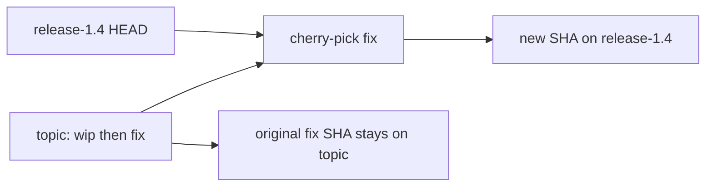

import { ConceptTemplate } from '@/features/kb/components/templates/ConceptTemplate'
import { Callout } from '@/features/kb/components/mdx/Callout'
import { ComparisonTable } from '@/features/kb/components/mdx/ComparisonTable'

export default function Layout({ children }) {
  return (
    <ConceptTemplate title="Cherry-picking">
      {children}
    </ConceptTemplate>
  )
}

**Cherry-picking** applies the **diff** of an existing commit onto your current HEAD and records a **new** commit. The original SHA stays on its branch. The new SHA has a different parent, a different identity, and (by default) a `cherry picked from` trailer. You use it to **surgically** move a fix without taking the rest of a branch.

## 1. Deep Dive and Mechanics

**What Git does.** `git cherry-pick <sha>` computes the patch between that commit and its parent, then 3-way merges it against HEAD. Conflicts are the same class as a rebase conflict.

**Not a share of identity.** The new commit is not "the same commit." Tools that look at SHAs (revert, bisect notes, some cherry-pick detectors) must use patch-id or the trailer to see the kinship.

**Ranges.** `git cherry-pick A..B` walks commits. Order matters. Skipping a later commit that depends on an earlier one produces a mess.

**When it is right.** Hotfix onto a release branch. Backport a one-line CVE fix to LTS. Pull a colleague's isolated commit without their WIP.

**When it is wrong.** Regularly cherry-picking a long feature onto main instead of merging. You duplicate history, lose merge structure, and will conflict forever. Prefer merge or rebase of the whole topic.

**Duplicate detection.** `-x` adds the source SHA to the message. `git cherry` and some hosts use patch-id to warn "already applied."

<Callout icon="warning" title="Cherry-pick is a patch, not a time machine">
If the fix depended on a refactor two commits earlier, the pick will conflict or compile and be wrong. Read the commit, not only the SHA.
</Callout>

## 2. Mathematical / Theoretical Foundation

A commit is a snapshot plus a parent pointer. Cherry-pick uses the **delta** δ = diff(parent(c), c) and applies δ to tree(HEAD). Success requires that the context of δ still exists (or can be merged) in HEAD.

**Patch-id** hashes a normalised diff (strips index noise). Equal patch-id ⇒ likely same change. This is how Git guesses "already cherry-picked."

**Duplication.** After a pick, the DAG has two vertices with similar trees relative to different bases. A later merge of the two branches may see the change as already present — or may conflict on nearby lines. Merge after rampant cherry-picks is a known pain.

<ComparisonTable
  headers={['Operation', 'New SHA?', 'Takes neighbours?', 'Typical intent']}
  rows={[
    ['Cherry-pick', 'Yes', 'No', 'Surgical backport'],
    ['Merge', 'Merge commit', 'Yes, the whole side', 'Integrate a line'],
    ['Rebase', 'Yes, whole series', 'Rewritten series', 'Replay onto new base'],
    ['Revert', 'Yes, inverse patch', 'One commit inverted', 'Undo in public history'],
  ]}
/>

## 3. Real-World Implementation

```bash
git switch release-1.4
git cherry-pick -x abc1234
git push origin release-1.4
# later, do not re-merge the same logical fix blindly onto main
# if main already has abc1234 via the original PR
```

`-x` records `abc1234` in the new message so the next human can see the source. Tag 1.4.1 from this branch using the normal release pipeline.

## 4. Visualizations



## 5. Interview Prep

**Q: Does cherry-pick copy the commit?**
**A:** It copies the change. The new object has a new SHA, new parent, and possibly a new author date. It is not the same object.

**Q: Cherry-pick versus merge of one commit?**
**A:** You cannot merge "one commit" without also considering its ancestors if you merge the branch. Cherry-pick is the tool that ignores ancestors (at your peril).

**Q: How do you avoid double-fixing main and release?**
**A:** Prefer merging the release branch back or using the same PR cherry-picked with `-x` and then skipping when Git reports it empty. Communicate in the ticket.

## 6. Production Use Cases

- **LTS backports** in libraries and kernels.
- **Incident hotfixes** on a frozen release line during a holiday freeze on main.
- **Monorepo** picking a config fix into an environment branch you have not yet killed.

<Callout icon="tip" title="Pick the merge commit carefully">
`cherry-pick -m 1` is required for merge commits (which parent is the mainline). Guessing wrong applies the other side's whole diff.
</Callout>
