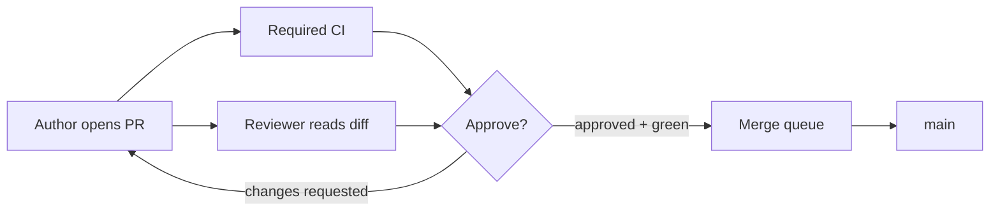

import { ConceptTemplate } from '@/features/kb/components/templates/ConceptTemplate'
import { Callout } from '@/features/kb/components/mdx/Callout'
import { ComparisonTable } from '@/features/kb/components/mdx/ComparisonTable'

export default function Layout({ children }) {
  return (
    <ConceptTemplate title="Code Reviews">
      {children}
    </ConceptTemplate>
  )
}

**Code review** is a human gate on a diff: one or more peers read the change, ask questions, and approve or request work. CI proves the suite still runs. Review proves a person believes the change **should** exist — design, security, operability, naming. It is also the cheapest way to spread mental models across a team.

## 1. Deep Dive and Mechanics

**The unit.** A pull/merge request with a description, a linked ticket, a small diff, and green checks. Giant PRs get rubber-stamps or stall. Split by deployable slice, not by "week of work."

**What to look for.** Correctness vs spec. Failure modes. AuthZ. Resource leaks. Schema compatibility. Observability (will we see this fail?). Tests that could fail. What **not** to bikeshed: colour of the bikeshed if a linter already owns it.

**Latency.** Review SLA (e.g. first pass in one business day) is a product metric. Slow review recreates long branches. Pair or mob when the change is the kind that dies in comment threads.

**CODEOWNERS.** Paths map to required reviewers. Use it for security-sensitive trees (IAM, payments), not as a vanity list that pages 15 people for a typo.

**Bots.** Suggested edits, coverage comments, semantic diffs. Bots should not drown the human signal. If the first 40 comments are style, your formatter is not in CI.

<Callout icon="warning" title="Approval is not a ritual">
If every PR is approved in 30 seconds because "we trust Alice," you have a social rubber-stamp, not a review. Trust and review both scale; neither replaces the other.
</Callout>

## 2. Mathematical / Theoretical Foundation

Empirical work (Microsoft, Google) finds defect detection drops as diff size grows — attention is a scarce budget of N lines. Model reviewer error as increasing in patch size and in context-switch count.

**Queueing.** Reviewers are servers. If arrival of PRs exceeds review capacity, wait explodes (Little again). Staffing "review time" in the sprint is how you keep the queue stable.

**Information.** A review comment is high-bandwidth if it changes the author's model. "nit: comma" is low-bandwidth. Prefer comments that teach a rule you then encode in a linter.

<ComparisonTable
  headers={['Mode', 'When it shines', 'Failure mode']}
  rows={[
    ['Async PR review', 'Most product work', 'Stale threads, huge diffs'],
    ['Pair / mob', 'Hard design, incidents', 'Calendar cost'],
    ['Post-commit review', 'Tiny trusted teams', 'Main already broken'],
    ['Automated only', 'Style, types, tests', 'Misses product intent'],
  ]}
/>

## 3. Real-World Implementation

```text
PR template (keep it short)

## Why
Ticket and user-visible effect.

## What
List of commits / approach in 3 bullets.

## Risk
Migrations, flags, rollback.

## Test
How you proved it, including what you did not test.
```

Require the template in the forge. A blank "fix" PR is a review tax on everyone else.

## 4. Visualizations



## 5. Interview Prep

**Q: What makes a good review comment?**
**A:** Specific, kind, and about the code or the risk — not about the person. Offer an alternative or a question. Distinguish blocking versus optional.

**Q: How do you review a 3 kLOC PR?**
**A:** You don't, really. Ask for a split. If you must, review architecture first, then the riskiest files, and say what you did not read.

**Q: Review versus pair programming?**
**A:** Pairing moves review left (continuous). PRs scale across time zones. High-risk changes often deserve both.

## 6. Production Use Cases

- **Required reviews** on main in every serious forge.
- **Security review** extra hop for auth, crypto, and payouts.
- **Open source** maintainer review as the quality and tone bar for strangers.

<Callout icon="tip" title="Review the tests first">
If the tests do not encode the behaviour you care about, the production diff is a rumour. Read tests, then the implementation.
</Callout>
