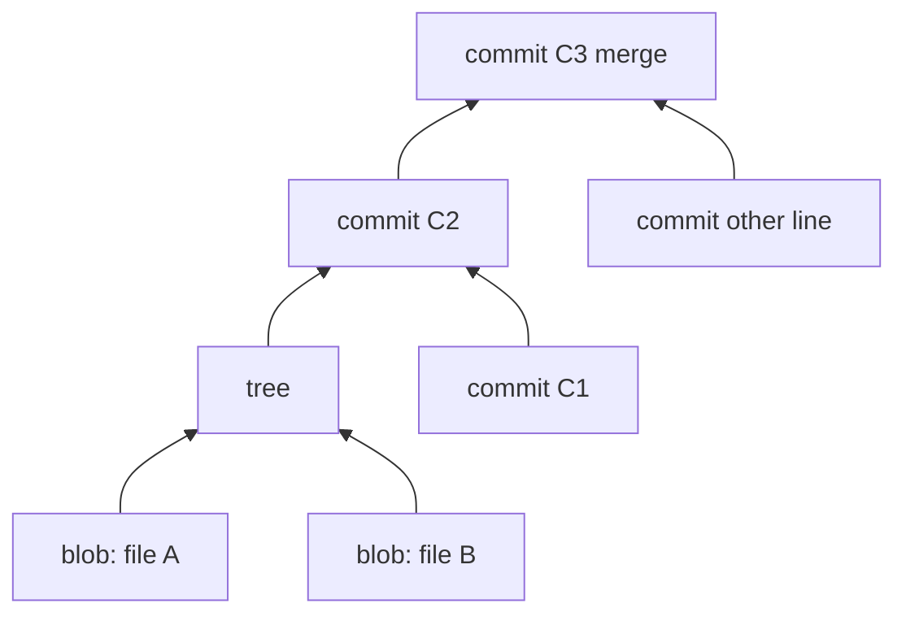

import { ConceptTemplate } from '@/features/kb/components/templates/ConceptTemplate'
import { Callout } from '@/features/kb/components/mdx/Callout'
import { ComparisonTable } from '@/features/kb/components/mdx/ComparisonTable'

export default function Layout({ children }) {
  return (
    <ConceptTemplate title="Commits">
      {children}
    </ConceptTemplate>
  )
}

A **commit** is Git's atomic historical record: a pointer to a **tree** (the snapshot), zero or more **parent** commits, author and committer identities, timestamps, and a message. Its name is a SHA-1 or SHA-256 hash of that object. Change a bit of the message and you have a different commit. History is a DAG of these objects.

## 1. Deep Dive and Mechanics

**Objects.** Blob (file bytes) → tree (directory) → commit (snapshot + parents). Packfiles compress them. You almost never touch this by hand; `git commit` writes the objects and moves the current branch ref.

**Snapshot, not a delta.** Git *stores* deltas in packs for efficiency, but the model is "the whole tree at this point." Checkout materialises that tree.

**Parents.** Ordinary commits have one. Merge commits have two or more. Root commits have zero. Revert commits are ordinary commits whose tree undoes a previous change.

**Amending and rebase.** `git commit --amend` and rebase **replace** objects. Old SHAs remain until GC if another ref still points at them. After you have pushed, rewriting is a social event (force-with-lease), not a casual cleanup.

**Messages.** Subject line + body. Conventional Commits (`feat:`, `fix:`) feed changelogs. The subject is what `git log --oneline` and revert PRs show — write it for a stranger in six months.

**Signing.** SSH or GPG signatures bind a commit to a key. Forges can require signed commits on main as a supply-chain control (weak if keys are not protected).

<Callout icon="info" title="Hash collision anxiety">
Git is moving to SHA-256. SHA-1 collision attacks exist in the lab; they are not why your rebase hurt. Integrity still depends on protecting the refs your team fetches.
</Callout>

## 2. Mathematical / Theoretical Foundation

The commit id is H(header || tree || parents || metadata). This is a **content-addressed** store. Tampering without breaking the hash is infeasible if H is strong and the client checks it (Git does).

The history is a DAG G=(V,E) with edges from commit to parents. Reachability from a ref defines what `git gc` may not delete. `git merge-base` finds the lowest common ancestors for a 3-way merge.

**Atomicity.** A commit is atomic from Git's point of view. It is not atomic from the product's point of view if you bundle an unrelated refactor and a bugfix — bisect and revert become cruel.

<ComparisonTable
  headers={['Kind', 'Parents', 'Typical command', 'Use']}
  rows={[
    ['Ordinary', 'One', 'git commit', 'Daily work'],
    ['Merge', 'Two+', 'git merge', 'Join histories'],
    ['Root', 'Zero', 'git commit on empty', 'Repo birth'],
    ['Revert', 'One', 'git revert', 'Forward-fix history'],
  ]}
/>

## 3. Real-World Implementation

```bash
git add -p
git commit -S -m "$(cat <<'EOF'
fix: charge tax once on bundled SKUs

Double taxation on bundle children came from applying
the rule at both line and group level. Tests in tax.spec.
EOF
)"
```

`-p` keeps the snapshot coherent. `-S` signs. The body explains **why**, which the diff cannot.

## 4. Visualizations



## 5. Interview Prep

**Q: Is a commit a diff?**
**A:** No. It is a snapshot plus parents. A diff is computed between two snapshots. Cherry-pick and rebase *use* diffs to build new snapshots.

**Q: Why do SHAs change on rebase?**
**A:** Parent, tree, or metadata changed, so H changed. The "same" logical patch is a new object.

**Q: When do you amend versus make a new commit?**
**A:** Amend only unpushed (or clearly private) tips when the last commit is still yours and the change is the same idea. Once others may have fetched it, add a new commit or coordinate a rewrite.

## 6. Production Use Cases

- **Bisectable main** where each commit builds — the hidden requirement of CD.
- **Signed commits** on protected branches for audit.
- **Revert-friendly** history: one concern per commit so `git revert` is safe.

<Callout icon="tip" title="Commit what you can revert">
If a commit mixes a migration and a feature, revert is a night-time archaeology dig. Two commits survive incidents better than one "hero" snapshot.
</Callout>
