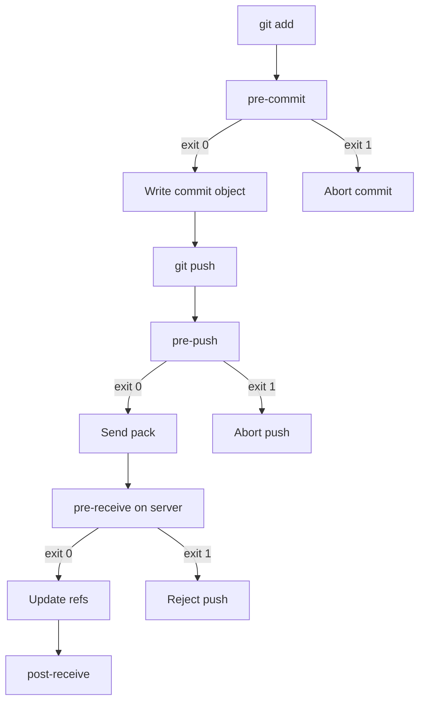

import { ConceptTemplate } from '@/features/kb/components/templates/ConceptTemplate'
import { Callout } from '@/features/kb/components/mdx/Callout'
import { ComparisonTable } from '@/features/kb/components/mdx/ComparisonTable'

export default function Layout({ children }) {
  return (
    <ConceptTemplate title="Git Hooks">
      {children}
    </ConceptTemplate>
  )
}

**Git hooks** are executable programs Git invokes at fixed points in a command. A non-zero exit aborts the command. They are the local half of "shift left": lint, format, and secret-scan on the laptop so CI is not the first computer that sees the mistake. They are also the server half of policy: `pre-receive` and `update` can refuse a push that rewrites `main` or skips a required trailer.

## 1. Deep Dive and Mechanics

**Where they live.** Client hooks sit in `.git/hooks/` and are **not** cloned. That is why teams use a versioned runner (pre-commit framework, Husky, leftover) that installs into that directory. Server hooks live on the receiving Git process (Gitolite, a forge's receive-pack, or a custom `pre-receive`).

**Client sequence.** `pre-commit` sees the index, not necessarily the working tree. `prepare-commit-msg` and `commit-msg` edit or reject the message. `post-commit` cannot abort. For push: `pre-push` receives remote name, URL, and the ref lines about to be sent.

**Server sequence.** `pre-receive` reads stdin: old SHA, new SHA, ref name for every updated ref. `update` runs once per ref. `post-receive` fires after refs have moved — use it for deploy pings, never as a gate.

**Bypass.** `--no-verify` skips `pre-commit` and `commit-msg`. Server hooks cannot be skipped by the client. That is why secret policy and protected-branch rules belong on the server or the forge, not only on laptops.

**Samples.** Git ships `*.sample` files. They are documentation, not enforcement, until you strip the suffix and `chmod +x`.

<Callout icon="warning" title="Hooks are not a security boundary">
Anyone can `--no-verify` or delete `.git/hooks`. Treat client hooks as a courtesy to the author. Secrets, signed commits, and branch protection live on the remote.
</Callout>

## 2. Mathematical / Theoretical Foundation

A hook is a **predicate** H(state) that returns success or failure. Git is a state machine; hooks are guards on transitions. `pre-commit` guards index → commit object. `pre-push` guards local refs → advertised wants. `pre-receive` guards advertised wants → updated refs.

**Fail-closed versus fail-open.** A crashed hook that exits 1 is fail-closed (safe, noisy). A missing executable is fail-open (Git proceeds). Server policy must assume the latter for clients.

**Composition.** N sequential hooks cost sum(T_i) on the critical path. A 8-second lint on every commit trains people to `--no-verify`. Bound client hooks to seconds; put minutes in CI.

<ComparisonTable
  headers={['Hook', 'Side', 'Can abort', 'Typical job']}
  rows={[
    ['pre-commit', 'Client', 'Yes', 'Lint staged files'],
    ['commit-msg', 'Client', 'Yes', 'Conventional Commits'],
    ['pre-push', 'Client', 'Yes', 'Secret scan / tests'],
    ['pre-receive', 'Server', 'Yes', 'Protect main, require sign-off'],
    ['post-receive', 'Server', 'No', 'Notify, trigger CI'],
  ]}
/>

## 3. Real-World Implementation

```bash
#!/usr/bin/env bash
# .git/hooks/pre-commit — keep this generated, not hand-copied
set -euo pipefail
files=$(git diff --cached --name-only --diff-filter=ACM | grep -E '\.(js|ts|tsx)$' || true)
if [[ -z "$files" ]]; then
  exit 0
fi
echo "$files" | xargs npx eslint
```

Prefer a shared config (`.pre-commit-config.yaml` or `lefthook.yml`) committed to the repo so every clone installs the same guards. Pair with a server-side secret scanner; the local hook is the fast path, not the last line.

## 4. Visualizations



## 5. Interview Prep

**Q: Why do hooks not travel with clone?**
**A:** They are executables in `.git`, which is not part of the tree. Shipping them in the tree and installing via a bootstrap script is the workaround. Forges implement their own receive hooks independently.

**Q: pre-commit versus CI?**
**A:** pre-commit is a cheap, optional filter for the author. CI is the enforceable gate on the merge. Duplicate the *idea* (lint, test), not the 20-minute suite, on the laptop.

**Q: Can a hook rewrite the commit?**
**A:** `prepare-commit-msg` can edit the file Git will use. Changing already-written objects is a different command (amend, filter-repo). Hooks should abort or annotate, not silently mutate history people think they just created.

## 6. Production Use Cases

- **Format-on-commit** so review diffs are not 400 files of whitespace.
- **Ticket-key trailers** required by `commit-msg` to keep Jira or Linear joins intact.
- **Server `pre-receive`** that denies non-fast-forward on `release/*` even if someone has admin on their laptop.

<Callout icon="tip" title="Generate hooks, do not document them">
A wiki page that says "copy this script" drifts in a week. A Makefile or package.json prepare script that installs pinned hook versions is the only durable approach.
</Callout>
