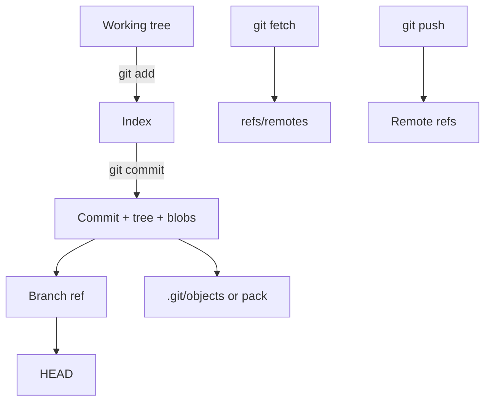

import { ConceptTemplate } from '@/features/kb/components/templates/ConceptTemplate'
import { Callout } from '@/features/kb/components/mdx/Callout'
import { ComparisonTable } from '@/features/kb/components/mdx/ComparisonTable'

export default function Layout({ children }) {
  return (
    <ConceptTemplate title="Git">
      {children}
    </ConceptTemplate>
  )
}

**Git** is a distributed version-control system. Every clone is a full repository: objects, refs, and enough history to work offline. There is no privileged "the server" in the data model — remotes are conveniences with social power (protected branches, CI). Git won because branching is cheap, history is a DAG you can rewrite locally, and the on-disk format is simple enough that every forge speaks it.

## 1. Deep Dive and Mechanics

**Four objects.** A **blob** is file bytes. A **tree** is a directory: name → mode + object id. A **commit** points at a tree, parents, and metadata. A **tag** object (annotated) points at a commit with a message and optional signature. Everything is named by a cryptographic hash of its content.

**Refs.** Branches and tags are pointers in `refs/heads` and `refs/tags`. `HEAD` is a symbolic ref to the current branch (or a detached commit). Remotes live under `refs/remotes`. Updating a branch is an atomic ref transaction, not a rewrite of every file.

**Index.** The staging area is a sorted list of paths and blob ids. `git add` writes blobs and updates the index. `git commit` writes a tree from the index, then a commit. This three-area model (working tree, index, HEAD) is what confuse people coming from SVN.

**Packfiles.** Loose objects are later packed with delta compression against similar objects. Fetch and clone transfer packs. `git gc` is housekeeping, not philosophy.

**Distributed.** `git fetch` copies objects and remote-tracking refs. `git push` asks the remote to update a ref if the update is a fast-forward (or if you force). Divergence is normal; merge and rebase are how you reconcile two tips.

<Callout icon="info" title="Git stores snapshots, packs store deltas">
The mental model is "whole tree at this commit." Packfiles use deltas for disk and network. Tools that assume Git is a patch stack (some SVN muscle memory) fight the object model.
</Callout>

## 2. Mathematical / Theoretical Foundation

Content addressing: id = H(type || size || content). Equality of ids is equality of content. The history is a DAG G=(V,E) with edges commit → parents. Reachability from refs defines the live set; unreachable objects are GC candidates.

**Fast-forward.** Updating ref R from A to B is a fast-forward iff A is an ancestor of B. Otherwise the remote rejects (unless force). This is a partial-order check on the DAG, not a file-level merge.

**Three-way merge.** Given tips L, R and merge-base B = LCA(L, R), Git diffs B→L and B→R and combines hunks. Conflicts are overlapping or adjacent edits on the same lines. Criss-cross merges yield multiple bases; Git uses a virtual merge base.

**Cost.** History walk is O(commits reachable). Blame and bisect are logarithmic in well-structured history. Monorepos hurt working-tree and index size more than object lookup — sparse-checkout and partial clone exist because the working copy, not the DAG, is the bottleneck.

<ComparisonTable
  headers={['System', 'Model', 'Offline', 'Branch cost']}
  rows={[
    ['Git', 'Distributed snapshots', 'Full', 'Pointer move'],
    ['Mercurial', 'Distributed snapshots', 'Full', 'Cheap named branches / bookmarks'],
    ['SVN', 'Central linear revisions', 'Partial', 'Directory copy'],
    ['Perforce', 'Central, file locks optional', 'Partial', 'Stream / branch view'],
  ]}
/>

## 3. Real-World Implementation

```bash
git clone --filter=blob:none git@github.com:acme/payments.git
cd payments
git sparse-checkout set services/ledger
git switch -c fix/tax-rounding origin/main
git add -p
git commit -S -m "fix: round tax on ledger lines once"
git push -u origin HEAD
```

Partial clone plus sparse-checkout is how large monorepos stay usable. Signed commits (`-S`) and a protected `main` are the production defaults; the commands above are the daily loop.

## 4. Visualizations



## 5. Interview Prep

**Q: What is in a commit object?**
**A:** Tree id, parent ids, author, committer, timestamps, message, and optional encoding or signature headers. Not the file diffs — diffs are computed.

**Q: Detached HEAD?**
**A:** HEAD points at a commit, not a branch. New commits are unreachable once you switch away unless you name them. Recover with `git reflog`.

**Q: Why is rebase "dangerous" after push?**
**A:** Rebase creates new commits (new hashes). Anyone who fetched the old tip now has a divergent history. Force-with-lease updates the remote only if it still matches the tip you expect.

## 6. Production Use Cases

- **Every modern forge** (GitHub, GitLab, Bitbucket, Azure Repos) is a Git object store plus a social layer.
- **Monorepos** at Google-scale cousins use Git with partial clone, or a virtual filesystem on top of Git.
- **Release engineering** treats annotated, signed tags as the artifact identity that CI promotes.

<Callout icon="tip" title="Learn the three trees first">
Almost every "Git is confusing" story is working tree versus index versus HEAD. Once those three are solid, merge, rebase, and stash are just different ways to move content between them.
</Callout>
