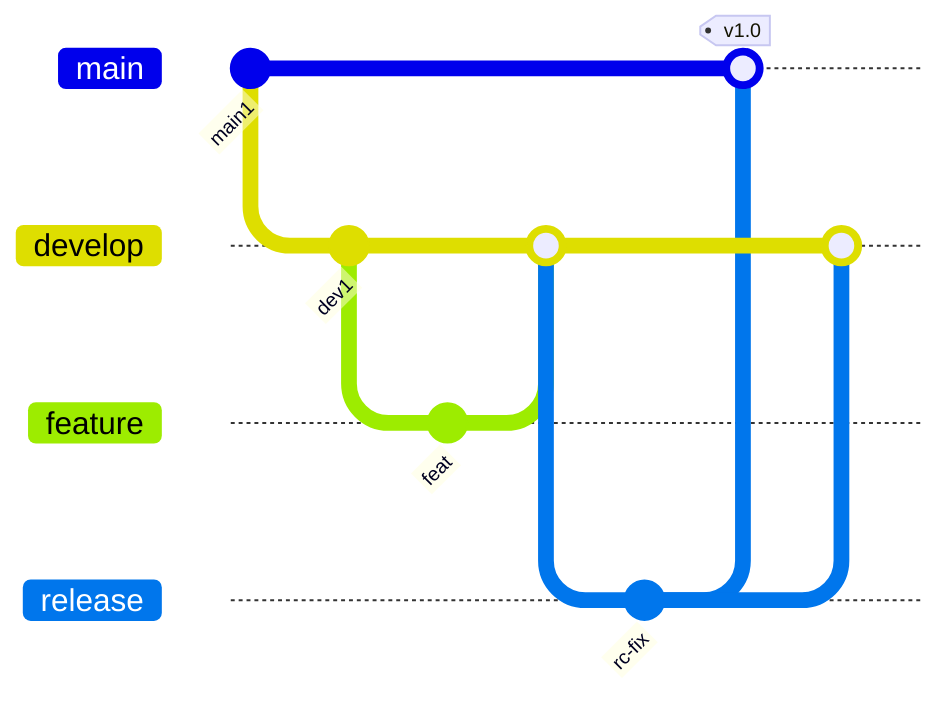

import { ConceptTemplate } from '@/features/kb/components/templates/ConceptTemplate'
import { Callout } from '@/features/kb/components/mdx/Callout'
import { ComparisonTable } from '@/features/kb/components/mdx/ComparisonTable'

export default function Layout({ children }) {
  return (
    <ConceptTemplate title="GitFlow">
      {children}
    </ConceptTemplate>
  )
}

**GitFlow** is Vincent Driessen's 2010 branching model. `main` (or `master`) is always production-ready. `develop` is the integration branch for the next release. Feature branches fork `develop` and merge back. Release branches freeze `develop` for QA. Hotfixes fork `main` and merge into both `main` and `develop`. It matches **versioned, scheduled software** (desktop, mobile stores, on-prem). It fights **continuous deployment**, where every green commit on trunk can ship.

## 1. Deep Dive and Mechanics

**Two eternal branches.** `main` receives only release merges and hotfixes, each typically tagged. `develop` receives features. The merge from a release branch to `main` is the "we shipped" event.

**Feature branches.** Named `feature/foo`, branched from `develop`, merged to `develop` (often with `--no-ff` so the feature remains a merge bubble). Long-lived features accumulate merge debt against `develop`.

**Release branches.** `release/1.4` cuts from `develop` when feature-complete. Only bugfixes land there. When QA signs off, merge to `main`, tag `1.4.0`, merge back to `develop` so the bugfixes are not lost.

**Hotfixes.** `hotfix/1.4.1` from `main`, merge to `main` and `develop` (or the current release branch if one is open). This is the model's answer to "production is on fire during a release freeze."

**Tooling.** `git-flow` CLI wrappers encode the dance. The wrappers are optional; the policy is the branch names and merge targets.

<Callout icon="warning" title="GitFlow plus CD is a contradiction">
If every commit should be releasable, a long-lived `develop` that is "not quite prod" is a second main you must keep green and a place bugs hide. Prefer trunk-based development and feature flags for CD.
</Callout>

## 2. Mathematical / Theoretical Foundation

Treat branches as **parallel timelines** that must be periodically joined. Each join is a merge commit. The integration cost between two branches grows with divergent commit count and overlapping file sets — roughly the size of the symmetric difference of their trees from the merge-base.

**Release isolation.** A release branch is a snapshot of `develop` plus a restricted write set. It is a concurrency-control protocol: features after the cut wait for the next version. That is valuable when QA is a calendar event; it is waste when QA is the pipeline.

**Hotfix diamond.** A hotfix creates a commit H on `main` that must also appear on `develop`. If you only tag `main`, `develop` drifts and the next release reintroduces the bug. The dual merge is the invariant.

<ComparisonTable
  headers={['Model', 'Integration branch', 'Release cadence', 'Fits']}
  rows={[
    ['GitFlow', 'develop', 'Scheduled versions', 'Shipped boxed software'],
    ['GitHub Flow', 'main', 'PR then deploy', 'Web CD, simple products'],
    ['Trunk-based', 'trunk', 'Hours to days', 'High-frequency CD'],
    ['Release branching', 'main + release/*', 'Patch trains', 'LTS products'],
  ]}
/>

## 3. Real-World Implementation

```bash
# Cut a release, then ship and merge back
git switch develop
git pull
git switch -c release/2.3
# QA commits land only on release/2.3
git switch main
git merge --no-ff release/2.3
git tag -a v2.3.0 -m "v2.3.0"
git push origin main v2.3.0
git switch develop
git merge --no-ff release/2.3
git push origin develop
```

Automate the dual merge in the release pipeline. Humans forget the `develop` merge under pressure; that forgotten merge is the classic GitFlow outage of the *next* release.

## 4. Visualizations



## 5. Interview Prep

**Q: When is GitFlow the right default?**
**A:** Multiple supported versions in the wild, a real QA freeze, or store review gates. Not for a single SaaS that deploys from `main` ten times a day.

**Q: develop versus main — why two?**
**A:** So `main` can stay a clean production history while `develop` absorbs unfinished integration. If `develop` is always production-quality, you do not need it.

**Q: How do you hotfix during an open release branch?**
**A:** Branch from `main`, merge to `main`, to the open `release/*`, and to `develop`. Missing any one of those three reintroduces the defect.

## 6. Production Use Cases

- **Mobile apps** with store review and a version the support team must name.
- **On-prem enterprise** with N-2 version support and hotfix trains.
- **Desktop products** that ship quarterly installers and need a frozen RC branch.

<Callout icon="tip" title="Name the release in the branch">
`release/2.3` is searchable in the forge and in `git branch -a`. `release` or `rc` as a singleton branch does not scale to two trains.
</Callout>
