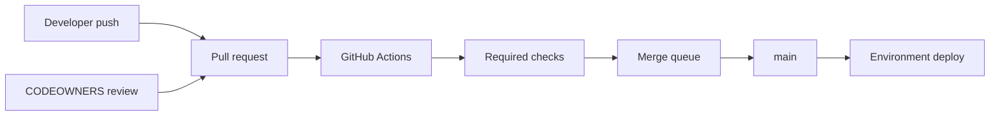

import { ConceptTemplate } from '@/features/kb/components/templates/ConceptTemplate'
import { Callout } from '@/features/kb/components/mdx/Callout'
import { ComparisonTable } from '@/features/kb/components/mdx/ComparisonTable'

export default function Layout({ children }) {
  return (
    <ConceptTemplate title="GitHub">
      {children}
    </ConceptTemplate>
  )
}

**GitHub** is Microsoft's Git hosting platform and the default public square for open source. A repo is Git objects plus issues, pull requests, Actions workflows, Packages, Discussions, and a permission model (users, teams, orgs, enterprises). Teams pick it for network effects — every engineer already has an account — and for Actions as CI that lives next to the code.

## 1. Deep Dive and Mechanics

**Git hosting.** Receive-pack, pull, LFS, and partial clone. Protected branches encode required checks, linear history, signed commits, and CODEOWNERS. Rulesets (org or repo) are the newer, composable form of the same policy.

**Pull requests.** The social merge object: commits, diff, review threads, requested reviewers, and a merge button (merge commit, squash, rebase). Draft PRs signal "not ready." Merge queues serialise hot `main` so each PR is retested on the updated tip.

**Actions.** YAML under `.github/workflows`. Runners are GitHub-hosted VMs or self-hosted. The marketplace is reusable actions — a supply-chain surface as much as a convenience.

**Identity.** OAuth apps, GitHub Apps (fine-grained installation tokens), PAT v2, and OIDC to cloud roles so workflows need not store long-lived cloud keys.

**Enterprise.** GitHub.com with Enterprise features, or GitHub Enterprise Server (self-hosted appliance). EMU (Enterprise Managed Users) binds identities to the IdP.

<Callout icon="warning" title="The marketplace is in your trusted computing base">
A third-party action at `@v3` that moves the tag is a supply-chain attack. Pin by full SHA and review the action's permissions block.
</Callout>

## 2. Mathematical / Theoretical Foundation

A PR proposes to make target T an ancestor of (or squash-equivalent to) a new tip T'. Required checks are predicates on the head SHA. A **merge queue** is a serialisation of PRs: each is merged onto a speculative queue branch and retested, turning concurrent "green on stale main" into a single-writer log.

**Permission lattice.** Org → team → repo → environment. Environment protection (wait timer, required reviewers) is a second lattice on deploy, not on git push.

**OIDC trust.** The runner presents a signed JWT with repo, workflow, and ref claims. The cloud IdP maps those claims to a role. The security property is "short-lived credentials scoped by workflow identity," not "a secret in Settings."

<ComparisonTable
  headers={['Forge', 'Public OSS gravity', 'CI', 'Self-host']}
  rows={[
    ['GitHub', 'Highest', 'Actions', 'Enterprise Server'],
    ['GitLab', 'Strong (self-host culture)', 'GitLab CI', 'CE / EE'],
    ['Bitbucket', 'Low', 'Pipelines', 'Data Center'],
    ['Azure Repos', 'Low', 'Azure Pipelines', 'Azure DevOps Server'],
  ]}
/>

## 3. Real-World Implementation

```yaml
# .github/workflows/ci.yml
name: ci
on:
  pull_request:
  push:
    branches: [main]
permissions:
  contents: read
jobs:
  test:
    runs-on: ubuntu-latest
    steps:
      - uses: actions/checkout@8ade135a41bc03ea155e62e844d188df1ea18608
      - uses: actions/setup-node@v4
        with:
          node-version: 22
          cache: npm
      - run: npm ci
      - run: npm test
```

Pin `actions/checkout` to a SHA in production. Leave `setup-node@v4` only if you accept tag-move risk for a first-party action — many teams pin those too.

## 4. Visualizations



## 5. Interview Prep

**Q: Merge commit versus squash versus rebase?**
**A:** Merge preserves the feature DAG. Squash makes `main` a linear story of PRs (one SHA per PR). Rebase replay keeps commits but linearises. Pick one org-wide; mixing them breaks `git bisect` culture.

**Q: Why OIDC instead of AWS keys in secrets?**
**A:** Keys leak from logs and forks. OIDC tokens expire and are audience-bound. You revoke by changing the trust policy, not by hunting a leaked string.

**Q: Fork PRs and secrets?**
**A:** `pull_request` from a fork does not get secrets. `pull_request_target` does — and runs the base workflow against untrusted code if you check out the fork carelessly. That combination is a classic incident.

## 6. Production Use Cases

- **Open-source defaults**: issues, PRs, Actions, Dependabot, draft releases.
- **Inner-source enterprises** on GitHub.com or GHE with SAML and rulesets.
- **GitOps**: the repo is the desired state; Actions or a reconciler applies it.

<Callout icon="tip" title="Rulesets over ad-hoc branch settings">
Org rulesets apply to name patterns (`release/*`) and survive repo copy-paste. Per-repo "protect main" does not scale past twenty services.
</Callout>
