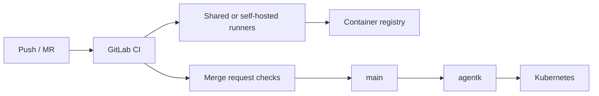

import { ConceptTemplate } from '@/features/kb/components/templates/ConceptTemplate'
import { Callout } from '@/features/kb/components/mdx/Callout'
import { ComparisonTable } from '@/features/kb/components/mdx/ComparisonTable'

export default function Layout({ children }) {
  return (
    <ConceptTemplate title="GitLab">
      {children}
    </ConceptTemplate>
  )
}

**GitLab** is a Git forge that deliberately swallowed the rest of the delivery toolchain. One application gives you repos, merge requests, GitLab CI, a container registry, package registry, SAST/DAST, environments, and (in higher tiers) extras like epics and compliance frameworks. The bet is **fewer vendors, one identity, one audit trail**. Teams that self-host often pick GitLab because Community Edition is capable and the CI runner model is straightforward.

## 1. Deep Dive and Mechanics

**Editions.** GitLab.com (SaaS), self-managed CE/EE, and Dedicated (single-tenant SaaS). Features are gated by tier (Free, Premium, Ultimate). That gating is the usual procurement fight.

**Merge requests.** GitLab's PR analogue. Approval rules, CODEOWNERS, merge trains (their merge queue), and "pipelines must succeed." Fast-forward and semi-linear history are first-class merge methods.

**CI.** `.gitlab-ci.yml` at the repo root (or an included remote). Runners are shared (SaaS) or self-hosted binaries that poll for jobs. Child pipelines, DAG `needs`, and environments with manual gates cover most CD shapes.

**Auto DevOps and agents.** Optional opinionated CI. The GitLab agent for Kubernetes (`agentk`) is the supported path to in-cluster deploy without opening the API server to the internet.

**Security.** Dependency scanning, container scanning, secret detection, and license approval policies can block an MR. They run as CI jobs; they are not magic outside the pipeline.

<Callout icon="info" title="One app is a product choice, not a law">
You can still point GitLab repos at Jenkins. The value is when MR, pipeline, registry, and deploy live on one issue id so audit is a query, not a scavenger hunt.
</Callout>

## 2. Mathematical / Theoretical Foundation

An MR is a proposed ref update plus a pipeline id. Mergeability is the conjunction of: no conflicts, approvals ≥ N, pipeline success, and any custom policy. A **merge train** rebases each MR onto a speculative ref so tests run against the would-be main, then fast-forwards if green — the same serialisation idea as GitHub's merge queue.

**Runner scheduling.** Jobs are work items; runners advertise tags and capacity. Fair scheduling across projects is a queueing problem: shared runners starve noisy neighbors unless you shard by tag or concurrency limits.

**Include graph.** CI config is a DAG of `include` files. Cycles and override order (`extends`, `!reference`) are the usual "why did this job disappear" bugs.

<ComparisonTable
  headers={['Capability', 'GitLab', 'GitHub', 'Jenkins']}
  rows={[
    ['Git host', 'Yes', 'Yes', 'No'],
    ['First-party CI', 'gitlab-ci.yml', 'Actions', 'Jenkinsfile'],
    ['Self-host default', 'Common', 'GHE only', 'Always'],
    ['Registry + scan', 'Built-in', 'GHCR + extras', 'Plugins'],
  ]}
/>

## 3. Real-World Implementation

```yaml
# .gitlab-ci.yml
stages: [test, deploy]
default:
  image: node:22
test:
  stage: test
  script:
    - npm ci
    - npm test
deploy_prod:
  stage: deploy
  environment:
    name: production
    url: https://pay.example.com
  rules:
    - if: $CI_COMMIT_BRANCH == "main"
  script:
    - ./scripts/deploy.sh
```

Protect `production` in **Operate → Environments** so only maintainers (or a protected deploy token) can run that job. Use CI variables with masked + protected flags for secrets.

## 4. Visualizations



## 5. Interview Prep

**Q: GitLab versus GitHub for a new company?**
**A:** GitHub if you want OSS gravity and Actions ecosystem. GitLab if you want one self-hosted bill and CI/registry/security without assembling five products. Neither Git is different.

**Q: What is a merge train?**
**A:** Serialised speculative merges. Each MR is rebased onto the train ref and retested so "was green on stale main" cannot land a break.

**Q: Shared versus specific runners?**
**A:** Shared is cheap and noisy. Specific (tagged) runners hold secrets, GPUs, or VPC access. Never put prod deploy credentials on a shared runner fleet.

## 6. Production Use Cases

- **Self-hosted enterprises** that cannot put source on GitHub.com.
- **Single-app platforms** where MR → pipeline → registry → deploy is one URL.
- **Regulated** shops using Ultimate compliance frameworks and merge-request approvals as the control.

<Callout icon="tip" title="Pin includes like you pin Actions">
Remote `include` of an unpinned project@main is the same supply-chain hole as an unpinned marketplace action. Pin a SHA or a release tag you control.
</Callout>
