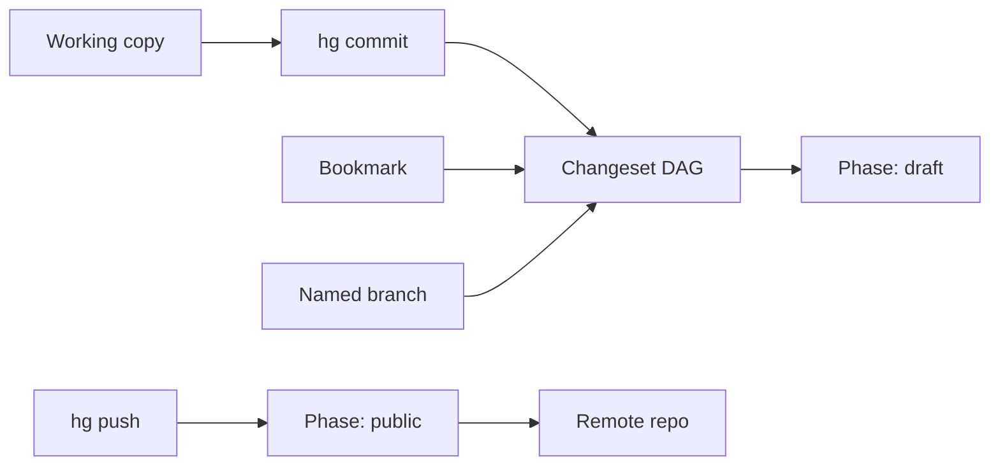

import { ConceptTemplate } from '@/features/kb/components/templates/ConceptTemplate'
import { Callout } from '@/features/kb/components/mdx/Callout'
import { ComparisonTable } from '@/features/kb/components/mdx/ComparisonTable'

export default function Layout({ children }) {
  return (
    <ConceptTemplate title="Mercurial">
      {children}
    </ConceptTemplate>
  )
}

**Mercurial** (hg) is a distributed version-control system from the same 2005 moment as Git. It stores a DAG of **changesets**, clones are full repos, and the command vocabulary was designed to be harder to get catastrophically wrong. History rewriting is possible (`histedit`, `evolve`) but not the default culture. Facebook/Meta scaled Mercurial internally; Mozilla and Python used it for years. Public hosting largely consolidated on Git, so Mercurial today is a specialist and a historical peer, not the default hire skill.

## 1. Deep Dive and Mechanics

**Changesets.** A changeset has parents, a manifest (tree), filelogs, and a description. Node ids are hashes. Phases (public, draft, secret) encode whether a changeset is safe to rewrite: public (pushed) is immutable by default.

**Branches versus bookmarks.** **Named branches** are permanent labels recorded on each changeset — good for long-lived release lines. **Bookmarks** are movable pointers, the close analogue of Git branches. New teams confuse the two; pick bookmarks if you think in Git.

**Revsets.** Mercurial's query language for selecting changesets (`-r "ancestors(bookmark(main))"`) is more regular than Git's revision syntax. Templates format log output.

**Evolve and topics.** The evolve extension treats history edits as first-class: obsolete markers replace "force push and hope." Topics are ephemeral feature names that do not pollute the named-branch namespace.

**Interchange.** `hg-git` and `gitifyhg` exist; they are lossy around named branches, phases, and obsolescence. A dual-VCS shop should pick one source of truth.

<Callout icon="info" title="Bitbucket no longer hosts Mercurial">
Atlassian ended Mercurial hosting in 2020. Heptapod (GitLab fork) and self-hosted hgweb remain for teams that did not migrate.
</Callout>

## 2. Mathematical / Theoretical Foundation

Same DAG model as Git: nodes are changesets, edges are parents. **Phases** are a monotonic lattice: secret → draft → public. Promotion is easy; demotion of public is refused without `--force` and is socially equivalent to Git force-push.

**Immutability as default.** Git makes rewrite cheap (rebase is core). Mercurial makes rewrite an extension. The theoretical claim is fewer lost objects and fewer "I rebased shared history" incidents, at the cost of messier "fix the last commit" workflows unless evolve is installed.

**Storage.** Revlogs are append-only delta chains per file and per manifest. Long delta chains need periodic "better deltas" (similar to Git repack). Scaling work at Meta focused on shallow clone, sparse, and a remotefilelog so working copies do not materialise the world.

<ComparisonTable
  headers={['Concern', 'Mercurial', 'Git']}
  rows={[
    ['Daily branch analogue', 'Bookmark', 'Branch ref'],
    ['Long-lived line', 'Named branch', 'Branch + convention'],
    ['Rewrite default', 'Discouraged / evolve', 'rebase, amend'],
    ['Hosting in 2026', 'Niche', 'Universal'],
  ]}
/>

## 3. Real-World Implementation

```bash
hg clone https://hg.example.com/ledger
cd ledger
hg bookmark fix-tax
# edit files
hg status
hg commit -m "fix: charge tax once on bundle SKUs"
hg push -B fix-tax
```

`-B` publishes the bookmark. Without evolve, amending a pushed draft requires coordination. Enable `fsmonitor` and `sparse` on large trees the same way you would enable Git sparse-checkout.

## 4. Visualizations



## 5. Interview Prep

**Q: Why did Git win hosting?**
**A:** GitHub's social layer, then a virtuous cycle of tooling. Mercurial's UX was often nicer; distribution of forges and CI was not.

**Q: Named branch versus bookmark?**
**A:** Named branch is a durable field on the changeset (shows up forever in `hg log`). Bookmark is a movable pointer. Use bookmarks for features; named branches for `release-2.3`.

**Q: Can you rebase?**
**A:** Yes, via histedit or evolve. After a changeset is public, you are in the same social contract as Git force-push. Phases exist to make that line visible.

## 6. Production Use Cases

- **Holdouts** that never paid the Git migration tax (internal monorepos, games, research).
- **Heptapod** shops that want GitLab MR UX on Mercurial storage.
- **Interchange** during a migration: one-way export to Git, freeze hg, do not dual-write for long.

<Callout icon="tip" title="If you still run hg, invest in evolve">
Without evolve, people invent unsafe strip-and-push rituals. Obsolete markers are how Mercurial does rewrite without losing the old node ids.
</Callout>
