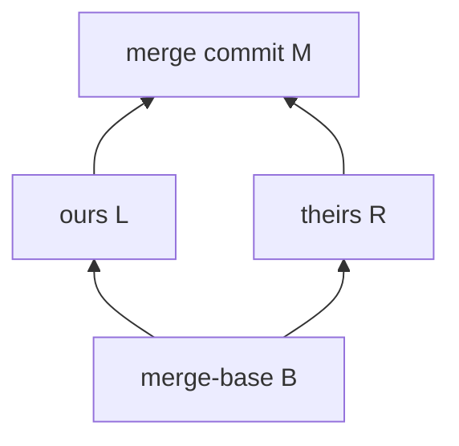

import { ConceptTemplate } from '@/features/kb/components/templates/ConceptTemplate'
import { Callout } from '@/features/kb/components/mdx/Callout'
import { ComparisonTable } from '@/features/kb/components/mdx/ComparisonTable'

export default function Layout({ children }) {
  return (
    <ConceptTemplate title="Merges">
      {children}
    </ConceptTemplate>
  )
}

A **merge** integrates two lines of history. If your branch is a strict descendant of the target, Git **fast-forwards** the ref — no merge commit. Otherwise Git finds a **merge-base**, performs a three-way merge of the trees, and (on success) writes a commit with two parents. Conflicts are overlapping edits Git will not guess. Merges are how shared branches stay a DAG rather than a single tape.

## 1. Deep Dive and Mechanics

**Fast-forward.** `main` at A, feature at B, A ancestor of B → moving `main` to B is a pointer update. `--no-ff` forces a merge commit anyway so the feature remains a bubble (GitFlow's default).

**Three-way merge.** Merge-base B, ours L, theirs R. For each path: same change on both sides → take it; change on one side → take that side; change on both to different results → conflict. Delete/modify is a conflict. Rename detection pairs paths by similarity, then merges the content.

**Recursive / ORT.** Multiple merge-bases (criss-cross) are first merged into a virtual base, then that base is used. The ORT strategy is the modern default: same idea, fewer surprises on renames.

**Octopus.** `git merge` of three or more branches writes an n-parent commit when diffs do not overlap. Rare outside topic-integration scripts.

**Abort and continue.** Conflicts write stages 1–3 into the index (`:1:`, `:2:`, `:3:`). `git mergetool` or a manual edit plus `git add` marks resolved. `git merge --abort` restores `HEAD` and the index.

<Callout icon="warning" title="A green merge is not a green product">
ORT can auto-merge two semantically opposite edits that do not overlap in the file. Tests and review exist because the merge algorithm is textual, not semantic.
</Callout>

## 2. Mathematical / Theoretical Foundation

History is a DAG. A merge-base is a **lowest common ancestor** (LCA). In a DAG there may be several; the recursive strategy reduces them. Fast-forward exists iff one tip is reachable from the other.

**Conflict** is not "the lines differ from the base." It is "both sides differ from the base and from each other." Unchanged-versus-changed is resolved automatically.

**Correctness.** Merge is **associative** only in boring cases. (A merge B) merge C can differ from A merge (B merge C) when conflicts or renames appear. That is why integration order on long-lived branches matters.

**Content merge versus history merge.** Squash "merge" produces a single-parent commit that contains the tree of a merge but drops the second parent — useful for linear `main`, fatal for `git merge-base` later if you need to merge the same branch again (Git thinks the work is already in).

<ComparisonTable
  headers={['Kind', 'Parents', 'History', 'Use']}
  rows={[
    ['Fast-forward', 'None new', 'Linear pointer move', 'Already-rebased PR'],
    ['True merge', 'Two+', 'Preserves DAG', 'Shared long-lived branches'],
    ['Squash', 'One', 'Hides feature commits', 'Linear main'],
    ['Octopus', 'Three+', 'Wide join', 'Many non-overlapping topics'],
  ]}
/>

## 3. Real-World Implementation

```bash
git switch main
git pull --ff-only
git merge --no-ff origin/feature/tax \
  -m "merge: tax rounding for bundle SKUs"
# on conflict:
git status
git checkout --ours path/with/lockfile
git add path/with/lockfile
git merge --continue
```

Prefer `--ff-only` on `main` when a merge queue already rebased the PR. Use `--no-ff` when you want the merge bubble as the release note boundary. Never `--ours` a whole source file to "just finish" unless you intend to drop their work.

## 4. Visualizations



## 5. Interview Prep

**Q: Why not always squash?**
**A:** Squash loses parent linkage. Re-merging the feature branch later replays already-landed hunks as new conflicts. Fine if the branch is deleted and never merged again.

**Q: What is a criss-cross merge?**
**A:** Two branches merged in both directions earlier, so there are two LCAs. Git builds a virtual merge-base first. Weird rename conflicts often come from this.

**Q: merge versus rebase to update a feature branch?**
**A:** Merge creates a merge commit ("merged main into feature"). Rebase replays your commits on new main (new SHAs). Rebase keeps the PR diff clean; merge keeps original SHAs.

## 6. Production Use Cases

- **Protected main** that only advances via merge commits from a queue — each merge SHA is the release unit.
- **Long-running release branches** that merge `main` forward and cherry-pick back.
- **Monorepo trains** where an octopus or a sequenced merge bot integrates many green heads.

<Callout icon="tip" title="Resolve with the index stages">
`git show :1:file`, `:2:`, `:3:` are base, ours, theirs. If your editor "won" the wrong side, the stages are still there until you `git add`.
</Callout>
