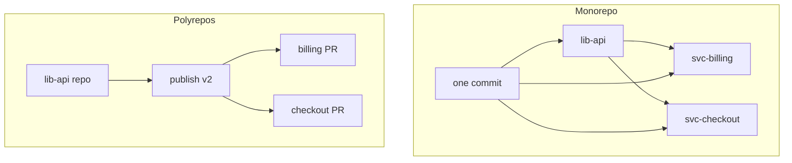

import { ConceptTemplate } from '@/features/kb/components/templates/ConceptTemplate'
import { Callout } from '@/features/kb/components/mdx/Callout'
import { ComparisonTable } from '@/features/kb/components/mdx/ComparisonTable'

export default function Layout({ children }) {
  return (
    <ConceptTemplate title="Monorepos vs Polyrepos">
      {children}
    </ConceptTemplate>
  )
}

A **monorepo** stores many projects in one Git (or equivalent) repository. A **polyrepo** gives each service, library, or team its own repo. Neither is morally superior. Monorepos win when you routinely change an API and all callers in one commit. Polyrepos win when teams, lifecycles, and access control should not share a working tree. The failure mode is picking one slogan and refusing the tooling the slogan requires.

## 1. Deep Dive and Mechanics

**Atomic cross-cut.** In a monorepo, rename a proto field and update every stub in one SHA. CI can require that SHA to be green. In polyrepos you version a library, publish, then land N follow-up PRs — a window where callers are stale.

**Tooling tax.** Monorepos need **affected-target** CI (Bazel, Nx, Pants, Turborepo): test only what the diff can break. Without that, every PR runs the universe and the repo dies of queue time. Polyrepos need a **compatibility policy** (semver, contract tests, artifact promotion) or you get distributed breakage instead.

**Clone and ACL.** Monorepo working trees and history are large; sparse-checkout, partial clone, and virtual FS are the remedies. Polyrepos allow per-repo permissions; a monorepo usually grants read to everyone and encodes ownership in CODEOWNERS (social ACL, not cryptographic).

**Versioning.** Monorepo libraries often skip published versions and depend by path. Polyrepo libraries must publish. Apps that are independently releasable can live in a monorepo anyway — "one repo" is not "one deployable."

**Ownership.** CODEOWNERS and directory conventions replace repo-level admin. Review load concentrates on shared platform directories; that is a staffing problem, not a Git problem.

<Callout icon="warning" title="A folder full of disconnected apps is not a monorepo strategy">
If nothing shares CI, versioning, or generate-and-update workflows, you paid monorepo pain for polyrepo isolation. Either invest in a build graph or split.
</Callout>

## 2. Mathematical / Theoretical Foundation

Model the codebase as a directed graph of build targets. A change to node V **affects** all nodes reachable from V in the reverse dependency graph. Monorepo CI is sound if it tests that affected set. Cost is O(|affected|), not O(|repo|), when the graph is accurate. Stale graph edges are missed tests; extra edges are wasted minutes.

**Consistency window.** Polyrepo cuts a single logical change into k commits across k repos. The system is inconsistent for the time until the last lands. Monorepo k=1. That is the only theorem that matters; everything else is operations.

**Access.** Polyrepo ACL is per-repo capability. Monorepo ACL is path-based and enforced by the forge (CODEOWNERS, rulesets), which is weaker against a leaked credential with repo write.

<ComparisonTable
  headers={['Axis', 'Monorepo', 'Polyrepo']}
  rows={[
    ['Cross-cutting change', 'One commit', 'Version + N follow-ups'],
    ['CI without tooling', 'Does not scale', 'Naturally scoped'],
    ['Access control', 'Path / social', 'Repo boundary'],
    ['Clone size', 'Needs sparse / partial', 'Small by default'],
  ]}
/>

## 3. Real-World Implementation

```javascript
// nx.json-style idea: compute affected projects from the git diff
// Run in CI: nx affected -t test,lint --base origin/main --head HEAD
{
  "targetDefaults": {
    "test": { "dependsOn": ["^build"] },
    "lint": { "cache": true }
  }
}
```

The `^build` edge is the graph. If a library's test does not depend on its build, "affected" will lie. Polyrepo equivalent is a contract-test pipeline that consumes the library's staged artifact before the library tag is public.

## 4. Visualizations



## 5. Interview Prep

**Q: Google uses a monorepo, should we?**
**A:** Google also has a custom VFS, a distributed build, and a dedicated eng-prod org. Copy the *atomicity* goal if you need it; do not copy the slogan without the build graph.

**Q: Can you CD from a monorepo?**
**A:** Yes. Deploy the affected services from the same SHA. Tagging the whole repo as v1.2.3 is optional and often meaningless.

**Q: How do you open-source one library from a monorepo?**
**A:** Sparse publish, git subtree split, or copy-out with rewritten history. Plan that on day one; it is painful as an afterthought.

## 6. Production Use Cases

- **Monorepo**: product suites with shared UI kit and proto schemas, where API and callers must move together.
- **Polyrepo**: platform teams publishing SDKs to external customers, or acquisitions that must keep separate ACLs.
- **Hybrid**: a platform monorepo plus leaf service repos that pin a platform version.

<Callout icon="tip" title="Measure affected-test ratio">
If 80 percent of CI minutes are on unaffected targets, you do not have a monorepo — you have a slow polyrepo in one folder. Fix the graph before hiring more runners.
</Callout>
