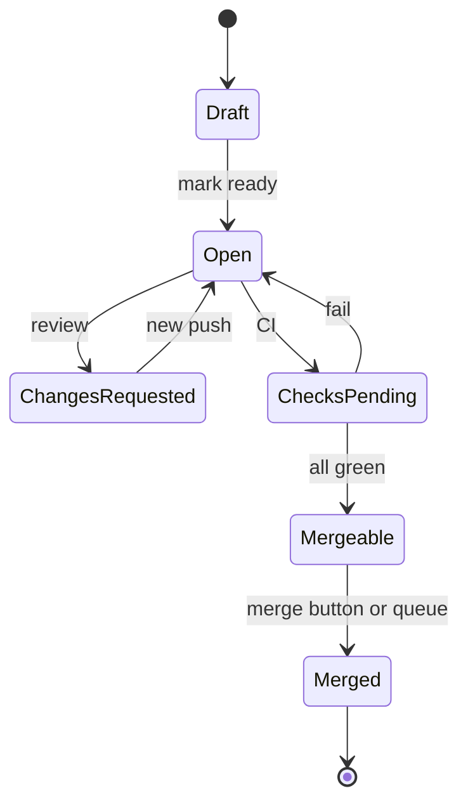

import { ConceptTemplate } from '@/features/kb/components/templates/ConceptTemplate'
import { Callout } from '@/features/kb/components/mdx/Callout'
import { ComparisonTable } from '@/features/kb/components/mdx/ComparisonTable'

export default function Layout({ children }) {
  return (
    <ConceptTemplate title="Pull Requests">
      {children}
    </ConceptTemplate>
  )
}

A **pull request** (merge request on GitLab) is not a Git object. It is a forge record: source ref, target ref, commits, a computed diff, review threads, CI checks, and a merge strategy. Git supplies the commits; the PR supplies the **conversation and the gate**. Almost all modern delivery policy — CODEOWNERS, required builds, signed commits — hangs off this object.

## 1. Deep Dive and Mechanics

**Refs.** Hosts keep `refs/pull/N/head` (the current tip) and often `refs/pull/N/merge` (a trial merge into the target). CI should build `head` or a merge-queue ref, not a stale local branch.

**Diff.** The PR diff is merge-base(target, head) versus head — what review sees. After the target moves, that diff changes even if you did not. "Why did my PR grow?" is usually a stale merge-base.

**Review.** Comments attach to a line SHA. If rebase rewrites that SHA, comments go "outdated." Requested reviewers and CODEOWNERS are policy: the merge button stays red until those predicates hold.

**Merge strategies.** Merge commit (two parents), squash (one new commit on target), rebase-and-fast-forward. The button is a server-side `git merge` (or equivalent) plus webhooks.

**Draft and auto-merge.** Drafts advertise unreadiness. Auto-merge queues the PR to land when checks pass — a small merge queue of size one unless the host has a real queue.

<Callout icon="info" title="Small PRs are a reliability feature">
Review quality collapses after a few hundred lines. Bisect, revert, and rollback all get worse as the PR's SHA mixes unrelated ideas. Split by deploy risk, not by ticket count.
</Callout>

## 2. Mathematical / Theoretical Foundation

A PR is a tuple (source, target, head SHA, predicates P_i). Merge is allowed iff every P_i is true and the trial merge is conflict-free. Checks are usually memoised by head SHA: a new push invalidates them.

**Stale green.** Head H was green on target T0. Target is now T1. Green(H, T0) does not imply green(H, T1). Merge queues exist to re-evaluate green(H', T_latest) before the ref moves.

**Review as sampling.** Reviewers inspect a subset of the diff. Defect detection probability rises with time-on-diff and falls with diff size — the empirical reason for size limits, not a fashion.

<ComparisonTable
  headers={['Host name', 'Trial ref', 'Queue', 'Notes']}
  rows={[
    ['GitHub PR', 'pull/N/merge', 'Merge queue', 'Fork ACL is subtle'],
    ['GitLab MR', 'merge-requests/N/head', 'Merge train', 'Approval rules are first-class'],
    ['Bitbucket PR', 'pull-requests/N', 'Optional', 'Jira key join'],
    ['Gerrit change', 'refs/changes/...', 'Submit', 'Patch sets, not branches'],
  ]}
/>

## 3. Real-World Implementation

```bash
git switch -c fix/tax-rounding
# ... commits ...
git push -u origin HEAD
gh pr create --draft --title "fix: round tax once on bundles" --body "$(cat <<'EOF'
## Why
Bundle children were taxed at line and group.

## Test
ledger/tax.spec covers the grouped SKU case.
EOF
)"
gh pr ready
gh pr merge --squash --delete-branch
```

The body is for the future reverser. Link the check that must stay green. Squash if `main` is a PR-linear history; merge if you keep feature bubbles.

## 4. Visualizations



## 5. Interview Prep

**Q: Is a PR a Git feature?**
**A:** No. Git has `request-pull` (an email generator). PRs are forge state plus special refs. You can merge with a raw `git merge` and skip the social object — and skip the policy.

**Q: Why rebuild after a small typo push?**
**A:** Checks key off the head SHA. The typo is a new object. Cache CI by content hash of the affected graph if you need to be kinder.

**Q: Fork PR versus same-repo PR?**
**A:** Forks are untrusted. Secrets and `pull_request_target` are the incident class. Same-repo PRs share the repo's secret set on `pull_request` depending on host defaults — still treat first-time contributors as untrusted if you can.

## 6. Production Use Cases

- **Required PR to main** with CODEOWNERS and signed commits as the change-management control.
- **Release PRs** that only bump versions and changelogs, reviewed by release eng.
- **Automation PRs** (Dependabot, Renovate) with auto-merge when a tight test suite is the real reviewer.

<Callout icon="tip" title="Describe the rollback">
A PR that cannot say "revert this SHA" or "turn off flag X" is not done. Reviewers should ask that before nits about naming.
</Callout>
