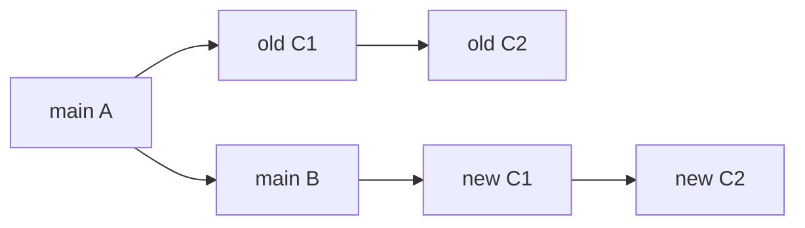

import { ConceptTemplate } from '@/features/kb/components/templates/ConceptTemplate'
import { Callout } from '@/features/kb/components/mdx/Callout'
import { ComparisonTable } from '@/features/kb/components/mdx/ComparisonTable'

export default function Layout({ children }) {
  return (
    <ConceptTemplate title="Rebasing">
      {children}
    </ConceptTemplate>
  )
}

**Rebase** takes a sequence of commits and **replays** them onto another tip. Each replayed commit is a new object: new parent, often a new tree, always a new hash. The old chain remains until nothing points at it (reflog, then GC). Rebase is how you update a feature branch onto fresh `main` without a merge bubble, and how you squash or split local history before anyone else has fetched it.

## 1. Deep Dive and Mechanics

**The algorithm.** Git identifies the merge-base of your branch and the upstream, lists commits reachable from your tip but not from upstream, then cherry-picks them in order onto the new base. Conflicts pause the sequence (`--continue`, `--abort`, `--skip`).

**Interactive rebase.** `git rebase -i` lets you pick, reword, squash, fixup, drop, or edit. This is history editing, not magic: you are building a new chain and moving the branch ref at the end.

**Onto.** `git rebase --onto A B C` means "take commits after B up to C and replay them on A." Surgery for "this commit landed on the wrong parent."

**Update-refs and autosquash.** Recent Git can move stacked-branch refs during one rebase. `--autosquash` reorders `fixup!` commits next to their targets.

**What rebase is not.** It does not change published objects. Anyone who fetched the old SHAs still has them. After push, rebase plus force-with-lease is a coordination protocol.

<Callout icon="error" title="Never rebase a branch others have based work on">
Their merge-bases point at SHAs you just abandoned. They must rebase too, or you get duplicate-looking commits and tangled merges. Shared branches merge; private branches rebase.
</Callout>

## 2. Mathematical / Theoretical Foundation

Let C1 through Cn be the commits to replay and B-prime the new parent. Rebase constructs a new chain C-prime-1 through C-prime-n whose first parent is B-prime and whose later parents are the previous replayed commit. Each step is a cherry-pick: a three-way merge of the original commit onto the new parent.

**Hash change.** The new hash differs because parent and often tree differ. "Same patch" is a patch-id coincidence, not object identity. Git can skip commits whose patch-id already exists upstream.

**Commutativity.** Replaying A then B is not always the same as B then A when they touch related lines. Interactive reorder is a semantic act, not a free shuffle.

**Reflog.** The old tip is recorded. Recovery is `git reflog` plus `git reset --hard` to the pre-rebase SHA.

<ComparisonTable
  headers={['Move', 'New objects', 'Shared-safe', 'Resulting history']}
  rows={[
    ['Merge main into feature', 'One merge commit', 'Yes', 'Bubble'],
    ['Rebase feature onto main', 'One per replayed commit', 'No if already pushed widely', 'Linear'],
    ['Cherry-pick', 'One new commit', 'Yes', 'Duplicate patch-id possible'],
    ['Reset --hard', 'None', 'No', 'Moves ref only'],
  ]}
/>

## 3. Real-World Implementation

```bash
git fetch origin
git switch feature/tax
git rebase origin/main
# conflict: fix file, then
git add -p
git rebase --continue
git push --force-with-lease
```

`--force-with-lease` refuses to overwrite if the remote tip is not the one you last fetched — protection against clobbering a teammate's push. Use `git rebase -i origin/main` locally to clean wip commits before the first review push.

## 4. Visualizations



## 5. Interview Prep

**Q: Why do PR comments go outdated after rebase?**
**A:** Comments pin to a line in a SHA. Rebase created new SHAs. The forge cannot always map hunks across the rewrite.

**Q: rebase versus merge to update a PR?**
**A:** Rebase keeps the PR diff equal to what this branch adds to main. Merge adds a "merged main into feature" commit and a noisier diff against the original merge-base. Teams pick one and automate it.

**Q: What does force-with-lease prevent?**
**A:** Blind `--force` overwriting commits you have not seen. Lease checks the remote still matches your remote-tracking ref.

## 6. Production Use Cases

- **Private feature branches** kept on latest `main` so CI is not a stale-green lie.
- **Stacked PRs** rebased as a set when the bottom PR lands.
- **Release note hygiene**: interactive rebase to make `main` a sequence of revertible ideas.

<Callout icon="tip" title="Rebase locally, merge on the server">
Authors rebase to keep the PR readable. The forge merge button or queue performs the final integration so nobody force-pushes `main`.
</Callout>
