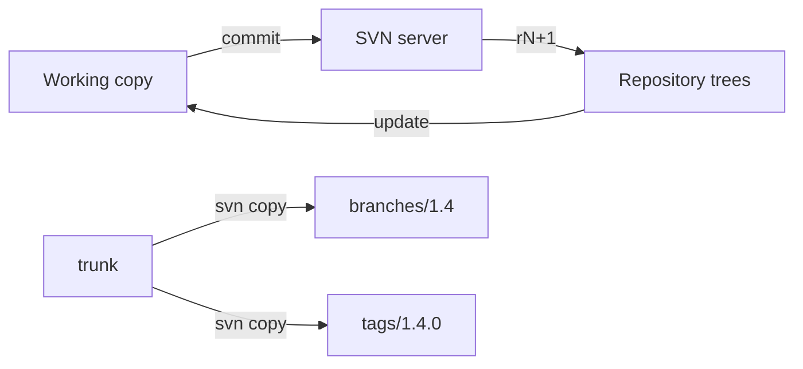

import { ConceptTemplate } from '@/features/kb/components/templates/ConceptTemplate'
import { Callout } from '@/features/kb/components/mdx/Callout'
import { ComparisonTable } from '@/features/kb/components/mdx/ComparisonTable'

export default function Layout({ children }) {
  return (
    <ConceptTemplate title="SVN">
      {children}
    </ConceptTemplate>
  )
}

**Apache Subversion** (SVN) is a centralised version-control system. There is one authoritative repository; working copies hold a slice plus metadata (`.svn`). Every successful commit increments a **global revision** number. Branches and tags are ordinary directories created by cheap copies. SVN still appears in enterprises that never finished a Git migration, in shops that want a simple linear audit story, and as the system Git users `git svn` against during transition.

## 1. Deep Dive and Mechanics

**Central server.** `svn commit` is a network round-trip that either creates rN+1 or fails. There is no local commit. Offline work is "edit files and hope nobody else touched them."

**Revisions.** r42 is a tree of the whole repository. A project living in `/trunk/app` still shares the revision counter with `/branches/other`. Blame and log are path-scoped; the number is not.

**Cheap copies.** `svn copy ^/trunk ^/branches/1.4` is O(1) on the server: a new directory that points at the same node history. Tags are copies you pinky-promise not to commit to. Enforcement is hook policy, not type system.

**Working copy.** Mixed-revision working copies are normal after a partial update. `svn update` moves the WC toward HEAD. Tree conflicts (delete vs edit) are first-class.

**Auth and locks.** Path-based authz. Optional file locks (`svn lock`) for unmergeable binaries — the feature Git users re-invent with LFS lock.

<Callout icon="info" title="trunk, branches, tags is a convention">
SVN does not know what a branch is. Layout (`/trunk`, `/branches`, `/tags`) is social. Break the convention and every tool that assumes it (Jenkins SVN plugin, git-svn) breaks too.
</Callout>

## 2. Mathematical / Theoretical Foundation

History is a **linear sequence** of repository-wide trees T_0, T_1, … T_n. A branch is a path prefix whose node-ids fork at a copy revision. Merge tracking (`svn:mergeinfo`) records which revision ranges of path A have been applied to path B — a set of intervals, easy to get wrong after renames.

**No DAG of commits as first-class objects.** Cross-branch history is reconstructed from copies + mergeinfo. That is why SVN merge is famously more painful than Git merge on long-lived branches.

**Concurrency.** Optimistic: commit fails if your base revision for a changed file is stale (out-of-date). Locks make that pessimistic for chosen paths.

<ComparisonTable
  headers={['Property', 'SVN', 'Git']}
  rows={[
    ['Authority', 'One server', 'Every clone'],
    ['Commit offline', 'No', 'Yes'],
    ['Revision name', 'Monotonic integer', 'Content hash'],
    ['Branch', 'Directory copy', 'Ref pointer'],
  ]}
/>

## 3. Real-World Implementation

```bash
svn checkout https://svn.example.com/ledger/trunk ledger
cd ledger
svn update
# edit
svn status
svn commit -m "fix: charge tax once on bundle SKUs"
svn copy ^/trunk ^/tags/2.3.0 -m "tag 2.3.0"
```

Server-side hooks (`pre-commit`) enforce log message patterns and protect `/tags`. For migration, `git svn clone --stdlayout` then treat Git as source of truth; do not dual-commit for months.

## 4. Visualizations



## 5. Interview Prep

**Q: Why did Git displace SVN for most new work?**
**A:** Offline commits, cheap real branches, and GitHub. SVN's model is simpler to explain (one number, one server) but branching/merging and distributed teams pushed shops off it.

**Q: Is a tag immutable?**
**A:** Only if a hook forbids commits under `/tags`. Otherwise it is a directory someone can edit.

**Q: What is git-svn good for?**
**A:** A bridge during migration. It is a leaky impedance match (one SVN revision to one Git commit, branches as refs). Finish the cut, then turn off write to SVN.

## 6. Production Use Cases

- **Regulated linear audit** where "r18432" is the language auditors already speak.
- **Binary-heavy shops** using locks (game assets, CAD) that never adopted Git LFS locks.
- **Migration tails**: a read-only SVN mirror kept for archaeology after Git is live.

<Callout icon="tip" title="Protect tags with a hook on day one">
A writable `/tags` directory is how "the 2.3.0 we certified" silently gains a file. Deny writes except to a release robot.
</Callout>
