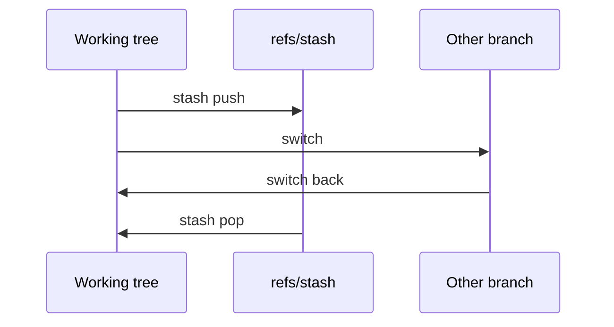

import { ConceptTemplate } from '@/features/kb/components/templates/ConceptTemplate'
import { Callout } from '@/features/kb/components/mdx/Callout'
import { ComparisonTable } from '@/features/kb/components/mdx/ComparisonTable'

export default function Layout({ children }) {
  return (
    <ConceptTemplate title="Stashing">
      {children}
    </ConceptTemplate>
  )
}

**Stash** is Git's pocket for unfinished work. `git stash push` records the dirty state, returns the working tree (and usually the index) to `HEAD`, and lets you switch branches. `git stash pop` reapplies and drops. It is a context-switch tool, not a backup system. The objects live under `refs/stash` and a reflog; they are easy to lose if you treat stash like a second branch.

## 1. Deep Dive and Mechanics

**What gets stored.** By default Git writes a commit for the index and a commit for the working tree (and optionally a third for untracked files with `-u`). `refs/stash` points at the working-tree commit; its parents encode `HEAD` and the index snapshot.

**Apply versus pop.** `apply` reapplies and keeps the stash. `pop` applies then drops that reflog entry. Conflicts during pop leave the stash intact (modern Git) so you do not lose the shelf.

**Partial stash.** `-p` hunk-selects. Pathspec stashes only some files. This is how you commit a fix without also committing a debug print — or you could `git add -p` and leave the rest in the tree.

**Untracked and ignored.** Default stash ignores untracked files (they remain and block checkouts). `-u` includes untracked. `-a` includes ignored (build artifacts — rarely what you want).

**Branch.** `git stash branch name` creates a branch from the original `HEAD` and applies the stash there. Use it when the destination branch has moved and apply conflicts look hopeless.

<Callout icon="warning" title="Stash is not a remote">
`refs/stash` is local. A laptop wipe, a new clone, or a careless `git stash clear` destroys the only copy. WIP that matters is a commit on a branch, even a `wip/` branch you push.
</Callout>

## 2. Mathematical / Theoretical Foundation

Stash is a **stack** (reflog) of snapshots S_i, each a pair of trees (index, worktree) relative to a base commit B_i. Apply is a three-way-ish merge of those trees onto the current `HEAD`. If `HEAD` ≠ B_i, you are merging across time — conflicts are expected.

**Drop** removes one reflog entry. **Clear** removes all. Unreachable stash commits become GC candidates after the reflog expiry. Recovery is possible until GC if you still have the SHA from the terminal.

**Versus a commit.** A commit is reachable from a ref you can push. A stash is reachable from a single local ref. Durability and visibility are the only important differences; the object store is the same.

<ComparisonTable
  headers={['Tool', 'Pushed', 'Conflict UX', 'Use']}
  rows={[
    ['stash', 'No', 'Apply as patch/merge', 'Seconds-long context switch'],
    ['wip commit', 'Optional', 'Normal merge later', 'WIP that must survive'],
    ['worktree', 'N/A', 'Separate trees', 'Parallel branches, no shelf'],
    ['edit in place', 'N/A', 'None', 'You will mix diffs'],
  ]}
/>

## 3. Real-World Implementation

```bash
git stash push -u -m "wip: tax debug prints"
git switch main
git pull --ff-only
git switch -
git stash pop
```

Prefer `git stash push -m "..."` over bare `git stash` so `git stash list` is readable. If you stash more than once a day as a habit, use `git switch --detach` plus a second worktree instead — less stack archaeology.

## 4. Visualizations



## 5. Interview Prep

**Q: Why did checkout fail after a stash?**
**A:** Untracked files were not stashed and collide with files on the target branch. Use `-u` or clean/move those files.

**Q: Where did my stash go?**
**A:** `pop` dropped it after a successful apply. `git fsck --unreachable` or the terminal SHA can recover until GC. Next time, `apply` then drop explicitly.

**Q: stash versus commit --amend?**
**A:** Amend rewrites the last commit you already made. Stash shelves work that is not a commit yet. Different objects, different mistakes.

## 6. Production Use Cases

- **Hotfix interrupt**: shelf the feature, branch from `main`, ship, pop.
- **Secrets accident**: stash `-p` to peel a credential out of the index before commit (then rotate the credential anyway).
- **CI reproduction**: do not stash; commit to a throwaway branch so the runner can fetch it.

<Callout icon="tip" title="Name every stash">
An unnamed stash list full of generic WIP entries is how people lose a day. A message that states the branch and intent is the whole interface.
</Callout>
