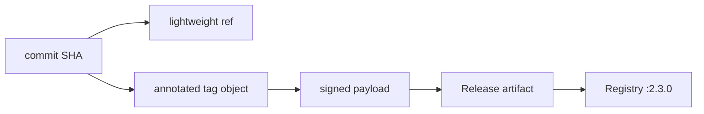

import { ConceptTemplate } from '@/features/kb/components/templates/ConceptTemplate'
import { Callout } from '@/features/kb/components/mdx/Callout'
import { ComparisonTable } from '@/features/kb/components/mdx/ComparisonTable'

export default function Layout({ children }) {
  return (
    <ConceptTemplate title="Tags">
      {children}
    </ConceptTemplate>
  )
}

A **tag** names a commit for humans and machines. **Lightweight** tags are refs in `refs/tags` that point straight at a commit — a sticky note. **Annotated** tags are objects: a message, tagger, date, and optional signature, pointing at a commit (or, rarely, another object). Releases should be annotated and usually signed. Branches move; tags, by social contract, do not.

## 1. Deep Dive and Mechanics

**Lightweight.** `git tag v1` creates `refs/tags/v1` → commit. `git describe` and some forges treat these as second-class (no message, no signature).

**Annotated.** `git tag -a v1.2.0 -m "..."`. The tag object has its own hash. Moving the tag means a new object plus a ref update — visible, but still rude if people already fetched the old one.

**Signed.** `-s` (GPG) or SSH signing. Forges can show a verified badge. The signature binds the tag message and the target object id to a key.

**Push.** Tags do not push with `git push` by default. `git push origin v1.2.0` or `--tags`. Deleting a remote tag is `git push origin :refs/tags/v1.2.0` — protect this on release tags.

**Describe.** `git describe` finds the nearest reachable annotated tag and appends commit count plus abbreviated SHA. That string is a common CI version when you are "after" a release.

<Callout icon="warning" title="Moving a published tag is a lie">
CI systems, Go modules, and humans cache `v1.2.0`. Changing the commit under that name silently retargets artifacts. Cut `v1.2.1` instead.
</Callout>

## 2. Mathematical / Theoretical Foundation

A tag is a name N in a namespace disjoint from branches. For annotated tags, object T = H(headers || message || target). Verification checks sig(T) under a trusted key and that `git cat-file` target matches the intended commit.

**Immutability is policy.** Git will happily move a tag ref (`-f`). The theoretical immutability of *content-addressed objects* still holds; the *name* is not content-addressed. Consumers that trust the name must also trust the ref advertisement (signed tags help: the name is inside the signed payload).

**Semver mapping.** Tags of the form `vMAJOR.MINOR.PATCH` are an external total order used by package managers. Git itself does not sort versions unless you ask (`sort -V`, or `git tag --sort=v:refname`).

<ComparisonTable
  headers={['Kind', 'Object', 'Signature', 'Use']}
  rows={[
    ['Lightweight', 'No, just a ref', 'No', 'Personal bookmarks'],
    ['Annotated', 'Yes', 'Optional', 'Releases, git describe'],
    ['Signed annotated', 'Yes', 'Yes', 'Production releases'],
    ['Branch named like a version', 'No', 'No', 'Do not confuse with a tag'],
  ]}
/>

## 3. Real-World Implementation

```bash
git switch main
git pull --ff-only
git tag -s -a v2.3.0 -m "v2.3.0: tax rounding for bundles"
git push origin v2.3.0
# CI should create the GitHub/GitLab Release from this tag, not the reverse
```

Sign with the org's release key, not a random laptop key. Pipeline should verify the tag signature before promoting the artifact that claims to be v2.3.0.

## 4. Visualizations



## 5. Interview Prep

**Q: Tag versus branch?**
**A:** A branch is expected to move. A tag is expected not to. Use a branch for `release-2.3` work; tag `v2.3.0` when that work is the artifact.

**Q: Why annotated for releases?**
**A:** Message, tagger, date, signature, and `git describe` behaviour. Lightweight tags omit the audit metadata.

**Q: Can I tag a blob?**
**A:** Yes, annotated tags can point at any object. Almost nobody should. Releases tag commits (the tree you built).

## 6. Production Use Cases

- **Immutable release identity** that CD promotes: image `app:2.3.0` built from tag `v2.3.0`.
- **Go modules and lerna-style** version discovery from tags.
- **Audit**: signed tag + provenance attestation as the "what did we ship" record.

<Callout icon="tip" title="Create tags in CI from a green main SHA">
Humans mistype and retag. A release workflow that only tags the SHA it just tested removes the "I tagged the wrong laptop commit" class of incidents.
</Callout>
