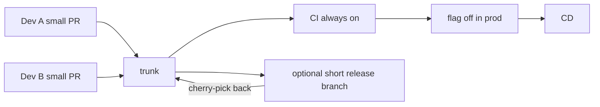

import { ConceptTemplate } from '@/features/kb/components/templates/ConceptTemplate'
import { Callout } from '@/features/kb/components/mdx/Callout'
import { ComparisonTable } from '@/features/kb/components/mdx/ComparisonTable'

export default function Layout({ children }) {
  return (
    <ConceptTemplate title="Trunk-Based Development">
      {children}
    </ConceptTemplate>
  )
}

**Trunk-based development** (TBD) is the rule that the default integration branch — **trunk**, usually `main` — is always releasable, and developers merge to it **at least daily**. Feature branches, if they exist, live hours, not weeks. Incomplete behaviour is hidden with **feature flags**, dark launches, or branch-by-abstraction. TBD is the branching model that actually matches continuous delivery; GitFlow is its inverse.

## 1. Deep Dive and Mechanics

**Short-lived branches.** A PR that lasts three days is already long. The point is to minimise the time two people edit overlapping files on divergent tips. Pairing and stacking are allowed; week-long "feature branches" are not.

**Trunk is green.** Every commit on trunk is a release candidate. CI on trunk is sacred: broken trunk stops the line (or auto-reverts). CD may deploy every trunk SHA or batch them; the branch discipline is the same.

**Flags, not branches.** A half-done checkout flow still merges, behind a flag defaulted off. The merge is integration; the flag is product launch. Removing the flag is a later, small PR.

**Release branches are optional.** High-frequency SaaS tags trunk. Lower cadence (mobile, regulated) cuts a short `release-x` from trunk and cherry-picks hotfixes **back to trunk** immediately so the next cut is not missing them.

**Code freeze is a smell.** If you need a freeze so trunk can become releasable, you were not trunk-based; you were accumulating risk on a hidden branch named `main`.

<Callout icon="warning" title="TBD without flags becomes cowboy commit-to-main">
The discipline is small, finished-enough slices plus hiding incomplete product behaviour. Dumping half-compiled ideas on trunk and hoping CI is kind is not TBD.
</Callout>

## 2. Mathematical / Theoretical Foundation

Integration cost between two developers grows with the product of their unmerged change sets and the overlap of their file sets. Daily merge caps each change set. That is why TBD claims lower merge pain — it is a bound on divergence time, not a new merge algorithm.

**Batch size.** Lead time and change-fail rate in DORA research improve as batch size shrinks. TBD is a policy that keeps batch size near "one flag-sized idea."

**Release branch delta.** Let T be trunk tip and R a release cut. Each hotfix applied only to R increases |T Δ R|. Cherry-pick-to-trunk is the invariant that keeps that delta from becoming a second product.

<ComparisonTable
  headers={['Discipline', 'Integration target', 'Feature lifetime', 'Unfinished work']}
  rows={[
    ['Trunk-based', 'main / trunk', 'Hours to a day', 'Flags / abstraction'],
    ['GitHub Flow', 'main via PR', 'Days', 'Branch until done'],
    ['GitFlow', 'develop', 'Days to weeks', 'The feature branch'],
    ['Free-for-all long branches', 'Whenever', 'Weeks+', 'Hope'],
  ]}
/>

## 3. Real-World Implementation

```javascript
// Flag-gated path so the incomplete flow can merge to trunk
export function checkout(cart, flags) {
  if (!flags.newTaxEngine) {
    return legacyTax(cart)
  }
  return taxOnceOnBundles(cart)
}
```

Default `newTaxEngine` off in prod, on in a test environment or for staff accounts. Delete the flag and `legacyTax` in a follow-up once metrics hold. The Git history on trunk stays deployable the entire time.

## 4. Visualizations



## 5. Interview Prep

**Q: Is TBD "no pull requests"?**
**A:** No. Most teams still use short PRs and required checks. The constraint is duration and trunk greenness, not the absence of review.

**Q: How do you do a multi-week feature?**
**A:** Slice vertically, merge each slice behind a flag, or use branch-by-abstraction (new module beside old, swap a call site last). Do not sit on a 400-file branch.

**Q: TBD versus GitFlow in interviews?**
**A:** Say which product cadence you had. TBD for CD; GitFlow for scheduled multi-version shipped software. "We used GitFlow on a SaaS we deploy hourly" is a red flag.

## 6. Production Use Cases

- **SaaS with hourly deploys** and an error-budget culture.
- **Large orgs** (Google-style) where the only scalable integration point is one trunk plus a massive CI graph.
- **Mobile** with a short release cut and mandatory cherry-pick-back of store hotfixes.

<Callout icon="tip" title="Measure branch age">
A dashboard of open PRs older than 48 hours is the TBD health check. If the median is a week, you have GitFlow with a `main` sticker.
</Callout>
