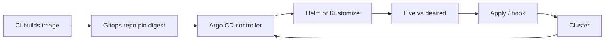

import { ConceptTemplate } from '@/features/kb/components/templates/ConceptTemplate'
import { Callout } from '@/features/kb/components/mdx/Callout'
import { ComparisonTable } from '@/features/kb/components/mdx/ComparisonTable'

export default function Layout({ children }) {
  return (
    <ConceptTemplate title="Argo CD">
      {children}
    </ConceptTemplate>
  )
}

**Argo CD** is a GitOps continuous-delivery tool for Kubernetes. You declare an **Application** (or ApplicationSet): a Git repo, a path, a revision, and a destination cluster/namespace. A controller compares live objects to the desired manifest and **syncs** the delta. Humans do not `kubectl apply` as the source of truth; Git does. Argo CD adds a UI for diffs, sync waves, hooks, SSO, and multi-cluster tenancy on top of that loop.

## 1. Deep Dive and Mechanics

**Desired state.** Helm, Kustomize, plain YAML, Jsonnet, or a config-management plugin render manifests. Argo stores the Git revision it last synced. Drift (a human kubectl-edit) shows as OutOfSync.

**Sync.** Manual or automated. Prune deletes objects missing from Git (dangerous if the renderer failed empty). Sync waves and hooks (PreSync Job, PostSync) order CRDs before CRs, migrations before Deployments.

**App of Apps / ApplicationSet.** An app that only contains other Application manifests, or a generator (git, cluster, list, PR, plugin) that stamps many apps. This is how you onboard 80 microservices without 80 click-ops.

**Multi-cluster.** One Argo (or a fleet of them) registers destination clusters via kubeconfig secrets. The controller's RBAC in each cluster is the real blast radius.

**SSO and projects.** AppProjects constrain which repos, clusters, and namespaces a team can target. Without projects, any Argo user who can create an Application can deploy anywhere the controller can reach.

<Callout icon="error" title="An empty successful render plus prune is a wipe">
If Helm values fail open to zero templates and prune is on, Argo will delete the namespace contents. Require a minimum object count or disable prune on first sync of a new app.
</Callout>

## 2. Mathematical / Theoretical Foundation

GitOps is a **reconciliation loop**: observe live L, desired D = render(Git rev), apply a diff that moves L toward D. Convergence assumes D is total and the cluster admits those objects (CRDs installed, quotas). Oscillation happens when another controller fights Argo (HPA vs replica count in Git).

**Sync waves** are a partial order on objects. Hooks are extra vertices in that order. Cycles (A waits B, B waits A) deadlock the sync.

**Freshness.** Time-to-sync is poll interval plus render plus apply. Webhooks cut the poll. Correctness is "eventually matches Git," not "matches the last CI image" unless the Git commit pins the image digest.

<ComparisonTable
  headers={['Tool', 'Model', 'UI', 'Multi-cluster']}
  rows={[
    ['Argo CD', 'App + sync', 'First-class', 'Yes'],
    ['Flux', 'Kustomization / HelmRelease', 'Optional / via other UIs', 'Yes'],
    ['Jenkins apply', 'Push from CI', 'Job log', 'DIY'],
    ['Spinnaker', 'Pipeline stages', 'Heavy', 'Yes'],
  ]}
/>

## 3. Real-World Implementation

```yaml
apiVersion: argoproj.io/v1alpha1
kind: Application
metadata:
  name: checkout
  namespace: argocd
spec:
  project: payments
  source:
    repoURL: https://git.example.com/org/gitops.git
    targetRevision: main
    path: apps/checkout/prod
  destination:
    server: https://prod-cluster.example.com
    namespace: checkout
  syncPolicy:
    automated:
      prune: false
      selfHeal: true
```

Pin images by digest in the rendered manifests (CI writes the digest to Git). Leave `prune: false` until the app has survived a few syncs.

## 4. Visualizations



## 5. Interview Prep

**Q: Argo CD versus Flux?**
**A:** Same GitOps idea. Argo is app-centric with a polished UI and SSO. Flux is Kubernetes-native CRDs, lighter, often preferred as a building block. Choose on UX and ecosystem, not on "which is more GitOps."

**Q: Why not apply from GitHub Actions?**
**A:** Push CD needs cluster credentials in CI. Pull CD keeps credentials in-cluster. Argo also continuously heals drift after the pipeline finished.

**Q: How do you do a canary?**
**A:** Argo CD syncs desired objects; Argo Rollouts (or Flagger) owns the progressive shift. Do not invent replica percentages in raw Deployments if you need analysis.

## 6. Production Use Cases

- **Multi-cluster product orgs** with a central platform Argo and per-team AppProjects.
- **Regulated** environments where every prod change is a Git SHA with two reviewers.
- **Ephemeral preview apps** via ApplicationSet on pull-request branches.

<Callout icon="tip" title="Pin digests, not moving tags">
If Git says `image: app:latest`, Argo can be perfectly synced to a lie. Desired state is a digest. Tags belong in CI, not in the cluster spec.
</Callout>
