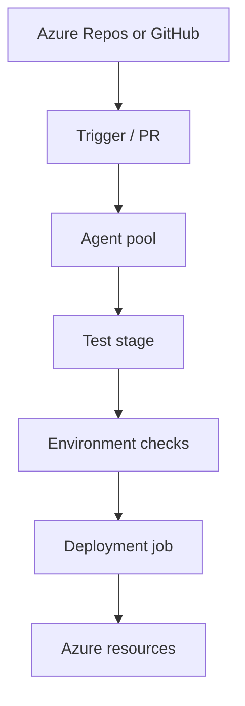

import { ConceptTemplate } from '@/features/kb/components/templates/ConceptTemplate'
import { Callout } from '@/features/kb/components/mdx/Callout'
import { ComparisonTable } from '@/features/kb/components/mdx/ComparisonTable'

export default function Layout({ children }) {
  return (
    <ConceptTemplate title="Azure Pipelines">
      {children}
    </ConceptTemplate>
  )
}

**Azure Pipelines** is the CI/CD service inside **Azure DevOps**. A pipeline is YAML (preferred) or the older visual "classic" editor. Agents are Microsoft-hosted VMs or self-hosted pools in your network. It wins in Microsoft estates: Azure Repos, Boards work-item linking, service connections to Azure subscriptions, and approval gates on environments. It also builds GitHub and other remotes; the gravity is still Azure.

## 1. Deep Dive and Mechanics

**YAML structure.** `trigger`, `pr`, `pool`, `stages` → `jobs` → `steps`. Templates (`extends`, `include`) are how org-wide compliance wrappers work: a team pipeline must extend a locked template that injects scanning.

**Agents.** Microsoft-hosted: billed minutes, clean VM each job. Self-hosted: persistent or scale-set agents that can see private networks. Capabilities (demands) match jobs to pools.

**Service connections.** Workload identity federation (OIDC-like) to Azure is the modern path; service principals with secrets are the legacy leak. Connections are scoped to projects and pipeline authorisations — a second ACL people forget.

**Environments and checks.** Deployment jobs target named environments with approvals, business-hours windows, and Azure-function checks. This is CD policy, not just "a stage named prod."

**Classic releases.** Still running in enterprises. They are a parallel product: artifacts from a build pipeline, then a release definition. New work should be multi-stage YAML.

<Callout icon="warning" title="Authorised pipelines can use any service connection they can see">
Restrict service connections to specific pipelines. A playground YAML in the same project that deploys to prod is a common audit finding.
</Callout>

## 2. Mathematical / Theoretical Foundation

A pipeline run is a DAG of jobs (plus implicit stage barriers). `dependsOn` edges define the partial order. Fan-out is matrix jobs: Cartesian product of axes, cost multiplicative.

**Gating.** Environment checks are predicates that must hold before a deployment job starts. They are the same idea as GitHub environments: a second lattice on "who may run this job," not on "who may push Git."

**Template lock.** `extends` with a required template SHA is a policy language: the child may only fill declared parameters. That is how a platform team enforces "every pipeline runs CodeQL" without trusting every repo's YAML.

<ComparisonTable
  headers={['Feature', 'Azure Pipelines', 'GitHub Actions', 'GitLab CI']}
  rows={[
    ['Home forge', 'Azure Repos / any Git', 'GitHub', 'GitLab'],
    ['Hosted agents', 'Microsoft-hosted', 'GitHub-hosted', 'SaaS runners'],
    ['Azure IAM', 'Native service connections', 'OIDC', 'OIDC / federated'],
    ['Org wrapper', 'Required templates', 'Reusable workflows', 'CI components / includes'],
  ]}
/>

## 3. Real-World Implementation

```yaml
trigger:
  branches:
    include: [main]
pool:
  vmImage: ubuntu-22.04
stages:
  - stage: test
    jobs:
      - job: unit
        steps:
          - task: NodeTool@0
            inputs:
              versionSpec: 22.x
          - script: npm ci && npm test
  - stage: prod
    dependsOn: test
    jobs:
      - deployment: deploy
        environment: production
        strategy:
          runOnce:
            deploy:
              steps:
                - script: ./deploy.sh
```

Map `environment: production` to an Environment with required approvers. Use a federated service connection in the deploy step instead of a password variable.

## 4. Visualizations



## 5. Interview Prep

**Q: YAML versus classic?**
**A:** YAML is reviewable, branchable, and template-lockable. Classic is click-ops that drifts. Migrate when you touch the release; do not rewrite 200 classic defs in a heroic week unless you have a generator.

**Q: How do you talk to a private VNet?**
**A:** Self-hosted or scale-set agents inside the VNet, or a deployment job that uses a privately networked service connection. Microsoft-hosted agents live on the public internet.

**Q: Pipelines versus GitHub Actions in Azure?**
**A:** Actions if the code is on GitHub and the team already lives there. Pipelines if Boards, Repos, and existing agent pools are the system of record.

## 6. Production Use Cases

- **.NET / Azure** shops with subscription-scoped service connections and environment approvals.
- **Hybrid** builds that must compile on on-prem agents then deploy to Azure.
- **Template-locked** enterprises where every pipeline extends a compliance skeleton.

<Callout icon="tip" title="Pin template refs">
An `extends` of `@templates` at `main` is an unpinned supply chain. Pin a tag or SHA of the template repo the same way you pin Actions.
</Callout>
